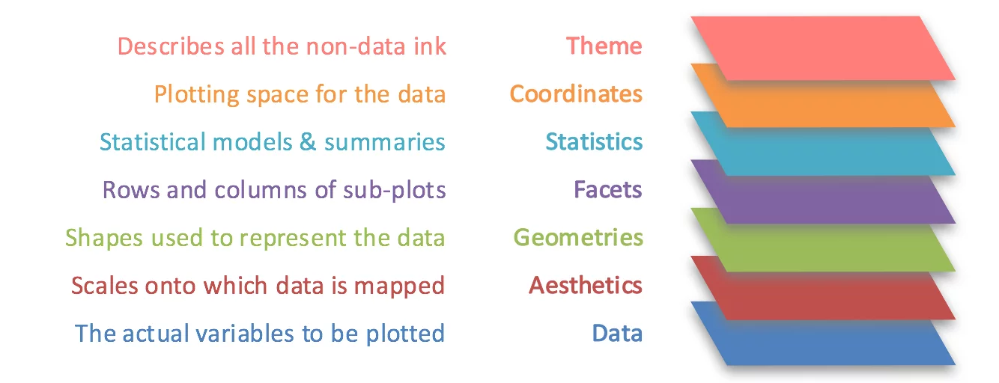

# (PART) Introduction {-}

# A very brief introduction to R {#intro-to-R}

This chapter is not meant to be an exhaustive be-all end-all to how to use R. It will only go through enough to complete RPMP's content. It will, however, introduce a couple of things that I think make for good starting habits using R - which is never a bad thing!

In general, I am a huge proponent of the 'tidy' workflow of data analysis. While it was originally designed for data science in mind, I think it's a valuable model for psychological science as well:

```{r echo = FALSE, fig.align = "center"}
knitr::include_graphics("https://d33wubrfki0l68.cloudfront.net/e5bf2a8f4c787a12facbc0b4191fc82bd192f4c5/4e5d2/diagrams/data-science-model.png")
```

The original subject was written with this workflow broadly in mind, although it wasn't intended to follow this closely (only to bring awareness to the general idea of modelling). For a far more comprehensive and rigorous overview of how to program in R, there is no better guide than *R 4 Data Science* (R4DS) by Hadley Wickham: <https://r4ds.had.co.nz/>.

## Basic syntax {#R-syntax}

### Operators

We can do basic maths in R using the following symbols:

-   Addition: `+`

-   Subtraction: `-`

-   Multiplication: `*`

-   Division: `/`

-   Exponentiation: `^`

```{r}
# Addition and subtraction
5 + 2
6 - 3
```

```{r}
# Multiplication and division
2 * 5
24/6
```

R will recognise brackets and perform calculations appropriately, following BEDMAS. As you normally would with a written equation, R will perform calculations left to right.

```{r}
(6 + 2) * 3/4
```

### Assignment and naming

When you type something in R, you almost always have the option of *assigning* that value to a variable to give it a name. In R, assigning values/strings etc. to variables is slightly different to other programming languages. Instead of using equals signs, we use a left arrow `<-` for assignment. For example:

```{r}
# Use this
x <- 5

# This works but isn't preferred 
x = 5
```

When it comes to naming variables and the like, the easiest/most readable way for most people is to separate words using an underscore. e.g.

```{r eval = FALSE}
# this is preferred
variable_name

# this is also very common
variable.name

# sentence case is also sometimes used
VariableName

# no spaces are allowed
variable name # This will give you an error

# some heathens use camel case
variableName

```

To view what has been assigned to a variable, you can simply write the variable name:

```{r}
# This is the variable we named earlier
x
```

### Variable types

Like many programming languages, R works by manipulating different types of variables. Knowing how to work with these different variables is fairly essential to using R, so here is a brief overview.

First, we have our most basic classes of variables. The first is **numeric**:

```{r}
var_a <- 5.25
var_a
```

A special form of a numeric variable is an **integer** variable, which is used for whole numbers.

```{r}
var_b <- 6
var_b
```

The second is **character**, which is used for text (or strings in programming language). Characters must be enclosed with speech marks:

```{r}
var_c <- "This is a string"
var_c
```

Finally, we have **logical** variables, which can take on the form of `TRUE` or `FALSE`. `TRUE` and `FALSE` (or alternatively `T` or `F`) are special values in R that, as their names suggest, are used to indicate when a certain value is true or false.

```{r}
var_d <- TRUE
var_d
```


## Data structures

Of course, in R we don't work with single values (often). We instead work with larger data structures. While there are a number of data structures in R, by and large the main one we will work with are **data frames.**

### Vectors {#vectors}

Vectors are extremely important in R: so much so that many functions are what we call *vectorised*, meaning that they operate over vectors. Vectors are a data structure that provide an ordered list of values of the same type. Vectors can contain multiple numbers, strings or logical values, as an example.

To create a vector, the `c()` function is used. Below is a vector containing 5 numbers:

```{r}
vector_a <- c(4, 1, 6, 2, 3)

vector_a
```

Each value in the vector has an **index**, which denotes its position in the vector starting from 1. We can pull values from vectors by using square brackets, `[]`. We give R the name of the vector, followed by the index of the value we want. Let us pull the number 1, for instance, which has an index of 2 (as it is 2nd in the vector):

```{r}
vector_a[2]
```

To subset multiple values, we can simply give a vector of indices within the square brackets. For example, let's say we want to pull values from indices 2-4. This means that our output should be 1, 6 and 2. We can create a vector corresponding to the indices that we want (`c(2, 3, 4)`), and give this to the square brackets for subsetting.

```{r}
vector_a[c(2, 3, 4)]
```

But there's a neater trick here that R allows you to do. When placing a semicolon, `:`, between two numbers, R will create a vector of numbers between the two numbers you give. The below command, for example, will create a vector of integers between the numbers 2 and 7:

```{r}
2:7
```

We can use this to great effect by subsetting multiple values from a vector at once:

```{r}
vector_a[2:4]
```

### Data frames {#dataframes}

Data frames are flexible, row-column structures that contain data. Data frames can essentially be thought of as several vectors joined together as columns.

R works best when data frames are in a *tidy* format. In a tidy format:

-   Each variable is its own column
-   Each observation (participant, object) is its own row
-   Each value is in its own cell.

```{r echo = FALSE, fig.align = "center", fig.cap = "Adapted from R4DS."}
knitr::include_graphics("https://d33wubrfki0l68.cloudfront.net/6f1ddb544fc5c69a2478e444ab8112fb0eea23f8/91adc/images/tidy-1.png")
```

Here is an example of a data frame in tidy format. Note how each column corresponds to a different variable, or piece of data that we're interested in. Each column is also clearly labelled, so it is clear what it represents. Each row corresponds to an observation (a single penguin, in this case). So, the first row represnts an Adelie penguin on Torgersen Island, with a bill length of 39.1mm etc etc.

```{r}
library(palmerpenguins)
penguins
```

For the purposes of RPMP you won't need to create any data frames, but you will need to know how to read files in and work with them.

With data frames, there are a number of functions in base R that allow us to do certain operations. These will be super useful in a range of scenarios.

First, it helps to understand that data frames are (conceptually) like matrices, in that they have rows and columns that are indexed. We can therefore pull out bits of information by the row or column index (i.e. number) using R. To do so, we can use the format `name[row, column]`. `name` in this instance is the name of our data frame, while `row` and `column` are the row and column numbers we want respectively. For example, let us take the cell corresponding to the first row and the first column:

```{r}
penguins[1,1]
```

Or, the cell in row 3, column 4:

```{r}
penguins[3,4]
```

We can pull out whole rows or columns by simply leaving the number blank. If we want all values in a row, we do not specify a column and vice versa. For example, let us take all of row 1 from the `penguins` dataset:

```{r}
penguins[1,]
```

Or let's take all of the species column only, which is column 1:

```{r}
penguins[,1]
```

The above operation actually can be done another way in R, and perhaps a way that is more intuitive. With data frames, we can grab individual columns using the `$` operator, followed by the column's *name*. This lets us grab columns by their name.

```{r}
penguins$species
```

Note though that the output here is different; it simply returns a vector, while the `[row,column]` notation returns a data frame. Given that many functions in R rely on vectors, this notation is often useful.

Finally, if we want to select multiple rows or columns then we need to give vectors to the row and/or column arguments within the square brackets. This means that our semicolon notation will work here as well. For instance, let's say we want to get the first 6 rows of the dataset:

```{r}
penguins[1:6,]
```

Or, columns 2 to 4:

```{r}
penguins[,2:4]
```

## Packages and functions

### Functions

R works primarily with **functions**, which take one or more inputs and return an output. Functions in R are always defined in `name()` format, i.e. the name of the function followed by brackets. Every function generally serves a very specific purpose, such as performing a specific calculation, manipulation of data or otherwise. Therefore, working with R requires us to use lots and lots of functions.

Most functions will have at least one, if not multiple **arguments.** Arguments define the options for a given function. For example, the `class()` function, which comes in base R, tells us the type of a variable. `class()` has one main argument, `x` - which is simply the name of the variable we want to know about. As an example, let us say we wanted to know what type of variable `var_a` was. We could write the following:

```{r}
class(x = var_a)
```

More simply, because `class()` only has one argument we can optionally write:

```{r}
class(var_a)
```


Functions may either have mandatory or optional arguments. Mandatory arguments are ones that you need to provide in order for the function to run. Optional arguments are often defaults that can be changed if needed. Many functions in R will have multiple arguments that are typically a mix of both. A key point arises here though: functions in R define arguments in specific orders. In other words, R expects you to input arguments in specific orders unless you explicitly define each argument's value, as we did for the first instance of `class()`.

The easiest way to find out information about what a function does and the arguments it requires is to type a question mark, `?`, with the name of the function immediately afterwards. e.g. 

```{r eval = FALSE}
?class
```


A basic function is the `round()` function, which - as the name suggests - rounds a value you give it. `round()` has two arguments: `x`, which is the number or the name of an object we want to round, and `digits`, which specifies the number of digits we want to round to. `x` is a mandatory argument, but `digits` is optional and has a preset value of 0. Therefore, if we type in the following you can see what we get:

```{r}
round(4.326)
```
If we want to round to 2dp, for instance, we would need to explicitly define the `digits` argument and set it to a different value. 

```{r}
round(4.326, digits = 2)
```

### Packages

By default, R comes with *lots* of functions, many of which will be used throughout this book. The beauty of R though is that its functionality is essentially limitless; its open-source nature and strong community mean that new functions and capabilities are regularly made for R. These new functions augment/extend what R is capable of doing, and are generally available in the form of **packages.** To provide a very simple explanation of what packages are, packages are a collection of code that provide extra functions in R. Some packages occassionally come with data too, such as the `palmerpenguins` package.

When you start a new R session, the first thing that you'll want to do is load the packages that you need to use.

For now, we'll load two packages for functions: `tidyverse` and `rstatix`. `tidyverse` is a huge package that contains a group of other packages designed for data manipulation, visualisation and cleaning. `rstatix` allows for simple statistical tests to be performed in an easy way. `palmerpenguins` comes with a dataset for practicing on. `palmerpenguins` loads a dataset named `penguins` that contains basic info on 3 species of penguins across 3 different islands.

To load a package, call the `library()` function and enter the name of the package in brackets:

```{r}
library(tidyverse)
library(rstatix)
library(palmerpenguins)
```

### Tidyverse

The tidyverse is a mega-collection of phenomenal packages that fundamentally change how to interface with R. The tidyverse provides packages for things like:

-   Wrangling data
-   Reading and writing data
-   Making graphs
-   Tidying and reshaping data
-   Scraping the web

The tidyverse is probably the single most popular suite of packages for R because of the functionality it provides. All of the tidyverse packages are written in consistent syntax, generally use very easy language that has an emphasis on verbs (i.e. you're telling R to *do* something) and integrate seamlessly with each other and R. The tidyverse is a philosophy of R just as much as it is a suite of functions, and is part of what makes R so powerful today.

Many aspects of the tidyverse are reliant on the pipe operator, `%>%`. This basically tells R to take a dataframe or output and pass it onto a function that comes directly afterwards. Any function that takes a data frame as its first argument can (theoretically) be piped, meaning that we can chain strings of functions together in one run in a readable way. See the example below:

```{r eval = FALSE}
data %>%
  function_1() %>%
  function_2(do = "this") %>%
  function_3(avoid = "that")
```

in the hypothetical example above, we first take `data`, and pass it to function 1. We then take the output of function 1 and pass that to function 2, which has the argument `do = "this"`. Afterwards, we take the output of function 2 and pass it to function 3.

There are a number of clear benefits to the tidyverse way of doing things. These include:

-   Functions are generally stated as *verbs*, which means that you're always *doing* something with a function (and it's clear what that something is)
-   Piping avoids the cyclical hell of creating intermediate variables. Consider a non-tidyverse version of the code example above, written down below. This code is not only a bit of a pain to read, but is also clunky in that it generates several intermediate variables that aren't all that useful (a lot of the time).

```{r eval = FALSE}
output_1 <- function_1(data)
output_2 <- function_2(output_1, do = "this")
output_3 <- function_3(output_2, avoid = "that")
```

-   Piped code is generally quite easy to read.
-   `tidyverse` also provides a consistent syntax for *other* packages! It provides a quasi-philosophy and style guide for developers to write their own packages to write 'tidy' packages. `rstatix` is a great example of this.

Throughout this book you will see a lot of tidyverse!

### The `here()` package

Another staple bit of code you will see throughout RPMP is the `here` package. The official vignette for `here` summarises what this package does:

> The `here` package enables easy file referencing by using the top-level directory of a file project to easily build file paths. This is in contrast to using `setwd()`, which is fragile and dependent on the way you order your files on your computer.

Alternatively, read the below quote from R goddess Jenny Bryan:

> If the first line of your #rstats script is `setwd("C:\Users\jenny\path\that\only\I\have")`, I will come into your lab and SET YOUR COMPUTER ON FIRE.

In short, `here()` allows us to locate files in a *relative* manner as opposed to an *absolute* one. This is super super useful for sharing your code and data with other people, and ensuring that your scripts will run no matter where they are.

We won't get into project-oriented workflows for RPMP. However, imagine you have a folder structure like this:

```         
|-code
|-----rpmp_week1.Rmd
|-data
|-----w1_dataset.csv
|-output
|-RPMP.rproj
```

Normally, to locate a file on a disk you would generally have to give the entire pathway to that file. That could be something like `"C:\Users\Dan\Documents\Subjects\RPMP\data\w1_dataset.csv"` - which is immensely unwieldy if we want to read in data - and won't work the moment I give my script to someone else, as their folder structure could be completely different!

The alternative with here could be as simple as:

```{r eval = FALSE}
here("data", "w1_dataset.csv")
```

This tells R that I'm looking for something *here* in the data folder, specifically a file named `w1_dataset.csv`. As long as the relative positions are correct - i.e. the `.csv` file is in the `data` folder - R will know where to locate the file.

You will see a lot of `here()` in this version of the RPMP guide because as you may appreciate, there are a lot of data files stored in all manner of folders.

## Wrangling data with dplyr and others

`dplyr` is a package within the tidyverse for manipulating and wrangling data. `dplyr` is one of the most popular packages on R because it provides a suite of functions that are fairly essential to manipulating and working with data. Below is a brief overview of some of these functions, applied to the `penguins` dataset.

### Selecting columns with `select()`

`select()` lets you select the columns you want from a dataset. Simply specify the columns that you want by name. Below we take the species and island columns from the penguins dataset:

```{r}
penguins %>%
  select(species, island)
```

You can select columns via a number of ways:

-   Simply by name, e.g. `select(species, island)`
-   By their *index* or column number, e.g. `select(1, 2)`
    -   `select(1:4)` will select columns 1 to 4
    -   `select(-1)` will select the *last* column
-   By certain operator functions, such as `starts_with()` and `ends_with()`, e.g. `ends_with("mm")` will select all columns that end with "mm"

Combinations of the above also work. Removing columns is simply done by adding a minus sign `-` in front of the arguments for select, and are compatible with all of the options above.

### Filtering rows with `filter()`

`filter()` selects the rows that you want based on a certain condition. Here, we specify the column that want to filter by and state the condition (`==` means equals to). We can filter on multiple conditions; for example, filtering Adelie penguins by the year 2007:

```{r}
penguins %>%
  filter(year == 2007, species == "Adelie")
```

You can also choose to filter *out* rows based on a condition by adding an exclamation mark in front of the column name.

```{r}
penguins %>%
  filter(!year == 2007)
```

`drop_na()` is another useful starting function that simply removes all rows with NA/empty cells. If you enter it as is then it will clean the entire dataset; if you specify a column then it will remove all rows with NAs in that column. Below is an example of a pipe using these functions - going from selecting columns to filtering rows and finally cleaning up the empty cells.

```{r}
penguins %>%
  select(species, body_mass_g, year) %>%
  filter(year == 2009) %>%
  drop_na()

```

### Creating new columns with `mutate()`

`mutate()` is a function that lets you create new columns. This can be extremely useful for operations like recoding variables and transforming them. The nice thing about `mutate()` is that you can do all manner of operations without touching your original data.

The basic workflow of `mutate()` looks like this:

```{r eval = FALSE}
data %>%
  mutate(
    new_column_1 = a_function(...),
    new_column_2 = another_function(...)
    )
```

This example code would create two new columns, named `new_column_1` and `new_column_2`, with their respective values being whatever the functions were. For example, in the `penguins` dataset we have a variable called `body_mass_g`, which is the body mass of each penguin in grams. If we wanted to convert this to kilograms, we would need to divide each penguin's value on this variable by 1000. `mutate()` makes this a piece of cake. Let's also chain a `select()` command to only show the following variables: species, island, body_mass_g and sex.

```{r}
penguins %>%
  select(species, island, body_mass_g, sex) %>%
  mutate(body_mass_kg = body_mass_g/1000)
```

You can see now that we have a new column called `body_mass_kg` that has our new transformed variable.

`mutate()` can also take functions (and likely will make up the majority of your use of it). For example, let's say that we want to make a variable that takes the natural logarithm of bill length (for whatever reason). We could do this as follows using the `log()` function within our `mutate()` call:

```{r}
penguins %>%
  select(species, island, bill_length_mm, bill_depth_mm) %>%
  mutate(bill_length_log = log(bill_length_mm))
```

### Summarising data with `summarise()` and `group_by()`

Finally, sometimes we will want to summarise data - for example, to calculate basic features such as descriptives or for plotting. To do that, we can use the function `summarise()` (or `summarize()` for American users).

`summarise()` works very similarly to `mutate()`.

```{r eval = FALSE}
data %>%
  summarise(
    summary_1 = a_function(...),
    summary_2 = another_function(...)
    )
```

The difference is that while `mutate()` retains the features of your data, `summarise()` will instead collapse it. To illustrate, let's say we want to calculate a) how many penguins there are (with the function `n()`) and b) the mean body mass (with the `mean()` function).

```{r}
penguins %>%
  summarise(
    n_penguins = n(),
    mean_mass = mean(body_mass_g, na.rm = TRUE)
  )
```

This is... good and all, but consider what we've just done. We've just calculated the number of penguins and the mean body mass across the *entire* dataset. However, that may not necessarily be meaningful, particularly in this instance where we have meaningful groups within the data. For example, the above mean collapses across years, which may not be appropriate.

Enter in another function called `group_by()`. As the name implies, `group_by()` will perform operations per a grouping variable that you specify. `group_by()` works especially well with summarise, because the idea is something like this:

```{r eval = FALSE}
data %>%
  group_by(variable) %>%                 # Tell R to group the subsequent output by this variable
  summarise(
    summary_1 = a_function(...),
    summary_2 = another_function(...)
    ) %>%
  ungroup()         # Tell R grouping is no longer needed
```

Let's put this into practice by calculating the n and mean per year. Notice how the output now calculates n and the mean body mass per year, which is much more informative!

```{r}
penguins %>%
  group_by(year) %>%
  summarise(
    n_penguins = n(),
    mean_mass = mean(body_mass_g, na.rm = TRUE)
  ) %>%
  ungroup()
```

Naturally, `group_by()` can group using multiple variables. This is easy to do so as well

```{r}
penguins %>%
  group_by(year, island) %>%
  summarise(
    n_penguins = n(),
    mean_mass = mean(body_mass_g, na.rm = TRUE)
  ) %>%
  ungroup()
```

Suddenly this is much more informative - we can now do calculations/operations per year and island, which provides a lot more nuance.

### Some other handy tidyverse functions

As stated at the start of this chapter, this book will only cover enough R functions to provide you with an understanding of what goes on in this book and how. Nonetheless, there are so many tidyverse functions out there that are worth exploring and knowing about. Below is a brief list of some other functions from `dplyr` you may wish to keep in mind. To find out what a given function does in more detail, you just need to type `?function` into the R console to search for its documentation (or `??x` to do a broad search).

Note that all of these are `dplyr` functions, so need to be piped from a dataset like usual.

-   `arrange()` will sort your rows by a variable you specify. For example, if you wanted to sort the penguins dataset by island, you could use `arrange(island)` (or `arrange(desc(island))` for descending order).
-   `distinct()` will give you all *unique* values in a given column. `distinct(island)`, for instance, will give you each unique island name.
-   `rename()` will let you rename columns.
-   \``relocate()` will let you rearrange the column order.
-   The `slice()` set of functions will subset rows, but mainly based on positions (e.g. first, last) rather than conditions.

## Making graphs with ggplot2 {#ggplot}

### Building the plot

`ggplot2` (henceforth referred to as ggplot) is the tidyverse package for plotting and visualising data. It is an immensely powerful and flexible way of graphing data in R, and is basically the de facto means of creating visualisations for R users.^[Almost all of the graphs in RPMP (in fact, I think it actually is 100%) were made using `ggplot2`.]

The 'gg' in the name ggplot stands for **grammar of graphics**. The idea is that a graph is built by *layering* different components of a graph (the graphics) in a structured way (the grammar). The idea was first put forward by Leland Wilkinson, and looks something like this:

```{r echo = FALSE, fig.align = "center"}

```


A cheatsheet for ggplot can be found [here](https://rstudio.github.io/cheatsheets/html/data-visualization.html).

To start a plot, we first call the `ggplot()` function. Here, we specify three of the main features of our plot - the dataset that we want to use, the x axis and the y axis. the x and y axes are wrapped within the `aes()` function, which defines our aesthetics. Here, we simply say which columns of our dataset should go on the x and y axes. Using the `penguin` dataset, we can start to visualise a scatter plot between bill length and bill depth like this:

```{r}
ggplot(data = penguins, aes(x = bill_length_mm, y = bill_depth_mm))
```

However, notice that the plot is empty. This is because we've only specified the first two layers of our graph: the data and the aesthetics. We haven't defined any geoms, or actual plotting methods, in our plot.

### Geoms

Geoms (short for geometries) define *how* data is plotted. If `ggplot()` provides the basic canvas for the graph (i.e. *what* to plot), geoms are what create the graph (i.e. *how* it is plotted). Different graph types are defined using geoms. As per the diagram of the grammar of graphics above, we add (literally, using `+`) additional layers to our base `ggplot()` call in order to build our graph.

Refer to the cheatsheet for all of the possible geoms. For now, we will stick to some basics. 

A scatter plot can be specified by adding `geom_point()`. This requires that your x and y variables are continuous:

```{r warning = FALSE}
ggplot(data = penguins, aes(x = bill_length_mm, y = bill_depth_mm)) + 
  geom_point()
```

`geom_smooth()` will add a line of best fit to a scatterplot. You can add this as another geom layer by adding `geom_smooth(method = "lm")`. Specifying the method is important because by default, `geom_smooth()` will probably fit LOESS curves (local polynomial regressions). Note that this function should be added after using `geom_point()`.

By default, the line will also have standard error bands around it. You can turn this off by also specifying `se = FALSE` in the `geom_smooth()` call.

```{r warning = FALSE}
ggplot(data = penguins, aes(x = bill_length_mm, y = bill_depth_mm)) + 
  geom_point() +
  geom_smooth(method = "lm", se = FALSE)
```


`geom_boxplot()` will create boxplots. For this geom to work, a categorical variable must be on the x axis and a continuous variable must be on the y axis. An example is below, with species on the x axis and body mass on the y:

```{r warning = FALSE}
ggplot(data = penguins, aes(x = species, y = body_mass_g)) + 
  geom_boxplot()
```

`geom_violin()` plots violin plots, which is a variant of the boxplot that also plots the distribution.

```{r warning = FALSE}
ggplot(data = penguins, aes(x = species, y = body_mass_g)) + 
  geom_violin()
```

`geom_bar()` and `geom_col()` will both create bar plots, but their usage is slightly different. `geom_bar()` is best used if you want to plot the *number* of items in each category. `geom_col()` is best used to plot means or similar statistics.

```{r}
penguins %>%
  group_by(species) %>%
  summarise(
    mean_mass = mean(body_mass_g, na.rm = TRUE)
  ) %>%
  ggplot(aes(x = species, y = mean_mass)) +
  geom_col()
```

`geom_histogram()` will plot a histogram, which is useful for visualising distributions. For this, you only need to provide one continuous variable on the x-axis. `geom_density()` will plot the same information but using a smoothed line instead of bins.

```{r warning = FALSE, message = FALSE}
ggplot(data = penguins, aes(x = body_mass_g)) + 
  geom_histogram()

ggplot(data = penguins, aes(x = body_mass_g)) + 
  geom_density()
```


### Making the graph look better

This is all well and good, and we already have workable basic graphs using `ggplot`. From here, we can change many things by adding or modifying our existing layers to our ggplot. There are *so* many options available here, but here we'll only focus on some basic considerations.

An important aspect of data visualisation is a good use of colour. Colours should be used in both an informative and an aesthetically appealing way. A particularly common but effective use of colour is to use different colours to denote different groups in a plot. 

`ggplot` provides two mechanisms within aesthetics for controlling colour. Both must typically be included in the `aes()` part of `ggplot()`.

- `colour` controls the colouring of points and lines. For graphs with shapes, such as boxplots and violin plots, this argument will control the colour of the border.
- `fill` controls the colouring of anything over an area, such as bar plots, histograms and density/violin plots.

We can tell `gggplot` to colour in aspects of our graph based on another variable in the dataset we are using. For example, if we want to colour a scatterplot between two vraiables by sex (which is a column in the penguins data), we can do so by specifiyng `colour = sex` in our `aes()` function.

```{r warning = FALSE}
ggplot(data = penguins, aes(x = bill_length_mm, y = bill_depth_mm, colour = sex)) +
  geom_point()
```


Many graphs allow for control of both colour and fill. In these instances, as noted above, `fill` controls the colour within the shape while `colour` controls the colour of the shape's edges. For example, here is a density plot that specifies both `colour` and `fill` to be controlled by the variable `island`. This has the effect of making both the borders and the area within the shape the same colour.

```{r warning = FALSE}
ggplot(data = penguins, aes(x = body_mass_g, fill = island, colour = island)) + 
  geom_density()
```

Now, this is all well and good but in this particular instance the overlapping of curves means that we can't actually see what is going on very well. The data points from Torgersen island, for instance, almost completely overlap with the data points from Dream Island. One way to get past this is to specify another aesthetic called `alpha`, which sets the **transparency** of the fill. 

As we typically only want to change the transparency of one type of geom in a plot, the best place to include an `alpha` argument is within the geom call itself (in this case, within `geom_density()`). `alpha` can range from 0 - 1, where 1 means an object is 100% opaque (i.e. 0% transparent) and 0 means 0% opaqueness (100% transparency). Here, we use `alpha = 0.5` to set the fill to be 50% transparent:

```{r warning = FALSE}
ggplot(data = penguins, aes(x = body_mass_g, fill = island, colour = island)) + 
  geom_density(alpha = 0.5)
```
Now we can see the outlines of each density curve more clearly! This is great.

`ggplot` also supports the manual specification of colours. R by default comes with a bunch of strings that are recognised as colours during graphing, such as `"black"`, `"blue"` and `"red"`. These can be used to manually set either the colour or the fill of a geom. To use these, you can instead use `colour`/`fill` within the *geom* like so:

```{r warning = FALSE}
ggplot(data = penguins, aes(x = species, y = body_mass_g)) + 
  geom_boxplot(colour = "blue")
```

You can also provide hexadecimal strings (e.g. "white" corresponds to `"#FFFFFF"`). See [the Appendix](#colours) for a full list of the basic palettes in R.

Every graph needs good axis titles. By default, `ggplot` will use variable names as axis labels, which often aren't very informative by default. We can change this by adding `labs()`, which is a simple way of specifying x and y labels:

```{r warning = FALSE}
ggplot(data = penguins, aes(x = bill_length_mm, y = bill_depth_mm)) + 
  geom_point() +
  labs(x = "Bill length (mm)", y = "Bill depth (mm)") 
```

Finally, if you want to split plots by a certain variable, add `facet_wrap()` to your call. You need to specify what variable/column you want to split by, with a tilde in front. For example, if we wanted to split the scatter plot by year:

```{r warning = FALSE}
ggplot(data = penguins, aes(x = bill_length_mm, y = bill_depth_mm, colour = sex)) + geom_point() +
  labs(x = "Bill length (mm)", y = "Bill depth (mm)")  + 
  facet_wrap(~year)
```

You can see that the graph now creates one graph per year, which can be immensely useful for visualising data points between groups. 

From here, there are so many things you can do with ggplot - and it helps to get creative! 


