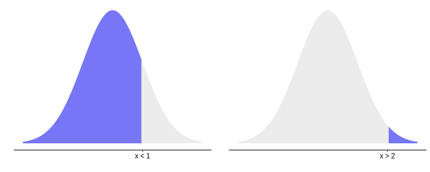

# Inferential statistics

```{r warning = FALSE, message = FALSE, echo = FALSE}
library(tidyverse)
library(ggpubr)
library(here)
library(rstatix)

theme_set(theme_pubr())
```


From a conceptual point of view, this week's module might just be the most important that we cover in this subject. I don't say that to freak you out, but in many ways it just is the genuine truth. The reason that this might be the most important one is because the topics that we cover in this module are ones that many people frequently misunderstand or misappropriate - to the point of scientific fraud. 

Inferential statistics are the subject of very heated debate in statistics, primarily about whether p-values and the like are really the right way to do science and statistics. We won't really go there because that's neither here nor there in terms of what the aim of this module really is: to not only show you one way of hypothesis testing, but to also equip you with the knowledge needed to understand how other people test hypotheses - or, sometimes, fail to do so.

Before you go into this module - make sure that you have 5.4 Variability, 5.5 Distributions and 5.6 Central Limit Theorem firmly under your belt as they will be relevant here.

By the end of this module you should be able to:

-    Describe the steps taken to test a statistical null and alternative hypothesis
-    Correctly define a p-value
-    Explain the difference between Type I and Type II error, and how these relate to statistical power
-    Construct a basic confidence interval for a point estimate, and interpret it

```{r echo = FALSE, fig.align= 'center', fig.cap = "[xkcd: Null Hypothesis](https://xkcd.com/892/)"}
knitr::include_graphics("https://imgs.xkcd.com/comics/null_hypothesis.png")
```

## The logic of hypothesis testing

<div style="background-color: #f5f5f5;  padding: 1.75rem;">
Central to all statistical testing is the underlying logic of hypothesis testing. All of the statistical tests that we cover in this module are built on this logic - and so it marks a great place for us to start our venture into inferential statistics.
</div>

### Revisiting the hypotheses

In Module 4 on Canvas, you will have had the chance to write your own hypothesis. This hypothesis guides the overall research and methodological design of our studies. However, you may have noticed that the hypotheses discussed in the video are not quite in the same format. This is because 'hypothesis' in this context refers to statistical hypotheses.

Statistical hypotheses are formal statements that we use when testing for an effect. As mentioned in the video above, we propose two contrasting hypotheses when we want to do statistical testing:

-    The null hypothesis ($H_0$) - that there is no effect or difference
-    The alternative hypothesis ($H_1$) - that there is an effect or difference

We can never know for sure whether one hypothesis is correct over the other. Instead, we choose to either reject or not reject the null hypothesis.


### The issue of tails


There are two main types of alternative hypotheses:

-    Two-tailed: we hypothesise that something is happening regardless of whether it's greater, smaller, increasing, decreasing etc...
-    One-tailed: we hypothesise that the effect has a direction

In a two-tailed hypothesis, we predict that an effect is occuring but we don't predict anything beyond that. For example, if we are comparing whether two groups are different our alternative hypothesis would be that they are different - but we don't predict whether group A will be bigger than group B or vice versa. These are sometimes called non-directional hypotheses.

The blue areas on the curve on the right represent a 0.05 level of signifiance for a two-tailed hypothesis test. This is essentially how likely it is that we would observe our effect/difference if nothing was happening. If a difference is large enough that it falls within these blue tails, it is statistically significant. This is because if nothing really was happening, it would be unlikely that we see an effect/difference this big. Therefore, we would choose to reject the null hypothesis at this would fall below our chosen significance level.

```{r echo = FALSE, warning = FALSE}
z_scores <- data.frame(
  x = seq(-3, 3, by = 0.01),
  y = dnorm(seq(-3, 3, by = 0.01))
)

ggplot(data = z_scores, aes(x, y)) + geom_line() +
  stat_function(fun = dnorm, xlim = c(-3, -1.96), geom = "area", fill = "blue", colour = "blue", alpha = 0.5) +
  stat_function(fun = dnorm, xlim = c(1.96, 3), geom = "area", fill = "blue", colour = "blue", alpha = 0.5)
```


In a one-tailed hypothesis, we predict that the effect exists in a specific direction (hence, they are directional hypotheses). For example, we might predict that Group A is bigger than Group B. Or, we might predict that as X increases, Y increases too. 

The two curves below show the significance levels for one-tailed hypotheses. If we predicted that Group A was smaller than Group B, we would only reject the null hypothesis if Group A really was smaller than Group B, and this difference was large enough to be statistically significant (i.e. within one of the green tails).


```{r echo = FALSE, warning = FALSE}


cowplot::plot_grid(
  ggplot(data = z_scores, aes(x, y)) + geom_line() +
    stat_function(fun = dnorm, xlim = c(-3, -1.645), geom = "area", fill = "darkgreen", colour = "darkgreen", alpha = 0.5) ,
  
  ggplot(data = z_scores, aes(x, y)) + geom_line() +
    stat_function(fun = dnorm, xlim = c(1.645, 3), geom = "area", fill = "darkgreen", colour = "darkgreen", alpha = 0.5),
  ncol = 2
  ) 
```


## p-values

<div style="background-color: #f5f5f5;  padding: 1.75rem;">
At one point, the video on the previous page talks about 'levels of significance' - what does this actually mean? Here, we'll talk about the p-value - one of the most commonly used, and possibly abused, concepts in research and statistics. We'll talk about what the p-value actually means, and tie it to two related concepts later in this module: error and statistical power.
</div>

### The definition of the p-value

The definition of the p-value is the following (APA Dictionary, 2018):


>"in statistical significance testing, the likelihood that the observed result would have been obtained if the null hypothesis of no real effect were true."

What does this actually mean? We actually already touched on this in the previous page, but let's dig a bit deeper. 

### A brief probability primer, and how this relates to p-values

To start with, a p-value is a probability. A probability, of course, ranges from 0 to 1; 0 (0%) representing an impossible result, and 1 (100%) representing a certain result. Probabilities can be conditional, meaning that they are dependent on a certain condition being true. A p-value is a conditional probability. Specifically, a p-value refers to the probability of getting a particular result, assuming the null hypothesis. To illustrate what we mean, consider the two graphs below, showing some example data as points.

```{r echo = FALSE}
knitr::include_graphics(here("img", "null_alt.svg"))
```

On the right is an example of what one possible alternative hypothesis might look like - that this data is meaningfully represented by two underlying distributions or groups, and that there is a difference between these two groups (shown as the blue and red curves). Contrast that with the left graph, where we hypothesise that there is no difference - in other words, that the data can be captured by the one distribution. This graph on the left is a representation of our null hypothesis, and as per the definition of the p-value, this is the distribution we focus on.

```{r echo = FALSE}

```

The area shaded blue represents the probability of getting that specific result. In the left example, the area shaded represents the probability of getting a value lower than x = 1. You can see that the blue area is quite big, so the probability of getting a value lower than 1 is quite high. On the right hand side is another example, which represents the probability of getting a value of x higher than 2. Here, the shaded area is small, so the associated probability is low.

Now, recall the following figure from last week:

```{r fig.align = "center", echo = FALSE}
norm_data <- data.frame(
  x = seq(-3, 3, length = 1001)
  ) %>%
  mutate(
    y = dnorm(x)
  )


ggplot(norm_data, aes(x, y)) + geom_line(linewidth = 1, colour = "transparent") +
  stat_function(fun = dnorm, xlim = c(1.96, 3), geom = "area", fill = "#556F44", alpha = 0.8, colour = "#556F44") +
  stat_function(fun = dnorm, xlim = c(-1.96, 1.96), geom = "area", fill = "#95BF74", alpha = 0.8, colour = "#95BF74") +
  stat_function(fun = dnorm, xlim = c(-3, -1.96), geom = "area", fill = "#556F44", alpha = 0.8, colour = "#556F44") +
  annotate("text", x = 0, y = 0.2, label = "95%") +
  annotate("text", x = 2.5, y = 0.05, label = "2.5%") +
  annotate("text", x = -2.5, y = 0.05, label = "2.5%") +
  theme_pubr() +
  labs(x = "Standard deviations", y = "") +
  theme(
    panel.grid.major = element_blank(), 
    panel.grid.minor = element_blank(),
    panel.background = element_rect(fill = "transparent",colour = NA),
    plot.background = element_rect(fill = "transparent",colour = NA),
    axis.line.y = element_blank(),
    axis.text.y = element_blank(),
    axis.ticks.y = element_blank()
  ) +
  scale_x_continuous(breaks = c(-1.96, 0, 1.96))
```

We established last week that on a normal distribution, 95% of the data lies within a certain range of values. Obtaining values beyond these thresholds (1.96 standard deviations either side of the mean) account for a relatively small percentage of possible values. In other words, the probability of getting a value beyond these bounds (in the figure above, where the dark green areas are) **is low**.

This is basically the thinking we use when we calculate a p-value. Let's break down the steps:

1.    We first **assume the null hypothesis is true**, and so we use the distribution of the null hypothesis to calculate the probability of getting our result or greater.
2.    To figure out where our result(s) sits on this null distribution, we calculate a **test statistic**. This test statistic is essentially a value that represents where our data sits on the test (null) distribution. Each test statistic is calculated in a different way because every distribution looks different, so we'll come back to this over the next couple of weeks.
3.    Afterwards, we calculate the probability of getting our test statistic (or greater) using a similar logic to the example above. This probability is our p-value. This marks the probability of observing this result or greater.
4.    Once we have a p-value we then compare this against **alpha**, which is our chosen significance level (usually p = .05). If the probability of getting our result is smaller than this (pre-defined) cutoff, it means that it is unlikely assuming the null hypothesis is true, and therefore our result is statistically significant and we **reject the null hypothesis. **

So in essence, if a p-value is p = .05 we're saying that assuming the null is true, there is a 5% chance of observing this result or greater. Likewise, an extremely small p-value (e.g. p = .0000000001) means that assuming the null is true, the probability of getting the data we have is extremely small. The logic, therefore, is that there must be an alternative explanation.

To clarify, the example above is just on a normal distribution - each statistical test we perform has its own (null) distribution, which we will talk about more in future modules. However, the rationale across tests is essentially the same.


<div style="background-color: #f5f5f5;  padding: 1.75rem;">
### The debate around p-values
Throughout history, p-values have been so misunderstood and misappropriated that some journals, such as Basic and Applied Social Psychology, actually either discourage or outright ban the reporting of p-values. This ties into a wider debate about the usefulness or meaningfulness of the hypothesis testing approach outlined on the previous page, with a number of academics and scientists arguing that it is time to do away with the system as a whole.

The debate is something that goes beyond the scope of the subject, so we won't be taking a strong stand on it either way. What we do think though is that it's really important that you understand how hypothesis testing works and what p-values can or can't tell you.
</div>

## Types of error

<div style="background-color: #f5f5f5;  padding: 1.75rem;">
Nothing in life is perfect, and that applies to the inferential statistics that we do. Every sample will differ slightly from one to another due to inherent sampling error; in a similar way, whenever we do an inferential test about a population from a sample, we always run the risk of making an error in the decisions that we make.
</div>

### Statistical error

Imagine an old man is seeing his local GP complaining of a headache. Upon examination, the doctor concludes that the old man is pregnant. 

A pregnant woman in her last trimester then comes in to the same GP. Despite her numerous pregnancy-related complaints, the doctor concludes that she is not pregnant. 

Both of these scenarios (while hopefully very unlikely!) are obviously forms of errors on the doctor's part. In the first scenario, the doctor has accepted a diagnosis that is very clearly wrong. In the second scenario, the doctor has rejected the correct diagnosis.

The same kind of logic applies directly to quantitative research. We want to be sure that when we observe a result, that result is actually likely. We therefore want to minimise the possibility of errors like above. 

We can draw a table to illustrate the possible outcomes when we perform a given hypothesis test:

```{r echo = FALSE}
data.frame(
  x = c("The null is true", "The alternative is true"),
  y = c("Correctly accept the null", "Type II error"),
  z = c("Type I error", "Correctly reject the null")
) %>%
  knitr::kable(
    col.names = c("", "Accept the null", "Reject the null")
  )
```


### Type I error and alpha

A moment ago we talked about alpha ($\alpha$), or the significance level, from the previous sections about hypothesis testing and the p-value. Alpha is the same here as it is there - it is the probability of making a Type I error - that we incorrectly reject the null hypothesis when the null hypothesis is actually true. Essentially, alpha is the rate of Type I error we're willing to accept whenever we do a hypothesis test.

We generally set alpha as *p* < .05 out of convention - i.e. most of the time, we're willing to accept a 5% chance of a Type I error rate. However, we can set alpha to anything we want. Sometimes, we may set it lower (more on this in a few weeks' time). 

## Statistical power

<div style="background-color: #f5f5f5;  padding: 1.75rem;">
Another related but crucial consideration for inferential statistics is the concept of statistical power. Without spoiling too much about what it means here, below is an overview of what this concept is and why it is important.
</div>

### Statistical power

Power in a statistical context essentially describes how likely we are to actually detect an effect given our sample size. Mathematically, power is defined as $1 - \beta$, which in English terms means that it is the probability of not making a Type II error. Power is expressed as a percentage. For example, if your study has 50% power, it means it has an 50% chance of actually detecting an effect. The most common guideline is to aim for a study with 80% power.

 
### Factors that affect power

The primary factor (within your control) that affects how much statistical power you have to detect an effect is sample size. Think back to the formula for standard error, as a proxy explanation as to why this is the case. Larger samples tighten the sampling distribution of the mean, and so two distributions will overlap less and less the greater the sample sizes are. Therefore, if there is less overlap there is greater space to detect an effect.

Some other factors that can affect power are:

-    The effect size - how large is the difference between your groups, etc? If you're trying to detect very small effects, you need much more power to detect it compared to larger ones. 
-    Performing a one-tailed test - because effects are only being tested in one direction, this alters the p-value (it actually halves it; a two-tailed p = .10 is a one-tailed p = .05). Don't do this though, because there are very few instances in which you can justify using a one-tailed test without reviewers and other clued-in readers suspecting that you're intentionally fudging your power.
-    Increase alpha - for a semi-detailed explanation of why, see here. In addition, there is a nifty tool here that lets you see what happens to error rates when you change specific parameters: Link to the tool 

The consequence of being underpowered means that you can miss effects that exist. A good proportion of studies in psychology are underpowered, meaning that effects are being missed where they exist. Power is therefore an integral consideration of good study design, particularly for experimental contexts.

<iframe src="https://unimelb.h5p.com/content/1291912330028426389/embed" aria-label="W6_error" width="1088" height="637" frameborder="0" allowfullscreen="allowfullscreen" allow="autoplay *; geolocation *; microphone *; camera *; midi *; encrypted-media *"></iframe><script src="https://unimelb.h5p.com/js/h5p-resizer.js" charset="UTF-8"></script>

### Power analyses

Identifying an appropriate level of statistical power is an important part of planning quantitative research. Before conducting a study, it is wise to run a power analysis. Doing a power analysis allows you to identify how many participants you may need in order to reliably detect an effect of a given size. 

Most modern statistics software will allow you to conduct power analyses:

-    SPSS (from version 27)
-    Jamovi (with the jpower module)
-    R (with the `pwr` package, among many others)

We won't get too into the maths here of how this is done (it heavily depends on your research design, e.g. how many groups you have, what test you plan on doing...). These programs will let you select the appropriate design you want to test, and choose the size of the effect you want and your alpha level. The power analysis will then give you a minimum sample size per group for you to achieve that level of statistical power.

 
### Post-hoc power analyses

You might see authors in some papers where you present a power analysis after collecting your sample and doing your analyses. Supposedly, this is to show that your sample had enough power to detect an effect. However, this is conceptually flawed. The primary flaw is that post-hocs are essentially just restatements of your p-values and so do little to show the true power of a design/test.


## Confidence intervals

<div style="background-color: #f5f5f5;  padding: 1.75rem;">
As we saw on the page about p-values, some people are vocal about their distaste for relying solely on p-values for decision making. One way of augmenting our estimates is to calculate a confidence interval for each estimate we make. Confidence intervals provide an estimate of the precision of our estimate, and so are a crucial concept to know about.
</div>

### A reminder from the previous module

It's time to force you to remember what the graph below means once again (I promise this is the last time you will see this figure! I think). By now you should be very familiar with what this graph shows; namely, that 95% of the data in a normal distribution lies within 1.96 standard deviations either side of the mean, yada yada. 

```{r echo = FALSE, fig.align = "center", fig.dim = c(8, 4), warning = FALSE}


normdist_1 <- ggplot(norm_data, aes(x, y)) + geom_line(linewidth = 1, colour = "transparent") +
  stat_function(fun = dnorm, xlim = c(1.96, 3), geom = "area", fill = "#556F44", alpha = 0.8, colour = "#556F44") +
  stat_function(fun = dnorm, xlim = c(1, 1.96), geom = "area", fill = "#659B5E", alpha = 0.8, colour = "#659B5E") +
  stat_function(fun = dnorm, xlim = c(0, 1), geom = "area", fill = "#95BF74", alpha = 0.8, colour = "#95BF74") +
  stat_function(fun = dnorm, xlim = c(-1, 0), geom = "area", fill = "#95BF74", alpha = 0.8, colour = "#95BF74") +
  stat_function(fun = dnorm, xlim = c(-1.96, -1), geom = "area", fill = "#659B5E", alpha = 0.8, colour = "#659B5E") +
  stat_function(fun = dnorm, xlim = c(-3, -1.96), geom = "area", fill = "#556F44", alpha = 0.8, colour = "#556F44") +
  geom_segment(aes(x = 0, y = 0, xend = 0, yend = max(y)), colour = "#556F44") +
  annotate("text", x = 0.5, y = 0.2, label = "34.1%") +
  annotate("text", x = -0.5, y = 0.2, label = "34.1%") +
  annotate("text", x = 1.5, y = 0.05, label = "13.6%") +
  annotate("text", x = -1.5, y = 0.05, label = "13.6%") +
  annotate("text", x = 2.5, y = 0.05, label = "2.1%") +
  annotate("text", x = -2.5, y = 0.05, label = "2.1%") +
  theme_pubr() +
  labs(x = "Standard deviations", y = "") +
  theme(
    panel.grid.major = element_blank(), 
    panel.grid.minor = element_blank(),
    panel.background = element_rect(fill = "transparent",colour = NA),
    plot.background = element_rect(fill = "transparent",colour = NA),
    axis.line.y = element_blank(),
    axis.text.y = element_blank(),
    axis.ticks.y = element_blank()
  ) +
  scale_x_continuous(breaks = c(-1.96, 0, 1.96))

normdist_2 <- ggplot(norm_data, aes(x, y)) + geom_line(linewidth = 1, colour = "transparent") +
  stat_function(fun = dnorm, xlim = c(1.96, 3), geom = "area", fill = "#556F44", alpha = 0.8, colour = "#556F44") +
  stat_function(fun = dnorm, xlim = c(-1.96, 1.96), geom = "area", fill = "#95BF74", alpha = 0.8, colour = "#95BF74") +
  stat_function(fun = dnorm, xlim = c(-3, -1.96), geom = "area", fill = "#556F44", alpha = 0.8, colour = "#556F44") +
  annotate("text", x = 0, y = 0.2, label = "95%") +
  annotate("text", x = 2.5, y = 0.05, label = "2.5%") +
  annotate("text", x = -2.5, y = 0.05, label = "2.5%") +
  theme_pubr() +
  labs(x = "Standard deviations", y = "") +
  theme(
    panel.grid.major = element_blank(), 
    panel.grid.minor = element_blank(),
    panel.background = element_rect(fill = "transparent",colour = NA),
    plot.background = element_rect(fill = "transparent",colour = NA),
    axis.line.y = element_blank(),
    axis.text.y = element_blank(),
    axis.ticks.y = element_blank()
  ) +
  scale_x_continuous(breaks = c(-1.96, 0, 1.96))


cowplot::plot_grid(normdist_1, normdist_2)
```

This sounds all well and good, but this provides us with some useful information. If all that business about values within 1.96 standard deviations is still fresh in your mind, this next statement should be a no-brainer: if 95% of our data on a normal distribution lies within 1.96 SD either side of the mean, that means that there is a certain range of values that 95% of our data falls in. 

For example, say we have a sample of scores on a test, with a mean of 70 and a standard deviation of 4. If we want to know where 95% of the scores lie in this sample, we would do the following calculation:

$$
95\% \ range = M \pm (1.96 * SD)
$$

Using this formula, we can calculate the values where 95% of the data lie:

$$
95\% \ range = M \pm (1.96 * SD)
$$
$$
70 \pm 7.84
$$

$$
= 62.16, 77.84
$$
In other words, 95% of our data in this sample lie between 62.16 and 77.84. The remaining 5% of the sample lie above or below these values.

### Confidence intervals

We can use the same principle to make inferences about the true population parameter. When we take a sample, each one will have its own standard error (remember this reflects an estimate of the distance between the sample mean and the true population mean). If we were to repeatedly take samples, in the long run we would expect the true population mean to fall within 95% of all sample means. And, just like the normal distribution, when we look at the sampling distribution of the means below, 95% of all sample means will fall within 1.96 standard errors (thanks to the Central Limit Theorem).

```{r echo = FALSE, fig.align = "center"}
norm_data <- data.frame(
  x = seq(-3, 3, length = 1001)
  ) %>%
  mutate(
    y = dnorm(x)
  )


ci_figure <- ggplot(norm_data, aes(x, y)) + geom_line(linewidth = 1, colour = "transparent") +
  stat_function(fun = dnorm, xlim = c(1.96, 3), geom = "area", fill = "#3d7ab8", alpha = 0.8, colour = "#3d7ab8") +
  stat_function(fun = dnorm, xlim = c(-1.96, 1.96), geom = "area", fill = "#7fbaf5", alpha = 0.8, colour = "#7fbaf5") +
  stat_function(fun = dnorm, xlim = c(-3, -1.96), geom = "area", fill = "#3d7ab8", alpha = 0.8, colour = "#3d7ab8") +
  annotate("text", x = 0, y = 0.2, label = "95% of sample means\nwill fall within this range") +
  # annotate("text", x = 2.5, y = 0.05, label = "2.5%") +
  # annotate("text", x = -2.5, y = 0.05, label = "2.5%") +
  theme_pubr() +
  labs(x = "Standard errors", y = "") +
  theme(
    panel.grid.major = element_blank(), 
    panel.grid.minor = element_blank(),
    panel.background = element_rect(fill = "transparent",colour = NA),
    plot.background = element_rect(fill = "transparent",colour = NA),
    axis.line.y = element_blank(),
    axis.text.y = element_blank(),
    axis.ticks.y = element_blank()
  ) +
  scale_x_continuous(breaks = c(-1.96, 0, 1.96))

ci_figure
```

With this important property in mind, we can calculate a 95% confidence interval. This is an estimate of the range of values for our estimate of the parameter. In other words, it is a measure of precision. The formula for a 95% confidence interval, as it turns out, is exactly the same as above with one change:

$$
95\% CI = M \pm (1.96 \times SE)
$$

Therefore, if we have an estimate of a population parameter (e.g. what the population mean is), we can use a 95% CI around that estimate to quantify the precision/uncertainty of that estimate. If a confidence interval is narrow, it suggests our estimate is quite precise. 

This can be extremely informative: not only can we use CIs to infer whether an effect is significant or not, but now they quantify *how* precise our estimates are. For example, pretend that we have a null hypothesis that a parameter is equal to 0 (as is usually the case). If we calculate a confidence interval and that happens to include the value of 0 (e.g. 95% CI: [-0.5, 1.5]), we can immediately infer that 0 is a likely value for this parameter - and thus, the null hypothesis is plausible. On the other hand, if the CI did not include 0 then we could infer that there likely is a significant effect.

Likewise, a CI of something like [0.5, 0.8] compared to a CI of [0.2, 20.5] tells us that the former is a much more precise of a parameter estimate than the latter.

Not all confidence intervals though will contain the true parameter purely because of how samples work (i.e. the inherent error between a sample and a population). In addition, it does not mean that there is a 95% chance a single interval will contain the true parameter. So what does the 95% part refer to?

### Confidence

The confidence level is a long-run probability that a group of confidence intervals will contain the true population parameter. A 95% confidence level means that if we were to take samples repeatedly and calculate a CI for each one, 95% of those CIs will contain the true population parameter in the long-run. 

Or, say if you were to take 100 samples and calculate a CI for each one, 95 of them would include the true population parameter:

```{r echo = FALSE, fig.dim = c(12, 4)}
samples <- vector("list", 100)
set.seed(2024)
population <- tibble(
  x = seq(35, 65, by = .01),
  y = rnorm(length(x), mean = 50, sd = 8),
  z = seq(1:length(x))
) 
```

```{r echo = FALSE, fig.dim = c(12, 4)}
samples <- vector("list", 100)
names(samples) <- seq(1:100)
for (i in 1:100) {
  samples[[i]] <- sample(population$y, 40)
}

samples <- do.call("rbind", samples) 
samples <- t(samples)

samples <- data.frame(samples)
colnames(samples) <- seq(1:100)

samples <- samples %>%
  pivot_longer(cols = everything(),
               names_to = "sample",
               values_to = "x") %>%
  mutate(sample = as.numeric(sample)) %>%
  group_by(sample) %>%
  summarise(
    mean = mean(x),
    sd = sd(x),
    se = sd/sqrt(40),
    ci_lower = mean - 1.96 * se,
    ci_upper = mean + 1.96 * se
  ) %>%
  ungroup() %>%
  rowwise() %>%
  mutate(
    contained = if_else(between(50, ci_lower, ci_upper), 1, 0)
  )

samples %>%
  ggplot(aes(x = sample, y = mean, colour = factor(contained, labels = c("No", "Yes")))) +
  geom_point(size = 3) +
  geom_errorbar(aes(ymin = ci_lower, ymax = ci_upper), width = 0.1) +
  ylim(35, 65) +
  geom_hline(yintercept = 50, linetype = "dashed") +
  labs(x = "Sample", y = "Estimate", colour = "Does 95% CI contain population mean?") +
  scale_x_continuous(breaks = seq(10, 100, by = 10)) +
  scale_colour_manual(values = c("red", "seagreen3"))
```

The 95% long-run probability **does not change** with sample size. What does change, however, is the **precision** of the estimates. This makes sense if you remember the formula for standard error, which divides by the square root of *n*. A larger *n* will lead to lower SE, and thus narrower confidence intervals. Below is an example with a much larger sample size. Notice how the confidence intervals are now much smaller:

```{r echo = FALSE, fig.dim = c(12, 4)}
samples <- vector("list", 100)
names(samples) <- seq(1:100)
for (i in 1:100) {
  samples[[i]] <- sample(population$y, 300)
}

samples <- do.call("rbind", samples) 
samples <- t(samples)

samples <- data.frame(samples)
colnames(samples) <- seq(1:100)

samples <- samples %>%
  pivot_longer(cols = everything(),
               names_to = "sample",
               values_to = "x") %>%
  mutate(sample = as.numeric(sample)) %>%
  group_by(sample) %>%
  summarise(
    mean = mean(x),
    sd = sd(x),
    se = sd/sqrt(300),
    ci_lower = mean - 1.96 * se,
    ci_upper = mean + 1.96 * se
  ) %>%
  ungroup() %>%
  rowwise() %>%
  mutate(
    contained = if_else(between(50, ci_lower, ci_upper), 1, 0)
  )

samples %>%
  ggplot(aes(x = sample, y = mean, colour = factor(contained, labels = c("No", "Yes")))) +
  geom_point(size = 3) +
  geom_errorbar(aes(ymin = ci_lower, ymax = ci_upper), width = 0.1) +
  ylim(35, 65) +
  geom_hline(yintercept = 50, linetype = "dashed") +
  labs(x = "Sample", y = "Estimate", colour = "Does 95% CI contain population mean?") +
  scale_x_continuous(breaks = seq(10, 100, by = 10)) +
  scale_colour_manual(values = c("red", "seagreen3"))
```


The choice of 95% is conventional, like alpha (our significance criterion); we can (but often don't) change our level of confidence. This changes the relevant formula for calculating the interval, as in the examples below:

$$
90\% CI = M \pm (1.645 \times SE)
$$

$$
99\% CI = M \pm (2.576 \times SE)
$$

Notice that the value we multiply the SE by has changed. If you have been especially observant so far, you may have figured out what these values are: they're z-scores!

<div style="background-color: #f5f5f5;  padding: 1.75rem;">
### Confidence intervals in literature

On the page about *p*-values, I left a brief note around some of the current discourse around the usefulness (or uselessness) of *p*-values. Proponents of getting rid of *p*-values/moving away from them advocate strongly for two alternatives: a) effect sizes (self-explanatory; we will come to this) and b) confidence intervals, to show the range of long-run plausible values for the estimate.

Again, we won't be taking an especially strong stance either way. That being said, it is now fairly common practice to report 95% confidence intervals alongside the results of significance tests for transparency. Programs like Jamovi will usually calculate these intervals automatically for you.
</div>
