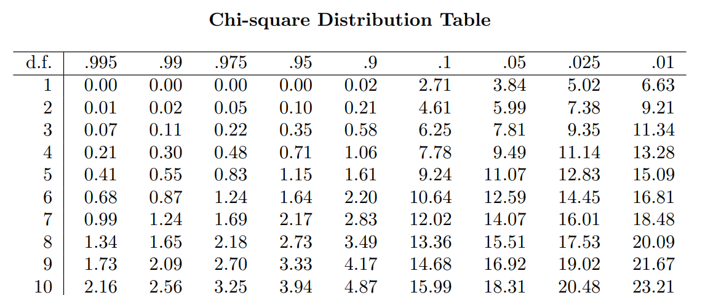
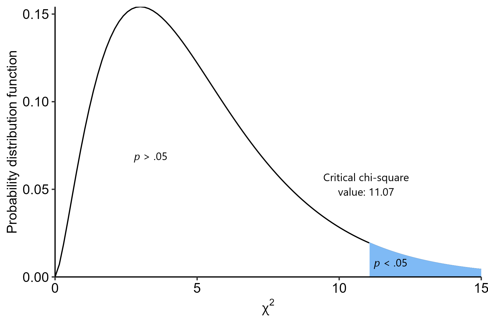

# (PART) Basic inferential tests {-}

# Chi-squares

```{r warning = FALSE, message = FALSE, echo = FALSE}
library(tidyverse)
library(ggpubr)
library(here)

# i_am("code/bookdown/04-chisquares.Rmd")
```

```{css echo = FALSE}
.math {
  font-size: x-large;
}
```

While many of the things we are interested in when it comes to psychological research are continuously distributed (height, weight, reaction time, personality), there are many instances where we will need to work with data that is categorical. This can involve categorical independent variables (e.g. assigning participants to one or two groups) or categorical outcomes (e.g. responding yes or no). We'll start with looking at relationships between these categorical variables, and testing for significant associations.

This module will see you diving deep into Jamovi again - so be prepared to get hands on with a bunch of data! Between the seminar, the worked examples and exercises there are at least 6 different datasets to play around with for this week!

By the end of this module you should be able to:

-    Describe how a chi-square statistic is calculated
-    Conduct two forms of chi-square tests: goodness-of-fit and tests of independence
-    Calculate and interpret an appropriate effect size for tests of independence

```{r echo = FALSE, fig.align = "center", fig.cap = "[xkcd: Question](https://xkcd.com/1448/)"}
knitr::include_graphics("https://imgs.xkcd.com/comics/question_2x.png")
```


## Calculating a chi-square

<div style="background-color: #f5f5f5;  padding: 1.75rem;">
We'll start this module off by briefly going through the basics of what research designs suit chi-square tests, as well as the basic maths underlying the first part of the statistical test.
</div>

### Categorical data

As mentioned at the start of this module, chi-square tests are used when we work with **categorical data** - i.e., when we are dealing with *counts* of items or people, rather than continuous variables. Research questions focused on relationships or associations among categorical variables are suited to chi-square tests. 

Every categorical variable will have **levels** (categories) within them. These are the different values that categorical variable can be. For example, biological sex is often coded with two levels: male and female. Or perhaps you might categorise socioeconomic status into three levels: low, medium and high bands. This is something that can form a core part of your research design. The most basic example is asking participants what their biological sex is - participants will respond with one of the two categories.

Alternatively, you can *create* categories from existing data. For example, many scales designed to assess psychological disorders such as depression and anxiety often have 'cutoff' points, where a certain score on the scale is indicative of a possible disorder. If you have everyone's raw scores, you can convert these scores into categories depending on whether they are above or below these cutoff points (though this needs to be strongly justified).

All of this kind of data are amenable to chi-square tests, *if* you are interested in relationships between categorical variables. The family of chi-square tests basically work by comparing the **observed values to** the **expected values**. As the names imply, observed value simply means the number of observations we have in each category or level (i.e. what our data actually is). Expected values, on the other hand, are the number of things we would *expect* to see under the null hypothesis.

We can visualise categorical variables in two basic ways: a) a **contingency table** or b) a **bar graph of counts**. Below is the same set of data, shown in both forms:

### The chi-square formula


To test whether a result is significant, remember that we need to calculate a test statistic, and see where that fits on its underlying distribution. Here, our test statistic is handily named the **chi-square statistic**. To calculate the chi-squared test statistic we use the following formula:

$$
\chi^2 = \Sigma \frac{(O-E)^2}{E}
$$

Where:

-   O = **observed value**

-   E = **expected** **value**

The English translation of that above formula can be described in four steps:

1.   Calculate observed count - expected count

2.  Square that difference

3.  Divide it by the expected count

4.  Do this for each cell, and add them all up

We'll look at this in more detail when we look at the actual tests. For the time being, here's the key takeaway: have a look at the two graphs below, representing the observed and expected values of two different datasets.

```{r fig.dim = c(8, 4), echo = FALSE}
a <- tibble(
  name = c("Observed", "Observed", "Expected", "Expected"),
  var = c("Morning", "Afternoon", "Morning", "Afternoon"),
  value = c(28, 40, 22, 51)
) %>%
  ggplot(
    aes(x = var, y = value, fill = fct_rev(name))
  ) +
  geom_col(position = "dodge") +
  theme_pubr() +
  labs(
    x = "Time of day",
    y = "Count",
    fill = "Variable"
  )


b <- tibble(
  name = c("Observed", "Observed", "Expected", "Expected"),
  var = c("Morning", "Afternoon", "Morning", "Afternoon"),
  value = c(20, 40, 22, 41)
) %>%
  ggplot(
    aes(x = var, y = value, fill = fct_rev(name))
  ) +
  geom_col(position = "dodge") +
  theme_pubr() +
  labs(
    x = "Time of day",
    y = "Count",
    fill = "Variable"
  )

cowplot::plot_grid(a, b)
```


Have a think about the following:

1.   What is each graph telling you?

2.   The left graph appears to show noticeable differences between the observed and expected values. Based on the mathematical formula above, what will happen to the chi-square value?

3.  Each graph represents one set of data. Based on your answers to a) and b) above, which one of the two would you expect to demonstrate a significant effect?

## The chi-square distribution

<div style="background-color: #f5f5f5;  padding: 1.75rem;">
On the previous page we introduced the formula for a chi-square test statistic. But what do we do with it? We'll go through this below in detail, given that this is the first time we're coming across an actual test. While a computer will do all of this stuff automatically, it's useful to know the actual mechanisms underlying the test.
</div>

### The chi-square distribution

Recall from Week 6 about how hypothesis tests work - we calculate a test statistic that conforms to a particular distribution, and we assess how likely our observed test statistic is (or greater) on this distribution, assuming the null hypothesis is true. This gives us the p-value for that test. With that in mind, the chi-square distribution that underlies the chi-square test looks something like this:

```{r echo = FALSE}
data <- tibble(
  x = seq(0, 15, by = .1),
  y1 = dchisq(x, df = 1),
  y2 = dchisq(x, df = 2),
  y3 = dchisq(x, df = 3),
  y4 = dchisq(x, df = 4),
  y5 = dchisq(x, df = 5),
  y6 = dchisq(x, df = 10),
  y7 = dchisq(x, df = 15),
  y8 = dchisq(x, df = 20),
  y9 = dchisq(x, df = 30)
) %>%
  pivot_longer(y1:y9,
               names_to = "df",
               values_to = "density") %>%
  mutate(
    df = factor(df, labels = c("df = 1", "df = 2", "df = 3",
                               "df = 4", "df = 5", "df = 10", 
                               "df = 15", "df = 20", "df = 30"))
  )

data %>%
  ggplot(
    aes(x = x, y = density, colour = df)
  ) +
  geom_line(linewidth = 1, show.legend = TRUE) +
  labs(
    x = expression(chi^2),
    y = "Probability distribution function",
    colour = "Degrees of freedom"
  ) +
  theme_pubr() +
  theme(legend.position = "right")
```

The shape of the chi-square distribution is only dependent on the degrees of freedom (*df*). We'll look at how to calculate degrees of freedom for various tests, including the family of chi-square tests, as we move along the subject.

Here is the same set of lines above, but shown in their own plot this time:


```{r echo = FALSE}
data <- tibble(
  x = seq(0, 15, by = .1),
  y1 = dchisq(x, df = 1),
  y2 = dchisq(x, df = 2),
  y3 = dchisq(x, df = 3),
  y4 = dchisq(x, df = 4),
  y5 = dchisq(x, df = 5),
  y6 = dchisq(x, df = 10),
  y7 = dchisq(x, df = 15),
  y8 = dchisq(x, df = 20),
  y9 = dchisq(x, df = 30)
) %>%
  pivot_longer(y1:y9,
               names_to = "df",
               values_to = "density") %>%
  mutate(
    df = factor(df, labels = c("df = 1", "df = 2", "df = 3",
                               "df = 4", "df = 5", "df = 10", 
                               "df = 15", "df = 20", "df = 30"))
  )

data %>%
  ggplot(
    aes(x = x, y = density, colour = df)
  ) +
  geom_line(linewidth = 1, show.legend = FALSE) +
  labs(
    x = expression(chi^2),
    y = "Probability distribution function",
    colour = "Degrees of freedom"
  ) +
  facet_wrap(~df, scales = "free_y") +
  theme_pubr()
```


As you can hopefully see, the chi-square distribution is very heavily skewed at lower degrees of freedom (and therefore in smaller sample sizes). As degrees of freedom increase though, it approximates a normal distribution. For instance, here's what the chi-square distribution looks like when *df* = 100:

```{r echo = FALSE}
tibble(
  x = seq(0, 200, by = 1),
  y = dchisq(x, df = 100)
) %>%
  ggplot(
    aes(x = x, y = y)
  ) +
  geom_line(linewidth = 1) +
  labs(
    x = expression(chi^2),
    y = "Probability distribution function"
  ) +
  theme_pubr()
```


### Hypothesis testing in chi-squares

At this point, also recall that *p*-values are the probability that we would get our observed result (or greater), assuming the null hypothesis is true.

Here is our first application of this concept. When we use a chi-square test, we are performing the following basic steps:

1.    Establish null and alternative hypotheses
2.    Determine alpha level (in this case, $\alpha$ = .05 as always)
3.    Calculate our test statistic - here, this is the chi-square statistic
4.    Compare our chi-square test statistic against the chi-square distribution
5.    Calculate how likely we would have seen our chi-square value or greater on this distribution
     a.   Or, alternatively, establish a critical chi-square value - the value that must be crossed for a result to be significant

We'll expand on this more in the next couple of pages.


### Calculating significance

Let's say that we have a *df* of 5. How do we know where the critical chi-square value is?

For that, we consult a chi-square table. This table gives the critical chi-square value at a set degrees of freedom and alpha level. These are freely available online, but here's a short excerpt. To read this table:

-    The far-left column lists different degrees of freedom. We need to find the row that corresponds to *df* = 5.
-    Each column provides critical chi-squares at different alpha levels. We want to find the column that says .05.
-    The number at both of these points tells us the critical chi-square value.

```{r echo = FALSE}

```


So, for a *df* = 5 and an $\alpha$ = .05, the critical chi-square value is 11.07. If our own chi-square value is greater than this, the probability of that value or greater occurring (assuming the null) will be less than 5%; i.e. the boundary for statistical significance.

In picture form:

```{r echo = FALSE}

```


Hopefully that makes sense - this kind of logic is pretty much identical to the other tests that we will cover in the coming weeks!

## Goodness of fit

<div style="background-color: #f5f5f5;  padding: 1.75rem;">
Now that we've covered the conceptual groundwork for chi-square tests in general, we can now start looking at actual tests that can help us answer research questions. The most basic chi-square test is the goodness of fit test. 
</div>

### Goodness of fit tests

Goodness of fit tests are used when we want to compare a set of categorical data against a hypothetical distribution. Goodness of fit tests require one categorical variable - as the name implies, a goodness of fit test looks at whether the proportions of categories/levels in this variable fits an expected distribution. In other words, do our counts for each category match what we would expect under the null?

"Distribution" in this context means probability distributions, and can apply to a wide range of scenarios. For the purposes of what we're learning here, we'll stick to a question along the lines of: "do the categories of variable X align with their expected probabilities"?

### Example

An example question that we look at in the seminar is Do Skittle bags have an even number of each colour? In the seminar, we go through whether or not a random bag has an even split of colours.

Here on Canvas, we'll now tackle their equally delicious rivals, M&Ms. The data and analysis come courtesy of Rick Wicklin, a data analyst at SAS (who also make statistics software). You can read his full blog here: [The distribution of colors for plain M&M candies](https://blogs.sas.com/content/iml/2017/02/20/proportion-of-colors-mandms.html). We'll be recreating Rick's first analysis here. We're sticking with the candy theme because a) they're delicious and b) the M&Ms are a great way to introduce what to do when expected proportions are not equal.

M&Ms come in six colours: red, blue, green, brown, orange and yellow. Unlike Skittles, these colours are not distributed equally within each bag of M&Ms. In 2008, Mars (the parent company) published the following percentage breakdown of colours:

-    13% red
-    20% orange
-    14% yellow
-    16% green
-    24% blue
-    13% brown

Rick collected his data in 2017, and so was interested in seeing if the proportions observed in his 2017 sample of M&Ms aligned with the distribution of colours listed in 2008.

A goodness of fit is the perfect test for this scenario because:

-    We are making a claim about a distribution 
-    Our variable (colour) is categorical 
-    A chi-square goodness of fit will allow us to test whether the distribution of colours in a sample of M&Ms aligns with the published proportions.

Here's our dataset:

```{r warning = FALSE, message = FALSE}
mnm_data <- read_csv(here("data", "week_7", "W7_M&M.csv"))
head(mnm_data)
```
### Calculating \(\\\chi^2\)

In goodness of fit tests, we first calculated the expected frequencies. In this example though, the expected proportions aren't equal - and so we have to be mindful of this when calculating expected values. See the expected count cell for Red M&Ms for how expected value is worked out in this instance.

We can draw this up in table form alongside our own data: 


```{r echo = FALSE}
mnm_data %>%
  group_by(colour) %>%
  summarise(n = n()) %>%
  mutate(
    expected_prop = c(0.24, 0.13, 0.16, 0.20, 0.13, 0.14),
    expected = c(170.88, 92.56, 113.92, 142.4, 
      "$712 \\times 0.13 = 92.56$", 99.68
    )
  ) %>%
  knitr::kable(
    escape = "FALSE",
    col.names = c("Colour", "Observed", "Expected proportion", "Expected count")
    )
```

Then we would use the formula we saw on the previous page to calculate a chi-square statistic. However, since we're doing this in R we'll skip the manual maths.

$$
\chi^2 = \Sigma \frac{(O-E)^2}{E}
$$

If we have a look at the observed vs expected values, we might have a good idea of what's going on already:

```{r echo = FALSE}
mnm_data %>%
  group_by(colour) %>%
  summarise(observed = n()) %>%
  mutate(
    expected_prop = c(0.24, 0.13, 0.16, 0.20, 0.13, 0.14),
    expected = nrow(mnm_data) * expected_prop
    ) %>%
  pivot_longer(
    cols = c(observed, expected),
    names_to = "var",
    values_to = "value"
  ) %>%
  ggplot(
    aes(x = colour, y = value, fill = var)
  ) +
  geom_col(position = position_dodge()) +
  theme_pubr() +
  labs(fill = "", x = "Colour", y = "Count")
```


### Using R


Using Jamovi

By default, the `chisq.test()` function in R will assume that your categories have an equal chance of happening. However, in this instance we know that the colours are not evenly distributed. To ensure the proper probabilities are set beforehand, this needs to be specified by giving the `p` argument within `chisq.test()`. Note that the order of the expected probabilities needs to match the order they appear in the dataset (R will generally order these alphabetically unless told otherwise):

```{r}
# This pulls the relevant variable directly
w7_mnm_table <- table(mnm_data$colour)

w7_mnm_chisq <- chisq.test(w7_mnm_table, 
                            p = c(0.24, 0.13, 0.16, 0.20, 0.13, 0.14))
```

### Output

Here's what our output looks like. First is our table of proportions. This can be really useful in laying out the data and seeing where the differences between observed and expected proportions might lie.

```{r}
w7_mnm_chisq$observed
w7_mnm_chisq$expected
```


Next, here is our test output. The result is significant (*p* = .004), suggesting that the 2017 bag of M&Ms does not follow the same distribution of colours as the 2008 values. (If you read the rest of Rick's blog post, it turns out that somewhere between 2008 and 2017 they changed where M&Ms are made, and actually split production across two factories that produce different distributions of colours. Rick eventually found out that his bag most likely came from one of the plants, although Mars has not made these proportions public like they used to.)

```{r}
w7_mnm_chisq
```

## Tests of independence

<div style="background-color: #f5f5f5;  padding: 1.75rem;">
The next chi-square test we will cover is probably the most common - the chi-square test of independence. Here, we move from one categorical variable to two.
</div>

Chi square tests of independence are used when we want to test whether two categorical variables are associated with each other (i.e. show a relationship). Some examples of this question might take on the following:

-    Is smoking history (yes/no) associated with lung cancer diagnosis? (yes/no)
-    Is there an association between gender and employment status?

 
### Example scenario

We'll start off with a very basic example. In the below dataset, children from several schools were surveyed regarding what instrument they played. This dataset focuses on two instruments that have historically been seen as gendered (e.g. see Abeles 2009) - clarinet and drums. The sex of the child playing the instrument was also recorded.

Our research question is: is there an association between sex and instrument choice?

Dataset:

```{r}
instrument_data <- read_csv(here("data", "week_7", "W7_instruments.csv"))
head(instrument_data)
```
 
### Contingency tables

The primary way of 'drawing up' categorical data, particularly when two variables are involved, is to draw a contingency table. A contingency table is a two-way table that shows how many participants/items/objects fall under each combination of our two variables. Here is a contingency table of our data below:

```{r}
w7_instrument_table <- table(instrument_data$instrument,
                             instrument_data$sex)

w7_instrument_table  %>%
  addmargins()
```


 
### Expected frequencies

To calculate expected frequencies in a two-way contingency table (i.e. a test of independence), we use the following formula:

$$
E = \frac{R \times C}{N}
$$

Where R = row total and column = column total.

Let's put this into practice with girls who play the clarinet (highlighted above). The row total for this cell is 99 (i.e. total number of clarinet players). The column total is 57 (total number of girls). To calculate an expected value for this cell, we would therefore calculate the following:

$E = \frac{99 \times 57}{122}$ 

This works out to be roughly 46.25 - which means that we would expect roughly 46 female clarinet players. We then go through and calculate this for each cell, so that we have all of our expected values.

Once we've done that, we can then calculate our chi-square test statistic using the same formula as always:

$$
\chi^2 = \Sigma \frac{(O-E)^2}{E}
$$

 
### Output

Here's our output! Firstly, our contingency table:

```{r}
w7_inst_chisq <- chisq.test(w7_instrument_table, correct = FALSE)

w7_inst_chisq$observed
w7_inst_chisq$expected

```

 

Next is our chi-square test output. As you can see, our test of independence suggests a significant result (*p* = .03). In other words, we reject the null hypothesis that there is no association between instrument and sex.


```{r}
w7_inst_chisq
```

Lastly we have this output. Hold onto this for now - we'll look at this in more detail over the next page.


## Effect sizes for chi-squares

<div style="background-color: #f5f5f5;  padding: 1.75rem;">
This is the first time we're coming across effect sizes for any test - thankfully, we start with relatively easy ones to wrap your head around. We will cover two effect sizes: phi ($\phi$) and Cramer's *V*, both of which apply when conducting a test of independence.
</div>


### Phi

Phi ($\phi$) is an effect size for chi-squares that applies only to 2x2 designs. The formula for phi is:

$$
\phi = \sqrt{\frac{\chi^2}{n}}
$$

Essentially, it is the chi-square test statistic divided by the sample size, which is then square rooted. Again, it only works for 2x2 designs - i.e. each categorical variable can only have two categories within it.


### Cramer's V

Cramer's V is another effect size for chi-squares, but one that can be used for anything beyond a 2x2 design as well. The formula for Cramer's *V* is similar:


$$
V = \sqrt{\frac{\chi^2}{n(k-1)}}
$$
Here, *k* refers to the number of groups in the variable with the lowest number of groups. So for example, in a 2x3 design, one variable has 2 levels and the other has 3; *k* = 2 in this instance.

Phi and Cramer's *V* can both be calculated in R with the following functions from the `effectsize` package, a handy package that will calculate many common effect size measures. Like `chisq.test()`, both functions will work if you give them a contingency table. Helpfully, both functions calculate 95% CIs.

```{r}
effectsize::phi(w7_instrument_table, adjust = FALSE, alternative = "two.sided")
effectsize::cramers_v(w7_instrument_table, adjust = FALSE, alternative = "two.sided")
```


### Interpretation


Phi and Cramer's *V* are essentially both correlation coefficients (more on this in Week 10). Both phi and Cramer's *V* can only be between 0 and 1. For this subject, the size of Cramer's *V* and phi can be interpreted as follows:

-    If the effect size = .10, the effect is small
-    If effect size = .30, the effect is medium
-    If effect size = .50 or above, the effect is large


### Practice

Given the following results from a 2x2 chi-square test of independence:

-   $\chi^2$ = 5.45
-   *N* = 46

Calculate both phi and Cramer's *V*. (You should get the same answer, but have a go at trying it both ways!)


## Bonus: McNemar's Test

<div style="background-color: #f5f5f5;  padding: 1.75rem;">
The chi-square test of independence, as the name implies, relies on the assumption of independence - that variable A is statistically independent of B. But what happens if we have a relationship that doesn't meet this assumption? The most common kind is when data is *paired* or *repeated*, i.e. participants are measured on the same variable twice. McNemar's test allows us to apply chi-square techniques to this kind of data. 
</div>

### McNemar's test

**McNemar's test** is used for when you have repeated-measures categorical data. Specifically, it applies to a 2x2 repeated measures contingency table. This will apply when you have one sample tested **twice** on a **binary outcome**. The most common example of this is a yes/no outcome, before and after something (e.g. an intervention.

McNemar's test will apply to situations where you have one sample tested twice like this:

```{r echo = FALSE}
data.frame(
  var = c("", "Timepoint 1 - A", "Timepoint 1 - B", "Total"),
  var2 = c("", "", "", ""),
  var3 = c("", "", "", ""),
  var2 = c("", "", "", "")
) %>%
  knitr::kable(
    col.names = c("", "Timepoint 2 - A", "Timepoint 2 - B", "Total")
  )
```
 			

 
### Mathematical basis

Consider the table above. We can formulate the cells between each combination of predictors, and their totals, as follows:

```{r echo = FALSE}
data.frame(
  var = c("", "Timepoint 1 - A", "Timepoint 1 - B", "Total"),
  var2 = c("", "a", "c", "a + c"),
  var3 = c("", "b", "d", "b + d"),
  var2 = c("", "a + b", "c + d", "N")
) %>%
  knitr::kable(
    col.names = c("", "Timepoint 2 - A", "Timepoint 2 - B", "Total")
  )
```

Essentially, in this instance cell *a* represents the number of cases/participants in T1-A and T2-A, *b* is T1-A and T2-B etc etc. Each cell has two **marginal probabilities**, which are the row and column totals corresponding to that cell. Cell *a*, for example, has marginal probabilities of *a + b* (the row total) and *a + c* (the column total). Cell d has marginal probabilities of *c + d* and *b + d*. 

The null hypothesis in this scenario is that the **two marginal properties for each outcome are the same**. This is a principle known as marginal homogeneity. In essence, the McNemar test tests the hypothesis that the proportion of participants responding A beforehand is the same at that responding A afterwards. The marginal probability in this instance is a + b (proportion of response A at timepoint 1) and a + c (proportion of response A at timepoint 2).

The same hypothesis applies to the proportion of participant saying B before and after, corresponding to cell d. In this case, the marginal probabilities are c + d (time 1) and b + d (time 2).

We can express this null hypothesis like this:

$$
p_a + p_b = p_a + p_c
$$

$$
p_b + p_d = p_c + p_d
$$

We can simplify both equations by removing identical terms from both sides of the equation. You might see then that both equations cancel out to simply be:

$$
p_b = p_c
$$

That, in effect, is our null hypothesis - that the probability of cell b is identical to cell c! So now we can express our null and alternative hypotheses:

-   $H_0: p_b = p_c$
-   $H_1: p_b \neq p_c$
 

Our chi-square test statistic is calculated as follows:

$$
\chi^2 = \frac{(b-c)^2}{b+c}
$$

And then from here on, the process of deriving a p-value is identical to a regular chi-square test, with the exception that the df is always df = 1 (remember we have a 2 x 2 table, and the formula for a df in a two-way chi-square test is to subtract 1 from each and multiply them together).

 
### Example

Below is a fictional dataset from 70 registered voters in a fictional country. The 70 voters were asked whether they intended to vote for the current government twice: before event X happened in the government and after event X. Their responses were recorded as simple Yes-No answers.

```{r}
w7_voting <- read_csv(here("data", "week_7", "W7_voting.csv"))
```


Here is a contingency table of our data:

```{r}
w7_voting_table <- table(w7_voting$before, w7_voting$after) 

w7_voting_table %>%
  addmargins()
```


We can identify our b = 28 and our c = 11. We can calculate a relevant chi-squared test statistic using the formula above:

$$
\chi^2 = \frac{(b-c)^2}{b+c}
$$

$$
\chi^2 = \frac{(28-11)^2}{28+11}
$$
$$
\chi^2 = \frac{(17)^2}{39}
$$

$$
\chi^2 = 7.41
$$

If we were doing this fully by hand, we could consult a chi-squared table and see what the relevant p-value would be with this chi-squared value and a df = 1. However, we'll skip straight to Jamovi. A McNemar test can be run in R using the `mcnemar.test()` function in base R:

```{r}
w7_voting_mcn <- mcnemar.test(w7_voting_table, correct = FALSE)

w7_voting_mcn
```


The output looks like this, and confirms that there is a significant change in proportions before and after event ($\chi^2$(1, *N* = 70) = 7.41, *p* = .006). Based on the original values of *b* and *c*, we can infer that this might be because more people changed their vote from No -> Yes than the other way round.
