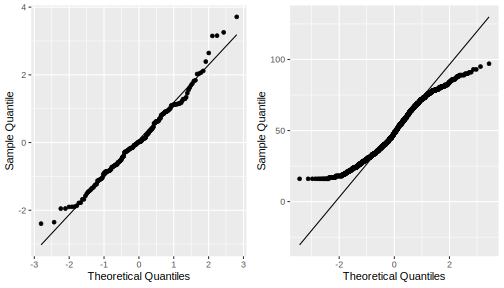

# t-tests

```{r warning = FALSE, message = FALSE, echo = FALSE}
library(tidyverse)
library(ggpubr)
library(here)
library(rstatix)
```

*t*-tests are usually one of the first families of statistical tests that students learn when they take a research methods subject. I (Dan) pretty much learnt only *t*-tests until my third year of my psychology major (I learnt chi-squares and other tests through taking separate statistics subjects through my uni's Department of Statistics before I learnt them in psychology). It's not hard to see why this is the case - *t*-tests are really intuitive and simple to conduct, and so are an accessible way into learning statistical tests (even though chi-squares are even easier).

The family of *t*-tests come into play when we have one categorical IV with two levels, and one continuous DV. As you can imagine, there are many instances where this kind of design comes into play, and you will see as much in the datasets and examples this week. There are nine datasets for you to play around this week (3 for each kind of test) - so hopefully that will give you plenty of practice!

By the end of this module you should be able to:

-   Describe how a t-test works in principle
-   Conduct three forms of chi-square tests: one-sample, independent-samples and paired-samples
-   Calculate and interpret an appropriate effect size for the above tests

```{r fig.cap = "[xkcd: Control Group](https://xkcd.com/2576/)", fig.align = "center", echo = FALSE}
knitr::include_graphics("https://imgs.xkcd.com/comics/control_group.png")
```


## *t*-tests and the *t*-distribution

We begin this week's module in much the same way we went through last week's. We'll look at the shape of the underlying distribution, and what determines the shape of that distribution. On this page we'll also go through what the basic premise of the *t*-test is.

### What is a *t*-test?

The family of *t*-tests, broadly speaking, are used when we want to compare one mean against another. This can take on three major forms, which we will go into later in the module:

1.  Is this sample mean different from the population mean?
2.  Are these two group means different?
3.  Is the mean at point 1 different to the mean at point 2?

All of these instances require a comparison between two means, which the *t*-tests will allow you to test for. So, in a general sense our hypotheses would be something like:

-   $H_0$: The means between the two groups are not significantly different. (i.e. $\mu_1 = \mu_2$)
-   $H_1$: The means between the two groups are significantly different. (i.e. $\mu_1 \neq \mu_2$)

The question of when *t*-tests should be used is hopefully somewhat obvious - in general, we use them we want to compare two means with each other. The important part is what kind of means they are:

-   If we compare one sample mean to a hypothesised population mean, this is a one-sample *t*-test
-   If we compare two group means, this is an independent samples *t*-test
-   If we measure one group twice and compare the two means, this is a paired-samples *t*-test.

In this module, we'll go through all three (but will emphasise the latter two especially as they see the most use).

### The *t*-statistic

Last week we introduced the chi-square statistic, which is the value that we use when we want to assess whether a result is significant. When we want to assess whether a difference between two means is significant we calculate a different test statistic, which (as the name implies) is the *t*-statistic. While you won't be required to calculate this by hand this week, it would be good to wrap your head around the below formula so you understand how it works in principle:

$$
t = \frac{M_1 - M_2}{SE}
$$

This is how *t* is calculated conceptually - it is the difference in the two means over the standard error of the mean. Note that the world conceptually is stressed here because the actual formula is slightly different for each *t*-test, but all work on this above principle. Again, we won't go through the maths of this in detail - this is beyond the scope of the subject!

### The *t*-distribution

By now, hopefully you're comfortable with the idea that we use our test statistic and find its position on its underlying probability distribution in order to calculate the *p*-value. The underlying distribution of this test is the *t*-distribution, which is depicted below. Note that like the chi-square distribution, degrees of freedom is the only parameter that determines its shape:

```{r fig.dim = c(8, 4), echo = FALSE}
t_data <- tibble(
  x = seq(-5, 5, length = 100),
  df_1 = dt(x, 1),
  df_2 = dt(x, 2),
  df_5 = dt(x, 5)
)


t_data %>%
  pivot_longer(
    cols = df_1:df_5,
    names_to = "df",
    values_to = "t"
  ) %>%
  mutate(
    df = factor(df, labels = c("df = 1", "df = 2", "df = 5"))
  ) %>%
  ggplot(
    aes(x = x, y = t, colour = factor(df))
  ) +
  geom_line(size = 1) +
  labs(
    x = "x",
    y = "Density",
    colour = "df"
  ) +
  theme_pubr()
  
```

The one key difference between the *t*-distribution and the chi-square distribution from a mathematical point of view is that the *t*-distribution is symmetrical, much like the normal distribution (although they are not the same). Therefore, it is possible to get a negative *t*-test statistic; however, this simply reflects the order in which the groups are being compared. E.g.

-   Say that Group 1 - Group 2 gives a test statistic of *t* = 1.5.
-   If you were to enter the groups as Group 2 - Group 1 instead, the *t* would be -1.5. This simply reflects the ordering of the groups.

### The *t*-table

Once again, like the chi-square we have a beautiful little table for calculating a critical *t*-value. We won't go into too much depth over how this works because it works exactly like how it does for chi-squares - find the row corresponding to your degrees of freedom, then find the column corresponding to your alpha level.

Yes, there are a lot of cross-references to what we covered last week with chi-squares - and that's a good thing! The point here is that conceptually, the process of testing hypotheses using *t*-tests is exactly the same as what we did with chi-squares, but the specific design and maths are different.

## Cohen's *d*

This might be starting to sound a little familiar by now, but here are some effect sizes for *t*-tests. Note that they're different to the Cramer's *V* we saw in the chi-square test of independence last week - this is because it is a) conceptually different and b) interpreted differently too.

### What is Cohen's *d*?

Cohen's d is a measure of effect size that is used when comparing between two means (i.e. in a *t*-test). It essentially is a measure of the distance between the two means. See below for three pairs of means:

```{r echo = FALSE, fig.dim = c(8, 2.5)}
small_effect <- ggplot(data = tibble(x = c(50, 90)), aes(x)) +
  stat_function(fun = dnorm, n = 101, args = list(mean = 70, sd = 5), colour = "blue", size = 2) + 
  stat_function(fun = dnorm, n = 101, args = list(mean = 71, sd = 5), colour = "red", size = 2) + 
  labs(x = "Scores", y = "") +
  scale_y_continuous(breaks = NULL) +
  theme(
    panel.grid.major = element_blank(), 
    panel.grid.minor = element_blank(),
    panel.background = element_rect(fill = "transparent",colour = NA),
    plot.background = element_rect(fill = "transparent",colour = NA)
  ) 

medium_effect <- ggplot(data = tibble(x = c(50, 90)), aes(x)) +
  stat_function(fun = dnorm, n = 101, args = list(mean = 69, sd = 5), colour = "blue", size = 2) + 
  stat_function(fun = dnorm, n = 101, args = list(mean = 71.5, sd = 5), colour = "red", size = 2) + 
  labs(x = "Scores", y = "") +
  scale_y_continuous(breaks = NULL) +
  theme(
    panel.grid.major = element_blank(), 
    panel.grid.minor = element_blank(),
    panel.background = element_rect(fill = "transparent",colour = NA),
    plot.background = element_rect(fill = "transparent",colour = NA)
  ) 

large_effect <- ggplot(data = tibble(x = c(50, 90)), aes(x)) +
  stat_function(fun = dnorm, n = 101, args = list(mean = 67, sd = 5), colour = "blue", size = 2) + 
  stat_function(fun = dnorm, n = 101, args = list(mean = 73, sd = 5), colour = "red", size = 2) + 
  labs(x = "Scores", y = "") +
  scale_y_continuous(breaks = NULL) +
  theme(
    panel.grid.major = element_blank(), 
    panel.grid.minor = element_blank(),
    panel.background = element_rect(fill = "transparent",colour = NA),
    plot.background = element_rect(fill = "transparent",colour = NA)
  ) 

cowplot::plot_grid(small_effect, medium_effect, large_effect, ncol = 3, labels = "AUTO")
```

If two groups aren't all that different (e.g. panel A), then any effect of group will be small or negligible. If the two groups are further apart, however (like panel C), there is a more obvious effect of group - and so the size of the effect itself will be larger. Cohen's *d* essentially is a measure of this 'distance'.

The basic formula for calculating Cohen's *d* is: 
$$
d = \frac{M_1 - M_2}{\sigma_{pooled}}
$$

In other words, Cohen's *d* is calculated by taking the difference between the two group means and dividing that by the pooled standard deviation across both groups. Pooled SD is essentially an aggregate SD across both groups in the sample, and not something we'll concern ourselves with this week (because like the maths for the *t*-statistic, the calculation of the pooled SD depends on the test and is hard).

### Interpreting Cohen's *d*

Cohen provided some now-famous guidelines for interpreting the size of Cohen's *d* values:

```{r echo = FALSE}
tibble(
  effect = c("d = .20", "d = .50", "d = .80"),
  interp = c("Small", "Medium", "Large")
) %>%
  knitr::kable(col.names = c("Effect size", "Interpretation"))
```


## One-sample *t*-test

The first test that we'll look at is the one-sample *t*-test, which is the most simple of the three that we will look at this week.

### One-sample *t*-test

A one-sample *t*-test is used when we want to compare a sample against a hypothesised population value. It is useful when we already know the expected value of the parameter we're interested in, such as a population mean or a target value.

The basic hypotheses for a three-way interaction are:

-   $H_0$: The sample mean is not significantly different from the hypothesised mean. (i.e. $M = \mu$)
-   $H_1$: The sample mean is significantly different from the hypothesised mean. (i.e. $M \neq \mu$)

It's worth noting that one-sample *t*-tests aren't that commonly used because they require you to know the population value (or, if you hypothesise a value, you need to justify why). However, they're included here because they're still a part of the *t*-test family, and they serve as a nice introduction to how *t*-tests work.

### Example data

Historically, scores in a fictional research methods class average at 72. This year, you are the subject coordinator for the first time, and you notice that last year's cohort appear to have really struggled. You want to see if there is a meaningful difference between the cohort's average grade and what the target grade should be.

Here's the dataset below:

```{r}
w8_grades <- read_csv(here("data", "week_8", "W8_grades.csv"))
head(w8_grades)
```

### Assumption checks

There is only one relevant assumption that we need to check for the one-sample *t*-test: whether our data is distributed normally or not. We can do this in two ways. The first and quickest is through a test called the Shapiro-Wilks test (often abbreviated as the SW test). The SW test is a significant test of departures from normality. The statistic in question, W, is an index of normality. If W is close to 1, then data is normally distributed; the smaller W becomes, the more non-normal the data is.

A significant *p*-value on the SW test suggests that the data is non-normal. Thankfully, that isn't an issue here.

```{r}
shapiro.test(w8_grades$grade)
```

The second way is through a QQ plot (Quantile-Quantile) plot. Essentially, these plot where data should be (if the data are normally distributed) against where the data actually is. If the normality assumption is intact, most of the data should lie on or close to the straight line, like the left plot. Data that looks like the right, where the data curves away from the central line, is more likely to be non-normally distributed.

```{r echo = FALSE}

```


### Output

Here are our descriptive statistics. They alone might already tell us something is going on:

```{r}
w8_grades %>%
  summarise(
    mean = mean(grade, na.rm = TRUE),
    sd = sd(grade, na.rm = TRUE),
    median = median(grade, na.rm = TRUE)
  ) %>%
  knitr::kable(digits = 2)
```

To run a one-sample *t*-test, the basic function is the `t.test()` function. For a one-sample *t*-test, you must provide the argument `x` (the data) and `mu`, which is the hypothesised population mean.

Below is our output from the one-sample *t*-test. Our result tells us that there is a significant difference between the mean of the sample (*M* = 67.09) and the hypothesised mean of 72 (*p* < .001). The mean difference here is calculated as Sample - Hypothesis; therefore, a difference of -4.91 means that the sample mean is 4.91 units *lower* than the population mean (which hopefully would have been evident from the descriptives anyway). This means that for some reason, last year's cohort are performing worse than the expected average. 

R Note: Jamovi will give you a 95% confidence interval around the mean difference as 95% CI = [-5.85, -3.97]. R however will give you a CI around the actual *mean*. In this case, the 95% confidence interval for the group mean is [66.15, 68.03]. Really though, this is giving us the same information; 72 - 5.85 = 66.15, and 72 - 3.97 = 68.03. So the only difference is in what value is presented for the 95% CI, but the actual inference itself doesn't change.

```{r}
t.test(w8_grades$grade, mu = 72)
```
Anoter way of writing a one-sample *t*-test is to use `variable ~ 1` formula notation. The ` ~ 1` is used to indicate that we are running a one-sample *t*-test. We still need to define `mu = 72` to set our hypothesised population mean.

```{r}
t.test(grade ~ 1, data = w8_grades, mu = 72)
```

Alternatively, you can use the `t_test()` function in `rstatix`. This function also requires formula notation. `detailed = TRUE` will print a detailed output that will give the 95% CI for the mean as well: 

```{r}
w8_grades %>%
  t_test(grade ~ 1, mu = 72, detailed = TRUE)
```


As we have previously done for chi-square tests, we will want to calculate an effect size for our *t*-test. The `cohens_d()` function from `effectsize` can handle the calculation of effect sizes for all three variants of *t*-tests. One thing that's quite nice about this function is that the required syntax for `cohens_d()` is nearly identical to that for `t.test()` - meaning that the correct type of Cohen's *d* (one-sample, independent samples, paired) will be calculated based on what you put in.

For a one-sample t-test, for instance, you can write the syntax exactly as you would for `t.test()`:

```{r}
# One-sample
# t.test(w8_grades$grade, mu = 72)
effectsize::cohens_d(w8_grades$grade, mu = 72)
```

The alternate way of specifying a one-sample *t*-test, the `var ~ 1` format, also works. `cohens_d()` will recognise both.

```{r}
# One-sample - alternate
# t.test(grade ~ 1, data = w8_grades, mu = 72)
effectsize::cohens_d(grade ~ 1, data = w8_grades, mu = 72)
```

Alternatively, you can use the `rstatix` package. This will give the same values, but the confidence intervals generated by `effectsize` are traditional confidence intervals, whereas `rstaix` uses a different method (which we need not concern ourselves with). In any case, the actual width of the intervals should be similar. Just note that for paired samples Cohen's *d*, long data is required (as is the case with *t*-tests in `rstatix`).

For a one-sample *t*-test, the formula once again needs to be in `var ~ 1` format and `mu` must be specified:

```{r}
w8_grades %>% 
  rstatix::cohens_d(grade ~ 1, mu = 72, ci = TRUE, ci.type = "norm") 
```


Here is an example write-up of the above:

<div style="background-color: #cce3c8;  padding: 1.75rem;">
A one-sample *t*-test was conducted to examine whether grades in the research methods class differed from the historical average of 72. The sample's grades (*M* = 67.09, *SD* = 5.38) were significantly lower than the historical average (*t*(127) = -10.3, *p* < .001), with a mean difference of 4.91 (95% CI = [-5.85, -3.97]). This effect was large in size (*d* = -0.91).
</div>


## Independent samples t-test

The independent-samples *t*-test is one of the most common tests that you will see in literature - it is one of the bread-and-butter tests of many music psychologists (for better or worse).

### Independent samples

Independent samples *t*-tests are used when we want to compare two separate groups on one continuous outcome. They're therefore well-suited for data with one categorical IV with two levels, against one continuous outcome.

### Example data

For this example we'll use a contrived but really simple example. A group of self-reported professional and amateur musicians were asked how many years of training they had on their primary instrument.

```{r}
w8_training <- read_csv(here("data", "week_8", "W8_training.csv"))
head(w8_training)
```

Let us start with a nice plot:

```{r fig.dim = c(4, 4), fig.align = "center"}
w8_training %>%
  group_by(Group) %>%
  summarise(
    mean = mean(Years_training, na.rm = TRUE),
    sd = sd(Years_training, na.rm = TRUE),
    se = sd/n()
  ) %>%
  ggplot(
    aes(x = Group, y = mean)
  ) +
  geom_point(size = 3) +
  geom_errorbar(aes(
    ymin = mean - 1.96*se,
    ymax = mean + 1.96*se
  ), width = 0.2) +
  theme_pubr()


```


### Assumption checks

There are three main assumptions for a basic independent samples *t*-test:

-   Data must be independent of each other - in other words, one person's response should not be influenced by another. This should come as a feature of good experimental design.
-   The equality of variance (homoscedasticity) assumption. The classical *t*-test assumes that each group has the same variance (homoscedasticity). We can test this using a significant test called Levene's test. If the test is significant (*p* < .05), the assumption is violated. In our data, this assumption seems to be intact (*F*(1, 58) = .114, *p* = .737).

```{r}
w8_training %>%
  levene_test(Years_training ~ Group, center = "mean")
```

-   The residuals should be normally distributed. This essentially has implications for how well the data behaves. We can test this in two ways. The first is using a normality test, like the **Shapiro-Wilks (SW)** test, which is usually done using `shapiro.test()`. Like Levene's test, if the result of this test is significant it suggests that the normality assumption is violated. The result that Jamovi gives is not super clear in terms of what values exactly have been used to run the SW-test, so we will turn to another method.

For an independent t-test specifically, another way of testing this assumption is to simply see whether the dependent variable is normally distributed in **both groups separately**. In other words, we perform a Shapiro-Wilks test on years of training in both amateurs and professionals.

`rstatix` provides its own version of the SW-test (`shapiro_test`) that is compatible with `group_by()` and general tidyverse notation. Thus, we can first group using `group_by()`, and then run a SW-test on each group:

```{r}
w8_training %>%
  group_by(Group) %>%
  shapiro_test(Years_training)
```

We can therefore see that for professionals our data is normally distribution (*W* = .94, *p* = .090), but not for amateurs (*W* = .90, *p* = .008).

### Output

In reality, it's rare that any of these assumptions are fully met even when tests say they are (the tests we just mentioned can be biased). This is especially true for classical *t*-tests, which are very sensitive to violations. A consistently better alternative is to use the Welch *t*-test, which assumes the equality of variance assumption is not met. Welch *t*-tests are also fairly robust against the normality assumption, and so are more flexible without sacrificing accuracy.

Here's our output from R. Note that this is from a Welch *t*-test - R will do this by default. 

```{r}
t.test(Years_training ~ Group, data = w8_training)

w8_training %>%
  t_test(Years_training ~ Group, detailed = TRUE)
```

Now for the effect size. For an independent samples *t*-test, you can give it *almost* the same as the regular `t.test()` function. The only change is that by default, `cohens_d()` will calculate Cohen's *d* assuming equal variance. In order for our value of *d* to match a Welch-samples *t*-test, we need to set `pooled_sd = FALSE` (which makes the syntax slightly different to `t.test()`).

```{r}
# Independent samples
# t.test(Years_training ~ Group, data = w8_training)
effectsize::cohens_d(Years_training ~ Group, data = w8_training, pooled_sd = FALSE)
```

Or again, we can alternatively use the `cohen_d()` function from `rstatix`:

```{r}
w8_training %>%
  rstatix::cohens_d(Years_training ~ Group, ci = TRUE, ci.type = "norm")
```

From this, we can see that the two groups do significantly differ on years of training (*t*(57.99) = 5.86, *p* < .001). We can use the mean difference value to see, well... the difference in means between the two groups. In this case, professionals have 2.92 more years of training (on average; 95% CI = [1.92, 3.92]) compared to amateurs. So, we could write this up as something like:

<div style="background-color: #cce3c8;  padding: 1.75rem;">
An independent samples *t*-test was conducted to examine whether professionals and amateurs differed on years of musical instrument training. Professionals had on average 2.92 years more training (95% CI [1.92, 3.92]) compared to amateurs (*t*(57.99) = 5.86, *p* < .001), corresponding to a large significant effect (*d* = 1.51).
</div>


(n.b. the signs for *t* and the mean difference don't overly matter so long as they are interpreted in the right way. The output above calculates amateurs - professionals, which is why the values for both are negative; but if you were to force the test to run the other way round, the values would be the same with the signs flipped. Hence why descriptives and graphs are super important too!

If for some reason you do want R to run a Student's *t*-test, you need to specify `var.equal = TRUE`. This tells R that we assume equality of variances.

```{r}
t.test(Years_training ~ Group, data = w8_training, var.equal = TRUE)

w8_training %>%
  t_test(Years_training ~ Group, detailed = TRUE, var.equal = TRUE)
```


## Paired-samples *t*-test

Here's our last test for the module, and it is again another bread-and-butter statistical test in literature: the paired-samples *t*-test.

### Paired-samples

Paired samples *t*-tests, as the name sort of implies, are used when we have a sample and we take measurements twice. Often, paired-samples *t*-tests are interested in testing the effect of time on an outcome; for example, a before-after design lends itself quite nicely to paired-samples and other repeated-measures tests.

The core hypotheses are very much the same here, aside from the caveat that the means are between conditions and not groups.

Mathematically, the paired-samples *t*-test is actually just a variant of the one-sample *t*-test. If we did a one-sample *t*-test on the differences between the two timepoints/conditions, we would get the same results. You can see a demonstration of this in the dropdown at the end of this section.

### Example data

For this example, we'll take a look at a simple interventions study. Participants were asked to answer a short list of questions relating to how they were feeling, once before an intervention and once afterwards. Higher scores represent better emotional states. The intervention was a series of self-regulation classes and exercises that the participants took twice a week. We're interested in seeing whether the intervention was effective.

```{r}
w8_symptoms <- read_csv(here("data", "week_8", "W8_symptoms.csv"))
head(w8_symptoms)
```

R-note: Data for paired-samples *t*-tests can either be in wide form or long form, and this depends on the specific function used. Our dataset is already in wide form as we have one column for before and one for after, so the following code will create a long-form version:

```{r}

# Pivot to long format
w8_symptoms_long <- w8_symptoms %>%
  pivot_longer(
    cols = everything(),
    names_to = "time",
    values_to = "symptom_score"
  )

# Display start of new data
head(w8_symptoms_long)
```

### Assumption checks

Similar to other tests, we need to check normality. Here, the assumption is whether the differences between time 1 and 2 are normally distributed (not necessarily time 1 and 2 themselves). Hence, when we run a Shapiro-Wilks test we're running this on the values we get from Time 1 - Time 2.

In our data, this assumption seems to be intact (*W*  .985, *p* = .918).

```{r}
shapiro.test(w8_symptoms$before - w8_symptoms$after)
```

### Output

In R, you can do pairwise *t*-tests using the default `t.test()` (or the `rstatix` equivalent `t_test()`) function. In both methods, you must set `paired = TRUE` in order to run a paired *t*-test. However, there is one key difference: the base `t.test()` requires data in *wide* format, whereas `rstatix::t_test()` requires data in *long* format. Here are both methods. 

For the base `t.test()` function, your data needs to be in wide format. From there it is as simple as giving the two columns as the arguments to the function, and setting `paired = TRUE`:

```{r}
t.test(x = w8_symptoms$before, y = w8_symptoms$after, paired = TRUE)
```
Alternatively, you can use the below notation. `Pair(before, after)` indicates that we want R to treat the `before` and `after` variables as paired data. The `~ 1`, as we saw before, indicates that this is a one-sample *t*-test. This is because a paired-samples *t*-test is functionally equivalent to a one-sample *t*-test on the differences between conditions (see the expandable dropdown below for more details).

```{r}
t.test(Pair(before, after) ~ 1, data = w8_symptoms)
```

Note that before R 4.4.0 (2024), the notation for paired-samples *t*-tests were different.


If you prefer `rstatix`, on the other hand, your data needs to be in long format. After that, you can pass the test as a formula much like how you would do so in the independent samples case:

```{r}
w8_symptoms_long %>%
  t_test(symptom_score ~ time, paired = TRUE, detailed = TRUE)
```


Once again, we'll also want to calculate Cohen's *d* for our paired-samples *t*-test. For a paired-samples *t*-test the developers of `effectsize` recommend using the `rm_d()` function, which stands for repeated-measures Cohen's *d*. This function takes the same basic syntax as `t.test()` for paired-samples *t*-tests, including the use of wide data, but a couple of extra arguments are required.

- `method = "z"` defines how the pooled SD term is calculated. There are six possible options, but this option gives the standard calculation.
- `adjust = FALSE`: calculates Hedges' G, which is an alternative effect size that corrects for small sample bias. We won't worry about this here, so we will set this to `FALSE`.

Note that like the other functions, you can either provide the arguments in `Pairs() ~ 1` or by subsetting the columns (`x = x$1, y = x$2`). 

```{r}
# Paired sample - works with wide data
# t.test(Pair(before, after) ~ 1, data = w8_symptoms)
effectsize::rm_d(Pair(before, after) ~ 1, data = w8_symptoms, method = "z", adjust = FALSE)

```

```{r}
# t.test(x = w8_symptoms$before, y = w8_symptoms$after, paired = TRUE)
effectsize::rm_d(x = w8_symptoms$before, y = w8_symptoms$after, method = "z", adjust = FALSE)
```


If using `cohen_d`() from `rstatix`, `paired = TRUE` must be selected:

```{r}
w8_symptoms_long %>%
  rstatix::cohens_d(symptom_score ~ time, paired = TRUE, ci = TRUE, ci.type = "norm")
```

The Canvas version asks you to interpret each of these effect sizes, but... `rstatix` will automatically label this for you!


The mean symptom scores of the two timepoints are significantly different (*t*(31) = 2.95, *p* = .006). Based on the means and mean difference (2.75; 95% CI = [0.85, 4.65]), participants reported having significantly better emotional states after the intervention compared to beforehand. We can write that up as below, and in this specific example we will condense the text down:

<div style="background-color: #cce3c8;  padding: 1.75rem;">
A paired samples *t*-test found that symptoms significantly decreased after the intervention (*t*(31) = 2.95, *p* = .006), with an average decrease of 2.75 points (95% CI [0.85, 4.65]). This decrease was medium in size (*d* = 0.52).
</div>


<details>
  <summary>Paired samples using the one-sample *t*-test</summary>
  Mathematically, all a paired-samples *t*-test is doing is running a one-sample *t*-test on the differences between the two timepoints/groups, Below is a demonstration of how paired-samples tests can be run using the one-sample *t*-test.
  
  Let's start by returning to the wide version of our dataset. We first need to calculate the difference between the `before` and `after` columns, which we can easily do with `mutate()`.
  
```{r}
w8_symptoms <- w8_symptoms %>%
  mutate(
    diff = before - after
  )

w8_symptoms
```
  
  We can run a one-sample *t*-test on the differences now, with the null hypothesis value being 0 - i.e. we are testing the null hypothesis that the mean differences are not significantly different from 0.
  
```{r}
t.test(w8_symptoms$diff ~ 1, mu = 0)
```
  As we can see, the results are equivalent to the output of the paired-samples *t*-test above. Note too that our Shapiro-Wilks test will also give equivalent results if it is run on the differences directly.
  
</details>

