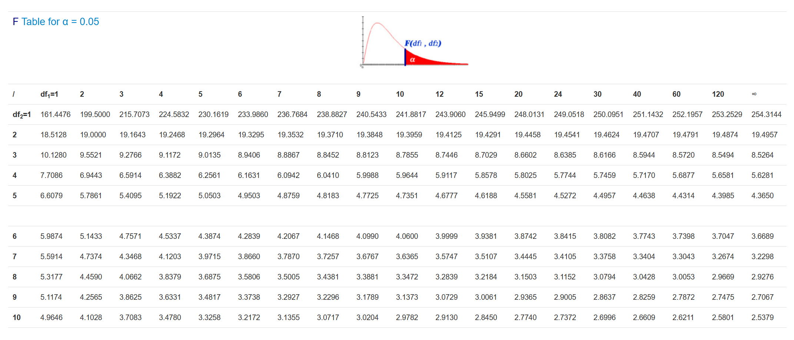

# ANOVAs

```{r warning = FALSE, message = FALSE, echo = FALSE}
library(tidyverse)
library(ggpubr)
library(here)
library(rstatix)
library(effectsize)

# i_am("code/bookdown/06-anovas.Rmd")
```

*t*-tests, as we saw last week, were a simple way of comparing a
continuous outcome between two groups or conditions (i.e. one
categorical variable with two levels). However, it's also common to
compare across three or more groups when doing real research. To test
this kind of hypothesis where we have three or more groups, we need to
turn to a different method - the ANOVA. ANOVAs are useful when you have
one categorical IV with 3+ levels, and one continuous DV.

The ANOVA is perhaps one of the most common statistical tests you will
see in music psychology literature, in part because they generalise to a
lot of research designs. In many respects, this week is fairly important
in terms of knowing how to conduct an ANOVA and when. We'll only be
stepping through the basics this week, but there are some really
important fundamentals to cover here.

It's also common to analyse two independent variables against one
dependent variable. These too can be done using ANOVAs. While we won't
go into this in this module, there will be an Extension Module that
deals with this separately - check it out sometime around Week 10/11 if
you're interested.

By the end of this module you should be able to:

-   Understand and describe the conceptual basis of an analysis of
    variance
-   Describe how an ANOVA is calculated
-   Conduct both one-way ANOVAs and one-way repeated ANOVAs, including
    their assumption tests
-   Interpret the output of the ANOVAs and report their findings

```{r echo = FALSE, fig.align = "center", fig.cap = "[xkcd: Third Way](https://xkcd.com/1285/)"}
knitr::include_graphics("https://imgs.xkcd.com/comics/third_way_2x.png")
```


## Anovas and the *F*-distribution

::: {style="background-color: #f5f5f5;  padding: 1.75rem;"}
Just as we've done so for chi-squares and *t*-tests, let's begin with an
overview of the mathematical and conceptual underpinnings of the ANOVA.
:::

### The basic logic of ANOVAs

As we said in the introductory page, ANOVA stands for **AN**alysis **O**f **VA**riance. This essentially sums up how an ANOVA works in principle. ANOVAs can be used when analysing a categorical IV with two or more groups (typically 3+) and a continuous DV. As the setup suggests, ANOVAs are a good way of comparing different groups on a singular outcome.

The most basic hypotheses for an ANOVA center around whether or not the
means between groups are significantly different, i.e.:

-   $H_0$: The means between groups are not significantly different.
    (i.e. $\mu_1 = \mu_2 = ... \mu_k$)
-   $H_1$: The means between groups are significantly different.
    (i.e.$\mu_1 \neq \mu_2 \neq ... \mu_k$)

How do we test for this? The basic logic of the ANOVA is this: Whenever
we have data that we categorise into different groups, we end up with
two key sources of variability, or variance: variance that exists
between groups, and variance that exists within groups:

```{r fig.dim = c(8, 3), echo = FALSE}
ggplot(data = tibble(x = c(37, 90)), aes(x)) +
  stat_function(fun = dnorm, n = 101, args = list(mean = 52, sd = 5), colour = "steelblue", linewidth = 2) + 
  stat_function(fun = dnorm, n = 101, args = list(mean = 61, sd = 5), colour = "darkseagreen", linewidth = 2) + 
  stat_function(fun = dnorm, n = 101, args = list(mean = 73, sd = 5), colour = "indianred", linewidth = 2) + 
  labs(x = "Scores", y = "") +
  scale_y_continuous(breaks = NULL) +
  theme(
    panel.grid.major = element_blank(), 
    panel.grid.minor = element_blank(),
    panel.background = element_rect(fill = "transparent",colour = NA),
    plot.background = element_rect(fill = "transparent",colour = NA)
  ) 

```

Pretend that the three curves above represent data covering three
different groups, and that we've hypothesised that there are three
different means. Collectively, this data has a certain amount of
variance.

The first fundamental to recognise is that this total variance can be
broken down into variance between groups and variance within groups:

$$
Variance_{total} = Variance_{between} + Variance_{within}
$$

The variability between the groups would simply be the variance between
the blue curve and the orange curve - in other words, how far apart the
two sets of data are (in a simplistic sense). The within-group variance,
on the other hand, is how much variance there is within each curve. If
there is a lot of within-group variance within each curve, that would
mean that (thinking back to Module 5) each group's curve would be spread
widely.

If you're following the logic of this so far, the consequences of high
within-group variance might be obvious - the two curves would
significantly overlap. In contrast, if the between-group variance is far
higher than the within-group variance, the curves may not overlap much
at all - suggesting that the means of the two groups really are
different.

This forms the basis of the ANOVA's *F*-test, which is a ratio of
variance:

$$
F = \frac{Variance_{between}}{Variance_{within}}
$$ 

We will see this more in practice on the next page, but the
*F*-statistic, which we use as part of significance testing in ANOVAs, is
calculated by simply dividing the between-group variance by the
within-group variance.

### The *F*-distribution

Like the other tests we've encountered so far, ANOVAs have their own
underlying distribution. In this instance, this is the *F* distribution,
which describes how the *F*-statistic behaves. We won't go far into the
maths around this, but the key here is that the *F* distribution is
characterised by two sets of degrees of freedom: one that relates to the
between-groups variance/effect, and one that relates to the
within-groups variance. One thing to note here is the terminology in the
headers of each graph: the first number in the brackets refers to the
between-groups variance, while the second number refers to the
within-groups variance.

```{r echo = FALSE}
f_data <- tibble(
  x = seq(0, 5, by = .1),
  y1 = df(x, df1 = 1, df2 = 1),
  y2 = df(x, df1 = 2, df2 = 1),
  y3 = df(x, df1 = 5, df2 = 2),
  y4 = df(x, df1 = 10, df2 = 1),
  y5 = df(x, df1 = 10, df2 = 2),
  y6 = df(x, df1 = 100, df2 = 100)
) %>%
  pivot_longer(y1:y6,
               names_to = "df",
               values_to = "density") %>%
  mutate(
    df = factor(df, labels = c("df = (1, 1)", "df = (2, 1)", "df = (5, 2)",
                               "df = (10, 1)", "df = (10, 2)", "df = (100, 100)"))
  )

f_data %>%
  ggplot(
    aes(x = x, y = density, colour = df)
  ) +
  geom_line(linewidth = 1, show.legend = FALSE) +
  labs(
    x = "",
    y = "",
    colour = "Degrees of freedom"
  ) +
  facet_wrap(~df, scales = "free") +
  theme_pubr()

```

### *F*-statistic tables

And, once again, we have a special *F*-table to determine critical *F*
values, given two degrees of freedom values. However, given that we have
two degrees of freedom the process is a little bit more complicated.
Most *F*-stat tables actually provide multiple tables, corresponding to
different alpha levels. For now, we will always use the table
corresponding to alpha = 0.05, a snippet of which is below:

```{r}
knitr::include_graphics(here("img/w9_f-table.png"))
```

To read this table, you need to know both degrees of freedom (more on
how to find that on the next page). The columns, marked df1, refer to
the first df value (between-groups), while the rows correspond to the
second df value (within-groups).

So, for example, if we have an *F*-test with degrees of freedom of (4,
10), we would first need to find the column that corresponds to 4 (our
df1), and then the row that corresponds to df2 = 10. Reading the cell at
the intersection would give us a critical *F*-statistic of 3.48; this is
the value our *F*-statistic would need to be greater than to be
significant at the *p* < .05 level.

## The ANOVA table

::: {style="background-color: #f5f5f5;  padding: 1.75rem;"}
Every time we do an ANOVA, there are actually a raft of calculations
that have to occur in order to get our test statistic and *p*-value.
Statistical software will display all of this in the form of an ANOVA
table, which we cover below.

Don't stress too much about the maths here - while the quiz does include
one question about this, the question itself isn't difficult (and you
won't be expected to do any of this by hand otherwise). The reason why
we go through this, however, is to demonstrate the conceptual logic from
the previous page.
:::

### The ANOVA table

On the previous page, we talked in depth about how the *F* statistic is
calculated, and what shapes the overall distribution. But how do we
actually calculate all of that stuff to begin with from raw data? Enter
the ANOVA table, a beautiful (remember, beauty is subjective) way of
calculating this information and laying it all out to see.

The basic ANOVA table looks like this, which you will see on any
statistical package you use.

|                    | Sums of squares (SS) | Degrees of freedom (df) | Mean square (MS) | F   | *p* |
|------------|------------|------------|------------|------------|------------|
| Group (our effect) |                      |                         |                  |     |     |
| Error/Residual     |                      |                         |                  |     |     |
| Total              |                      |                         |                  |     |     |

A couple of terminology-related things here.

-   'Group' in this context is our independent variable (i.e. the effect
    of group)- this is our between-subject variance.
-   'Error' or 'Residual' is the within-group variance.

Let's use the below data to calculate this by hand.

```{r echo = FALSE}
tibble(
  group_1 = c(1, 2, 3, 2, "Mean: 2"),
  group_2 = c(2, 4, 5, 3, "Mean: 3.5"),
  group_3 = c(5, 8, 6, 7, "Mean: 6")
) %>%
  knitr::kable(col.names = c("Group 1", "Group 2", "Group 3"))
```

The grand mean (i.e. the mean across all 12 pieces of data) is 4. Keep
this in mind.

Time to strap in - there are a lot of formulae involved!

### Sums of squares

The sum of squares quantifies how far each observation is from the
average - just like how it is calculated in the formula for standard
deviations. For an ANOVA, we have two sets of SS to calculate - one for
the between-groups term, and one for the within-groups/error.

**Between**

The formula for the between-groups sum of squares ($SS_b$) is:

$$
SS_b = \Sigma n(\bar x - \bar X)^2
$$

In words, this means:

-   Take each group's mean ($\bar x$), and subtract them from the grand
    mean ($\bar X$)
-   Square that difference
-   Multiply it by n, the size of each group
-   Add them all up.

Let's do that for our fictional data. Our group means are Group 1 = 2,
Group 2 = 3.5 and Group 3 = 6.5.
$SS_b = 4(2-4)^2 + 4(3.5-4)^2 + 4(6.5-4)^2$
$SS_b = (4 \times 4) + (4 \times 0.25) + (4 \times 6.25)$ $SS_b = 42$

**Within**

For the within-group sum of squares, the formula is:

$$
SS_w = \Sigma (x - \bar x)^2
$$

This one is a bit more tedious. It means:

-   Take each observation ($x$), and subtract them from their group mean
    ($\bar x$)
-   Square that difference
-   Add them all up.

So for our data, it would look something like.. 
$$
SS_w = (1-2)^2 + (2-2)^2 + (3-2)^2 + (2-2)^2 + (2-3.5)^2 + (4-3.5)^2 + (5-3.5)^2 + (3-3.5)^2 + (5-6.5)^2 + (8-6.5)^2 + (6-6.5)^2 + (7-6.5)^2
$$ 
$$SS_w = 12$$.

### Degrees of freedom

Because we have a term for between-groups and within-groups effects, we
also have degrees of freedom for both (think back to the previous page).
Thankfully, unlike the mess above the formulae here are relatively
simple.

**Between**

The between-groups df is given as: 

$$
df_b = k - 1
$$

Where k = the number of groups. So, in our data, $df_b = 3 -1 = 2$ (as
we have 3 groups).

**Within**

The within-groups df is given as:

$$
df_b = N - k
$$

Where k = the number of groups, and *N* is the total sample size (in our
case, 12). So $df_w = 12 -3 = 9$ (as we have 3 groups and 12 data points
in total).

### Mean squares

The mean squares is another value for variance that essentially
standardises the sum of squares by the degrees of freedom. The formula
for MS between and within is the same:

$$
MS = \frac{SS}{df}
$$

We've calculated SS and df for both our between and within-groups
effects, so we can substitute these values in to calculate a mean square
value for both: 

$$MS_b = \frac{SS_b}{df_b}$$
$$MS_w = \frac{SS_w}{df_w}$$

Putting in our values that we calculated earlier, we get:

$$MS_b = \frac{42}{2}$$ 
$$MS_w = \frac{12}{9}$$

This gives us $MS_b = 21$ and $MS_w = 1.33$.

### Calculating *F*

Remember on the previous page, how we talked about the *F*-statistic being
a ratio between two variances (between divided by within)? That's
exactly what we're going to do next, using our calculated mean-square
values:

$$
F = \frac{MS_b}{MS_w}
$$

This gives us:

$$
F = \frac{21}{1.33} = 15.75
$$

### Putting it all together

Phew! Now we've calculated everything we need to for our ANOVA - in
essence, we've done the majority of the ANOVA by hand. Let's put all of
our values into the table below:

```{r echo = FALSE}
tibble(
  x1 = c("Group (our effect)", "Error/Residual", "Total"),
  ss = c(42, 12, 54),
  df = c(2, 9, ""),
  ms = c(21, 1.33, ""),
  f = c(15.75, "", ""),
  p = c("", "", "")
) %>%
  knitr::kable(
    col.names = c("", "Sums of squares (SS)", "Degrees of freedom (df)",
                  "Mean square (MS)", "F", "p"),
    align = "l"
  )
```

Before we move on, it's also worth noting that
$SS_b + SS_w = SS_{total}$ ; this goes back to the fundamental we
discussed on the previous page, where an ANOVA breaks down total
variance into between and within-groups variance.

### Consulting the *F*-table

Now that we have our observed *F*-value, we can now consult an *F*-table and
use our two degrees of freedom to find out what our critical *F*-value is
(setting alpha = .05):

```{r echo = FALSE}

```

Reading the column for df1 = 2, and the row for df2 = 9, we get a
critical *F*-statistic of 4.2565. Now we can say that because our observed
test statistic (15.75) is greater than this critical value, our ANOVA is
significant at the alpha = .05 level.

In reality, like many of the other tests, we would calculate a *p*-value
by observing where our test statistic falls on the *F*-distribution, and
the associated probability of getting that value or greater. Our
software will do all of this stuff for us, but it helps to know exactly
how an ANOVA works!

If you want to calculate the *p*-value manurally in R though, this is entirely possible using the `pf()` function:

```{r}
pf(q = 15.75, df1 = 2, df2 = 9, lower.tail = FALSE)
```


## Multiple comparisons

::: {style="background-color: #f5f5f5;  padding: 1.75rem;"}
On this page we talk about what happens after a significant ANOVA
result, as well as some more detail about the multiple comparisons
problem, and how it can be accounted for.
:::

### Post-hoc tests

The ANOVA table on the previous page allows us to calculate by hand
whether there is a significant effect of our IV. However, it doesn't
tell us where that difference lies. Remember, we're comparing at least
three groups with each other - so we need some way of figuring out where
the actual significant differences between means are.

Enter post-hoc comparisons (post-hoc = after the fact). These are
essentially a series of *t*-tests where we compare each group with each
other. So, if we have groups A, B and C, and we get a significant
omnibus ANOVA that tells us there is a significant difference somewhere
in those means, we would run post-hoc comparisons by running individual
*t*-tests on A vs B, then B vs C, then A vs C.

However, we can't just do this blindly, and there's a good reason why...

### The multiple comparisons problem

In Module 6, we talked a fair bit about Type I and II error rates -
i.e., the rate of making a false positive and false negative judgement
respectively. Here, we'll focus on Type I error.

Recall that whenever we do a hypothesis test, we set a value for alpha,
which forms our significance level. Alpha is essentially the probability
of Type I errors we are willing to accept in a given test. In other
words, when we use the conventional alpha = .05 as our criterion for
significance, we are saying that we're willing to accept a Type I error
occurring 5% of the time - or 1 in 20.

This becomes problematic when we have to conduct multiple tests at once,
like what we have to do in an ANOVA. For example, let's say a variable
has 5 levels - A, B, C, D and E. If we ran an ANOVA on this data and
found a significant omnibus effect, we would want to find out where that
effect is. But that means that we'd have to compare A, B, C, D and E all
against each other, in a round-robin tournament way (e.g. A vs B, then A
vs C...). Where this becomes an issue is that each comparison will have
its own 5% Type I error rate (assuming we use alpha = .05). So in this
scenario, the Type I error rate will stack with each new comparison,
meaning that our overall Type I error rate will climb higher and higher.
This means that the chance of finding a false positive will increase
(see graph below).

```{r fig.dim = c(4, 4), echo = FALSE, fig.align='center'}
id <- seq(1, 100)
a <- (1 - (0.95)^id) * 100

fwer <- tibble(id, a)

fwer %>%
  ggplot(
    aes(x = id, y = a)
  ) +
  # geom_point() +
  labs(
    x = "Number of comparisons",
    y = "Type I error rate (%)"
  ) +
  theme_pubr() +
  geom_line(linewidth = 2, colour = "#1c76c9")
```

This overall rate of Type I errors is called the family-wise error rate
(FWER). 'Family' in this context refers to a family of comparisons -
like the comparison across A to E that we saw above.

### Correction methods

One way of dealing with this is to correct the *p*-values to set the
family-wise error rate back to 5%. We'll go through three main types
(two of which are already covered in the seminar).

**Tukey's HSD**

Tukey's Honest Significant Differences (Tukey HSD for short) is
appropriate specifically for post-hoc tests after ANOVAs. It essentially
works by first calculating the largest possible difference between each
group's means, then using that to calculate a critical mean difference.
Any mean difference that is greater than this critical threshold is
significant.

<details>
    <summary>How does the Tukey test work?</summary>
    Tukey's HSD works very similarly in principle to a *t*-test, although the exact maths involved are slightly different. The test statistic for a Tukey test is called *q* which denotes the Studentized range distribution (a specific distribution). For a given comparison between two group means, the formula for *q* is:
    
    $$
    \Large q = \frac{|M_1 - M_2|}{SE}
    $$
    
    
  Where $M_1$ and $M_2$ denote the means of groups 1 and 2, and SE denotes the standard error of the sum of the means.
  The *q*-statistic is then compared to a Studentized range distribution to estimate a <em>p</em>-value for that comparison. The shape of the Studentized range distribution is determined by alpha, *k* (the number of groups being compared) and *df* (in this case, the **error degrees of freedom*</strong>**).
</details>


**Bonferroni**

The Bonferroni correction is a method that can be used both within
ANOVAs and in more general contexts. The Bonferroni correction works by
multiplying each *p*-value in a set of comparisons by the number of
comparisons (i.e. the number of *p*-values).

For example, if a set of comparisons gives the following *p*-values: 0.05,
0.25 and 0.10, we would apply a Bonferroni correction by multiplying
each *p*-value by 3 (as there are 3 *p*-values) to get 0.15, 0.75 and 0.30
respectively.

(Note: in reality, Bonferroni works by dividing alpha by the number of
comparisons, i.e. 0.05/3 - but for the purpose of significance testing,
the maths works out to be the same).

**Holm**

The Holm correction is another correction method. In this method, each
*p*-value is first ranked from smallest to largest. and then numbered in a
descending fashion. Using the same *p*-values as above, we would get 0.05,
0.10 and 0.25. The *p* = .05 would be ranked as 3, the *p* = .10 would be 2
and *p* = .25 would be 1.

You then multiply the *p*-value by its rank, like the table below, to get
your adjusted *p*-values:

```{r echo = FALSE}
tibble(
  p = c(0.05, 0.25, 0.10),
  p_sort = c(0.05, 0.10, 0.25),
  rank = c(3, 2, 1),
  p_adj = c(0.15, 0.20, 0.25)
) %>%
  knitr::kable(
    col.names = c("Original p-value", "Sorted p-value", "Rank", "p-value x rank"),
    align = "l"
  )
```

The Bonferroni procedure is very conservative, in that it may actually
overcorrect (and subsequently reject too many); the Holm correction
still corrects the overall FWER without also increasing the overall Type
II rate as well.

## Eta-squared

```{r echo = FALSE, warning = FALSE, message = FALSE}
w9_memory <- read_csv(here("data", "Week_9", "w9_playing_from_memory.csv"))
w9_slices <- read_csv(here("data", "week_9", "w9_slices.csv"))

w9_memory_wide <- w9_memory

w9_memory <- w9_memory %>%
  pivot_longer(
    cols = PFM_97:PFM_99,
    names_to = "time",
    values_to = "memory_score"
  )

w9_slices_aov <- aov(rating ~ group, data = w9_slices)

w9_memory_aov <- w9_memory %>%
  anova_test(dv = memory_score, wid = Participant, within = time) 

w9_memory_design <- factorial_design(
  data = w9_memory,
  dv = memory_score,
  within = time,
  wid = Participant
)

w9_memory_alternate <- car::Anova(
  mod = w9_memory_design$model,
  idata = w9_memory_design$idata,
  idesign = w9_memory_design$idesign,
  type = 3
)
```


::: {style="background-color: #f5f5f5;  padding: 1.75rem;"}
Time to go over a new effect size measure! This time, we use eta-squared ($\eta^2$) as an effect size for ANOVAs.
:::

### Eta-squared and variance

At the start of this module, we introduced the concept of how ANOVA partitions total variance into both between and within-subject variance:

$$
Variance_{total} = Variance_{between} + Variance_{within}
$$

This partitioning allows for a simple but important way of calculating effect sizes for ANOVAs. If we're interested in the effect of our IV (group, which is between-subject variance), we simply need to know how much of the total variance is explained by this variable.

This is **eta-squared** ($\eta^2$), our effect size for ANOVAs. Eta-squared gives us a **percentage of how much variance in the DV can be attributed to the IV**. So an eta-squared of .778 means that 77.8% of the total variance in the outcome variable/DV is because of the IV variable/main effect. It is calculated as follows:

$$
\eta^2 = \frac{SS_{effect}}{SS_t}
$$

In other words, we divide the sum of squares for the main effect by the total sum of squares. For repeated-measures ANOVAs, the formula is the same in practice (i.e. divide the SS in the top row in the ANOVA table by the total).

A related version of this is **partial eta-squared** ($\eta^2_p$). This describes the effect of the IV *after* accounting for the variance explained by other factors. This is not so relevant for one-way designs - regular and partial eta-squared will give the same answer - but becomes more relevant when you move into factorial designs where you have more than one IV.

The formula for partial eta-squared is:

$$
\eta^2_p = \frac{SS_{effect}}{SS_{effect} + SS_{error}}
$$

Where $SS_{error}$ is the sums of squares for the error/residual term in an ANOVA. In general, it's good practice to default to at least reporting partial eta-squared. Again, in a one-way ANOVA this will give the same answer as regular eta-squared, but in a factorial design (where you have more than one IV) it will give a more precise estimate of each variable's effect size.

One more variant you will see is *generalised* eta-squared $\eta^2_g$, which is similar to the partial variant. While partial eta-squared is great, it is sensitive to design - in other words, what variables are included in the analysis will influence the calculation of $\eta^2_p$, meaning that it is only really comparable across studies of similar design. However, not every design will manipulate every predictor (e.g. gender), and so generalised eta-squared ($\eta^2_G$) can handle this. This effect size is best used in meta-analyses.

To calculate eta-squared using R, there are two ways as per usual. The first is by using tthe `anova_test()` function in `rstatix`. By default, `anova_test()` (and other ANOVA-related packages in R) will calculate *generalised* eta squared (labelled `ges` in the output). If you want partial eta-squared, you just need to give `anova_test()` the extra argument `effect.size = "pes"` as follows:

```{r}
w9_memory %>%
  anova_test(dv = memory_score, wid = Participant, within = time, effect.size = "pes") 
```
Note that as mentioned above, partial eta-squared and regular eta-squared are equivalent in a one-way ANOVA of any kind, so using this is ok.

Otherwise, our trusty `effectsize` package provides functions for calculating effect sizes in R. We use a function called - you guessed it - `eta_squared()`. This function works in very much the same way as the other `effectsize` family of functions do - you need to give them an anova model to calculate effect sizes for. 

Here is an example with a one-way ANOVA, which we will look at on the next page:

```{r}
eta_squared(w9_slices_aov, alternative = "two.sided")
```
For repeated-measures ANOVAs, the easiest way to calculate eta-squared using this function is to use `anova_test()` using the syntax described above. You can also use `eta_squared()` with a model built using `car::Anova()`. As both methods are a little involved, we'll deal with them in more detail on the page relating to repeated-measures ANOVAs.

```{r}
eta_squared(w9_memory_alternate, alternative = "two.sided")
```

### An example

Here's the ANOVA table we worked out by hand in Section 9.3:

```{r echo = FALSE}
tibble(
  x1 = c("Group (our effect)", "Error/Residual", "Total"),
  ss = c(42, 12, 54),
  df = c(2, 9, ""),
  ms = c(21, 1.33, ""),
  f = c(15.75, "", ""),
  p = c("", "", "")
) %>%
  knitr::kable(
    col.names = c("", "Sums of squares (SS)", "Degrees of freedom (df)",
                  "Mean square (MS)", "F", "p"),
    align = "l"
  )
```

If we were to calculate an eta-squared value for this, we would use SS effect (42) and SSt (54) like so:

$$
\eta^2 = \frac{42}{54} = .778
$$

### Interpreting eta-squared

Cohen (1988) provided the following guidelines for interpreting eta-squared:

-   $\eta^2$ = .01 is a small effect
-   $\eta^2$ = .06 is a medium effect
-   $\eta^2$ = .14 is a large effect

With these guidelines (which aren't perfect), a $\eta^2$ of .778 is astronomically huge.

Alternatively, when it comes to eta-squared you can avoid using benchmarks entirely and interpret them as the amount of variance (as a percentage) explained in the DV by the IV, as described above.


## One-way ANOVA

::: {style="background-color: #f5f5f5;  padding: 1.75rem;"}
In the previous section, we looked at how to compare differences between
either two groups, or two points in time. But how do we compare more
than that? The answer is the ANOVA (analysis of variance) - one of the
most common general statistical models for hypothesis testing. If you do
some statistical testing as part of your thesis, the ANOVA is likely
going to be one of your most useful tools to have.
:::

### The basic one-way ANOVA

The between-groups one-way ANOVA is the most basic form of ANOVA, which
aims to test differences between two or more groups. (Typically, ANOVAs
are used when there are three or more groups, but can easily be used in
situations where there are only two groups.)

We've briefly mentioned the general hypotheses for all ANOVAs, but here
they are again:

-   $H_0$: The means between groups are not significantly different.
    (i.e. $\mu_1 = \mu_2 = ... \mu_k$)
-   $H_1$: The means between groups are significantly different.
    (i.e.$\mu_1 \neq \mu_2 \neq ... \mu_k$)

### Example data

In the seminar, we talk about an example from Watts et al. (2003). Below
is another simple example, comparing taste ratings across three
different types of slices: caramel slices, vanilla slices and lemon
slices. Participants were randomly allocated to taste one of the three
slices blindfolded, and were then asked to verbally rate its taste on a
scale from 1-10 (10 being super tasty).

```{r}
w9_slices <- read_csv(here("data", "week_9", "w9_slices.csv"))

# Create factor
w9_slices$group <- factor(w9_slices$group)

head(w9_slices)
```

### Assumption checks

In R, to test assumptions we need to run the ANOVA *first*. This is because some assumptions rely on values that are calculated when the ANOVA is run. Other programs, such as Jamovi and SPSS, will hide this manual work and present the information to you automatically. This is not quite the case in R, but that's ok!

The basic function for running an ANOVA in R is the `aov()` function, which takes a formula input (much like `t.test()`). Anything created using `aov()` should be assigned to a new variable so that we can use it later. This creates an `aov` object that will a) test our main effects and b) let us check some of our assumptions.

```{r}
w9_slices_aov <- aov(rating ~ group, data = w9_slices)
```

There are four main assumptions for a basic ANOVA. 

-   Data must be independent of each other - in other words, one
    person's response should not be influenced by another. This should
    come as a feature of good experimental design.
-   The residuals should be normally distributed. We can assess this
    using the same methods as *t*-tests: either a QQ plot or a normality
    test (e.g. Shapiro-Wilks). You can access the residuals from the
    `aov` object directly like this:

```{r eval = FALSE}
w9_slices_aov$residuals
```

This lets us do the SW test:

```{r}
shapiro.test(w9_slices_aov$residuals)
```

A SW test on this data suggests the assumption is violated (*W* =.951, *p* =
.014), suggesting that the residuals are not normally distributed.

This is a bit of a problem in our dataset because our sample is relatively small. However - the ANOVA is fairly robust to violations of the normality assumption, meaning that non-normal residuals aren't a major problem so long as a) you have a big enough sample size and b) the skew isn't huge (or driven by outliers).

-   The equality of variance (homoscedasticity) assumption.

This means that the variances within each group are the same. We test this using Levene's test, using the `levene_test()` function. Helpfully, `levene_test()` is flexible enough to work with either a formula *or* an `aov` object we have already fitted:

```{r eval = FALSE}
# Either one of these will work
w9_slices %>%
  levene_test(rating ~ group, center = "mean")

levene_test(w9_slices_aov, center = "mean")
```

```{r echo = FALSE, warning = FALSE}
levene_test(w9_slices_aov, center = "mean")
```

The assumption doesn't appear to be violated (*F*(2, 60) = .721, *p* = .491). If it was, we
might consider using a Welch's ANOVA, which can be done with `welch_anova_test()` from `rstatix`.

For now though, we'll press ahead.

### Output

Here's our main output from the ANOVA, generated using the `summary()` function. This is called an omnibus, because it is a general test of the hypotheses:

```{r}
summary(w9_slices_aov)
```

Our main results suggest that there is a significant difference between means (*F*(2, 60) = 6.90, *p* = .002).

### Post-hoc tests

The output above told us that we could reject our basic null hypothesis - that there was no difference between means. However, remember that it doesn't tell us where those differences are. To figure out where they are, we need to follow up that ANOVA with post-hoc tests.

To generate post-hocs, there are a couple of ways. Tukey tests can be calculated with `TukeyHSD()` or `tukey_hsd()`:

```{r}
TukeyHSD(w9_slices_aov)
```

```{r eval = FALSE}
# These will give the same output

tukey_hsd(w9_slices_aov)

w9_slices %>%
  tukey_hsd(rating ~ group)
```

```{r echo = FALSE}
tukey_hsd(w9_slices_aov)
```

Here, you can see that we run a test for caramel vs lemon, caramel vs vanilla and lemon vs vanilla. For post-hocs in one-way ANOVAs, it is ok to stick to the Tukey-adjusted *p*-values. We can see that:

-   There is no significant difference between ratings of caramel and lemon slices (mean difference, MD = .48; *p* = .449).
-   There is a (marginal) significant difference between caramel and vanilla slices; participants rated vanilla slices higher than caramel slices (MD = .95, *p* = .047).
-   There is a significant difference between lemon and vanilla slices, in that participants preferred vanilla slices (MD = 1.43, *p* = .002).

To generate Bonferroni or Holm-corrected *p*-values, you need to use the `pairwise.t.test()` function:

```{r}
pairwise.t.test(x = w9_slices$rating, g = w9_slices$group, p.adjust.method = "bonferroni")
```

`rstatix::pairwise_t_test()` will also work, and looks like this:

```{r}
w9_slices %>%
  pairwise_t_test(rating ~ group, p.adjust.method = "bonferroni")
```

In both instances, you must provide `p.adjust.method` as an argument. By default, both versions will use Holm corrections.


<div style="background-color: #cce3c8;  padding: 1.75rem;">
A one-way ANOVA was conducted to examine whether there were differences in preferences for types of slices. There was a significant large main effect of slice type (*F*(2, 60) = 6.90, *p* = .002, $\eta^2$ = .187). Post-hoc tests with Tukey HSD corrections showed that participants rated vanilla slices higher than caramel slices (mean difference, *MD* = .95, *p* = .047), as well as significantly higher than lemon slices (*MD* = 1.43, *p* = .002). However, there was no significant differencce between caramel and lemon slices (*p* = .449).
</div>


## One-way repeated measures ANOVA

::: {style="background-color: #f5f5f5;  padding: 1.75rem;"}
The second form of ANOVA that we will cover in this module is the repeated measures ANOVA (sometimes abbreviated as RM-ANOVA). While it shares many features with the basic one-way ANOVA, the nature of repeated measures data introduces some key differences in the interpretation and calculation of this test.
:::

### Repeated measures ANOVAs

In principle, a repeated-measures ANOVA is very similar to the paired-samples *t*-test: both are repeated measures versions of their respective between-groups versions. So naturally, repeated-measures ANOVAs are used when we test one sample two or more times (again, like a
regular ANOVA, it's typically for 3+ times but can be used for two).

It shares many similarities with the basic one-way ANOVA, albeit with one additional step in calculation: because we now test the same sample repeatedly, we need to account for variance within subjects. We won't go too into detail about how that's calculated here, but essentially we split within-groups variance into subject variance and error/residual variance. This essentially adds an extra step to the ANOVA table.

### Example data

In this example, we'll use a dataset derived from [McPherson (2005)](https://journals.sagepub.com/doi/abs/10.1177/0305735605048012). This is a subset of data where children were scored on their ability to play songs from memory over three years - 1997 - 1999. We're interested in seeing whether this change over time is significant - therefore, time (3 levels) is our independent variable, while playing from memory is our dependent variable.

```{r}
w9_memory <- read_csv(here("data", "Week_9", "w9_playing_from_memory.csv"))
head(w9_memory)
```

For further analyses, we'll shape this into long format:

```{r}
w9_memory_wide <- w9_memory

w9_memory <- w9_memory %>%
  pivot_longer(
    cols = PFM_97:PFM_99,
    names_to = "time",
    values_to = "memory_score"
  )
```

### Assumption checks

There are two main assumptions for a repeated-measures ANOVA. Note that while the independence assumption as we know it doesn't apply here (by definition, repeated data is dependent), good experimental design should still aim to ensure that participants are independent of each other.

-   The residuals should be normally distributed.

Our usual tests apply here too. Below is a QQ plot, which might suggest that our residuals aren't normally distributed. (Use the data and perform a SW test on it to see what happens!)

```{r}
aov(memory_score ~ time, data = w9_memory) %>%
  broom::augment() %>%
  ggplot(aes(sample = .std.resid)) +
  geom_qq() +
  geom_qq_line()
```


-   The sphericity assumption. Sphericity is assumed if, the variances of the differences between each level of the IV are equal. Think of it as a form of the equality of variances assumption, where we assumed that the variances within groups were equal. The sphericity assumption applies to the differences between T1 and T2, then T2 and T3... etc etc.

Note that sphericity only applies when you have at least 3 levels of your IV (i.e. 3 timepoints). We can formally test it using Mauchly's test of sphericity. If sphericity is violated, it means that our degrees of freedom are too high for the data, which inflates the Type I error rate.

What next? We need to apply a correction to the omnibus ANOVA, which will alter the *p*-value. There are two on offer: Greenhouse-Geisser and Huynh-Feldt corrections. To help decide which one to use, R also calculates a value called epsilon ($\epsilon$). Epsilon, in short, is a measure of sphericity; if sphericity is assumed, $\epsilon$ = 1. If $\epsilon$ is below 1, sphericity is violated; the smaller it is, the greater the violation and therefore the greater the correction needs to be. Therefore, these corrections alter the degrees of freedom for each
test to account for this higher error rate.

(Mathematical note; the corrected dfs are calculated by multiplying the original dfs by $\epsilon$. So e.g. if your original df is 10 and $\epsilon$ = 0.9, your new corrected df will be 9.)

Broadly:

-   If epsilon ($\epsilon$) > .75, use the Huynh-Feldt correction.
-   If epsilon ($\epsilon$) < .75, use the Greenhouse-Geisser
    correction.

In R, most main packages will test the sphericity assumption along with the main ANOVA, so we will see this below.

### ANOVA output

R-Note: Repeated measures ANOVAs in R are *not* trivial in the slightest, and adapting this was a genuine challenge. To some extent this probably reflects the differences in approach between point-and-click software compared to actually having to code the ANOVA model: the former is easy but you perhaps make many assumptions about what's going on along the way. Below is the easiest way to run this analysis.

Here's our overall output from the ANOVA. It looks (and reads) pretty much the same as our previous example, but just bear in mind that the top row in the within-subjects effect (i.e. the effect of interest). In addition, this time you can see that there are now three rows to be
read:

```{r}
w9_memory_aov <- w9_memory %>%
  anova_test(dv = memory_score, wid = Participant, within = time) 

w9_memory_aov
```

Knowing which row to read is crucial here, as each one corresponds to a correction (or the original ANOVA). Here, our *p*-value is almost significant (*p* = .054); rather than going by a strict arbitrary cutoff, let's assume that it has been violated (both for teaching and for methodological purposes). Here, our epsilon value is high (~.95), so let's apply the Hyunh-Feldt correction. The associated epsilon value is $\epsilon = .943$; when reporting the repeated measures ANOVA we need to look at the rows corresponding to the Huynh-Feldt correction.

The two columns to look for are the ones labelled `DF[HF]` - this gives the adjusted degrees of freedom with the Huynh-Feldt corrections (`DF[GG]` would give Greenhouse-Geisser dfs) - and `p[HF]`, which gives the adjusted *p*-value. Thus, with the corrected output we can see our
effect of time is significant (*F*(1.92, 180.72) = 132.63, *p* < .001).

### Post-hoc tests

As per usual, we follow up a significant overall ANOVA with a series of post-hoc comparisons (note this time we set `paired = TRUE`:

```{r}
w9_memory %>%
  pairwise_t_test(memory_score ~ time, paired = TRUE, p.adjust.method = "bonferroni")
```

From this, we can see that all three means are significantly different from each other (*p* < .001, for brevity's sake). Scores increased year on year, i.e. 1997 < 1998 < 1999.

<div style="background-color: #cce3c8;  padding: 1.75rem;">
A one-way repeated measures ANOVA was conducted to examine whether scores for playing songs from memory changed over three years. We applied Huynh-Feldt corrections to account for non-sphericity. There was a significant large effect of year on performance scores (*F*(1.92, 180.72) = 132.63, *p* < .001, $\eta^2$ = .231). Post-hoc tests with Tukey HSD corrections showed that participants scored higher in 1998 than in 1997 (mean difference, *MD* = 29.61, *p* < .001). Participants also scored higher in 1999 compared to 1998 (*MD* = 15.27, *p* < .001) and 1997 (*MD* = 44.88, *p* < .001).
</div>


### Alternative using `car::Anova()`

Below is an alternative way of running a repeated measures ANOVA, this time using the `car` package. The function `factorial_design()` from the `rstatix` package is a useful helper function that can generate the necessary arguments to `Anova()` for repeated measures tests.

```{r}

w9_memory_design <- factorial_design(
  data = w9_memory,
  dv = memory_score,
  within = time,
  wid = Participant
)
```

The important things that are generated by this function are:

-   `name$model`: this essentially creates an ANOVA model

-   `name$idata`: this specifies the levels of the within-subject
    (repeated measures) factor

-   `name$idesign`: this creates a formula-style notation specifying
    what the within-subjects IV(s) are

We then just need to feed this to `car::Anova()` exactly as follows. Setting `type = 3` isn't strictly necessary here (this is more relevant for factorial ANOVAs):

```{r}
w9_memory_alternate <- car::Anova(
  mod = w9_memory_design$model,
  idata = w9_memory_design$idata,
  idesign = w9_memory_design$idesign,
  type = 3
)
```

Now that we've built our ANOVA model we can ask for the output like so. `multivariate = FALSE` is just an argument to specify that we're doing a univariate analysis (i.e. one dependent outcome).

```{r}
summary(w9_memory_alternate, multivariate = FALSE)
```

A benefit of doing a repeated-measures ANOVA this way is that this model is compatible with the `effectsize` functions, including `eta_squared()`:

```{r}
eta_squared(w9_memory_alternate, alternative = "two.sided")
```

