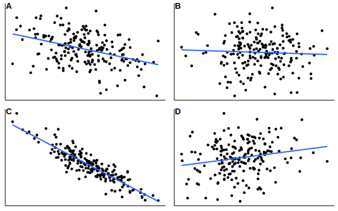
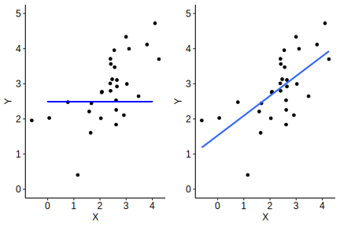

# Linear relationships

```{r warning = FALSE, message = FALSE, echo = FALSE}
library(tidyverse)
library(ggpubr)
library(here)
library(rstatix)

theme_set(theme_pubr())

# i_am("code/bookdown/07-regressions.Rmd")
```

Up until now we've been dealing almost exclusively with categorical variables in some way. For example, chi-square tests are for testing relationships between categorical variables; likewise, t-tests and ANOVAs deal with categorical IVs against continuous DVs. In reality though, many of the things we're interested in are inherently continuous in nature. There are very few psychological constructs that aren't continuous in some way, and so working with continuous variables forms a core part of doing statistical analyses.

Enter the linear regression and its many other forms - in some ways, the bedrock of many of the research that we do (more on this in Week 11). When we're dealing with continuous variables, linear regressions are generally the first place to start. We won't go much further beyond the basics here (certainly as it applies to a lot of psychological research), but even these concepts are foundational for many reasons.

By the end of this module you should be able to:

-    Describe how hypothesis testing works in regressions - including what is being tested
-    Conduct appropriate assumption tests for a linear regression
-    Run a linear regression and interpret the output
-    Make predictions based on the output of a linear regression
-    Run and interpret a multiple regression

## Correlations

<div style="background-color: #f5f5f5;  padding: 1.75rem;">
We've talked a surprising amount about correlations in this subject, but we haven't considered how to actually test if two things are correlated to begin with. We change that this week with an overview of correlation coefficients.
</div>

### Correlation coefficients

We can quantify the strength of two variables using a correlation coefficient, which gives us a measure of how tightly these two variables are related. 

To start, we need to know what covariance is. Covariance simply describes how two variables change with each other. For instance, if two variables have a positive covariance, this means that as one variable increases, so does the other. Similarly, if two variables have a negative covariance, this means that as one increases the other decreases. See if you can describe what the covariances would be like below:

```{r echo = FALSE}

```


Correlation coefficients are just another way of describing this. Correlation coefficients have the following properties:

-    They are between -1 and +1
-    The sign of the correlation describes the direction - a positive value represents a positive correlation
-    The numerical value describes the magnitude 
  -    A correlation of 1 means a perfect correlation; a correlation of 0 means a negative correlation
  -    A rough guideline for this subject, r = .20 is weak, r = .50 is moderate, r = .70 is strong
  -    Visually, a magnitude of 0 corresponds to a flat line; the steeper the line, the higher the magnitude

There are many types of correlation coefficients, but the most common is the Pearson's correlation coefficient. It's calculated using the below (simplified) formula:

$$
r = \frac{Cov_{xy}}{SD_x \times SD_y}
$$

In this subject we won't expect you to calculate a correlation coefficient by hand, but the key takeaway here is that by dividing a value by a standard deviation (or, in this case, a product of two SDs), we are standardising the covariance. Hence, a correlation coefficient is a standardised measure, meaning that we can compare correlation coefficients quite easily across variables regardless of their scale.

### Activity

### Testing correlations in R

Statistical programs like Jamovi and R will allow us to not only quantify a correlation between two variables, but test whether this correlation is significant. Generally, when working with continuous data it never hurts to run a basic correlation. 

This can easily be done in R by using the `cor.test()` function. You simply need to give it two 


If you need to run multiple correlations at once, there are two ways to visualise them. Below are two types, using fictional questionnaire data.

The first is simply a table, like below:

```{r echo = FALSE}
cor_mat <- matrix(c(1  , .24, -.56, .72, 
                    .24, 1  , -.38, .43,
                    -.56, -.38, 1  , -.11,
                    .72, .43, -.11, 1  ), ncol=4)

rownames(cor_mat) <- c("Q1", "Q2", "Q3", "Q4")
colnames(cor_mat) <- c("Q1", "Q2", "Q3", "Q4")

data.frame(cor_mat) %>%
  knitr::kable()
```


The second is a correlation heatmap, which is especially effective with many correlations at once (common when working with huge questionnaires or neuroimaging). As shown by the legend on the right, the colour and shade of each square are determined by the strength of the correlation. This can be easily done by the ``ggcorrplot` package, if you have a correlation matrix formatted in R:

```{r}
library(ggcorrplot)
ggcorrplot(cor_mat, type = "lower", show.diag = TRUE)
```

## Regression hypotheses

<div style="background-color: #f5f5f5;  padding: 1.75rem;">
Let's move on from correlations to regressions, where we test whether one variable can predict another. To do that, let's start by considering what it is we actually hypothesise in doing a linear regression.
</div>

### Terminology

Let's kick off the regression portion of this module with a bit of terminology:
-   The line is called the line of best fit. The slope of the line is, well, the slope. It describes how much Y changes if X changes by one unit.
-   The point at which the line crosses the y-axis is called the intercept (the y-intercept in full). The intercept is one of the two paramaters of a regression line (the other being the slope).

Linear regressions involve plotting a line of best fit to the data, and using this line to make predictions. 

If you think back to high school, you may have learned something like y = mx + c or y = ax + b in algebra to describe a straight line. In linear regression, we use the same concepts to both describe our line and make predictions using it (more on that later). The key difference is that we change the letters a bit:

$$
y = \beta_0 + \beta_1x + \epsilon_i
$$

Let's break this down:

-    y is simply our predicted value (i.e. the line of best fit)
-   $\beta_0$ is our intercept (the c in y = mx + c)
-   $x$ simply refers to our independent variable
-   $\beta_1$ is the slope for the independent variable - in other words, how much y increases for every unit increase of x. We also call this B
-   $\epsilon_i$ is error, which is essentially random variation (due to sampling). This error is normally distributed.

Keep this in mind for now - we'll come back to this later in the module!

 
### Hypothesis testing in regressions

When we conduct a linear regression, in part we're testing if the two variables are correlated. However, we're also testing whether we can predict our DV from our IV, so our statistical hypotheses are formulated around this idea. Our null and alternative hypotheses are therefore about the slope ($\beta_1$):

-   $H_0: \beta_1 = 0$, i.e. the slope is 0

-   $H_1: \beta_1 \neq 0$, i.e. the slope is not equal to 0

Consider the two graphs below. On the left is a graph where the line of best fit has a slope of 0 (the null). No matter what value X is, the value of Y is always the same (2.5 in this example) - in other words, X does not predict Y. The graph on the right side, on the other hand, is an example of the alternative hypothesis in this scenario. Here, X does clearly predict Y - as X increases, Y increases as well. 

```{r fig.align = "center", echo = FALSE}

```

But how do we actually test this? The answer is something we've seen before - we do a t-test! 

We came across t-tests in context of comparing two means against each other. The logic here is exactly the same, except now we compare two slopes with each other - the slope we actually observe (B) minus the null hypothesis slope (0). We can use this logic to calculate a t-statistic using the below formula:

$$
t = \frac{B}{SE_B}
$$

Where *B* = observed slope and SE = standard error of B. This is the same formula as the calculation for a t-test, albeit that the top row is just B (because it is B - 0). We can do this for each predictor, and then use the same t-distribution to test whether this slope is significant - in other words, whether our predictor (IV) significantly predicts our outcome (DV).

## Least squares regression

<div style="background-color: #f5f5f5;  padding: 1.75rem;">
Linear regression starts with trying to fit a line to our continuous data. But... how on earth do we figure out where that line sits?
</div>

### The regression line

See if you can take a guess where we should draw a line of best fit on the plot below:

```{r fig.align = "center", echo = FALSE}
set.seed(202305)
cor <- rbind(c(1, 0.6), c(0.6, 1))

df <- data.frame(MASS::mvrnorm(n = 80, mu = c(5, 8), Sigma = cor))

df %>%
  ggplot(
    aes(X1, X2)
  ) +
  geom_point()
```

You might have some good guesses, and there's every chance that you've drawn a line that fits the data points pretty well. But for this data, it's pretty obvious where the line would sit, and the data that we do work with won't always be as clear cut. 

The line of best fit sits where the distance between the line and every point is minimised. See the example below, where we have 10 data points to illustrate. Each dot represents a single data point, while the solid blue line is our line of best fit. The dashed lines represent the difference between the blue line (which is what we predict - more on this later) and the actual data point. This difference is called a residual. 

So, in other words, the line of best fit sits where the residuals are minimised.

```{r fig.align = "center", echo = FALSE}
set.seed(202306)
df <- data.frame(MASS::mvrnorm(n = 10, mu = c(5, 8), Sigma = cor))

fit_1 <- lm(X2 ~ X1, df)

intercept <- fit_1$coefficients[1]
slope <- fit_1$coefficients[2]
df$fitted <- intercept + slope * df$X1

df %>%
  ggplot(
    aes(X1, X2)
  ) +
  geom_point(size = 1) +
  geom_smooth(method = "lm", se = FALSE) +
  # geom_abline(slope = slope, intercept = intercept, color = "blue") +
  geom_segment(aes(xend = X1, yend = fitted), linetype = "dashed") +
  labs(x = "X", y = "Y")

```

We do this using the least squares principle. In essence, we calculate a squared deviation for each residual using the formula below - it might be familiar...

$$
SS_{res} = \Sigma (y_i - \bar y_i)^2
$$

Where $y_i$ is each individual (ith) value on the y-axis, and $\bar y_i$ is the predicted y-value (i.e. the regression line). Essentially, we calculate the residual for each data point, square it and add it all up. 

The actual minimising part is something we won't concern ourselves with for this subject (or at all), because quite frankly it's complicated - the key here is to understand how a regression line is fit to the data.

## Assumption tests

### Linearity

Believe it or not, for a linear regression your data should be... linear. Wild, right?

Bitter sarcasm aside, linearity is an important assumption that needs to be met before conducting a linear regression. Not all data will follow a linear pattern; some data may instead sit on a curve. Compare the two examples below, where one is clearly non-linear:

```{r fig.align = "center", fig.dim = c(8, 3), echo = FALSE}
set.seed(202305)
x <- 1:200

linear_data <- data.frame(
  x,
  y = 1.2 + 0.34*x + rnorm(200, sd = 10)
)

linear_plot <- linear_data %>%
  ggplot(
    aes(x, y)
  ) + 
  geom_point()

set.seed(202305)
quadratic_data <- data.frame(
  x,
  y = 1.2 + 0.68*x + 0.04*x^2 + rnorm(200, sd = 20)
)

quadratic_plot <- quadratic_data %>%
  ggplot(
    aes(x, y)
  ) + 
  geom_point()

cowplot::plot_grid(linear_plot, quadratic_plot)
```

If the data shows no clear linear relationship between your IV and DV, it is likely because the two are weakly correlated (and so a linear regression would not be useful anyway). If instead the data lies on a very obvious curve, you can either:

-    Transform the data to make it linear (but you must be clear about what this represents)
-    Attempt to fit a curve and see whether this has more explanatory power, but madness lies this way for the unprepared

 
### Homoscedasticity

The homoscedasticity assumption is one that we've seen before - it is essentially a version of the equality of variance test. In a linear regression context, however, this assumption works a little bit differently; if this assumption is met, then the variance should be equal at all levels of our predictor (i.e. the x-axis).

The easiest way to test this is to create a fitted vs residuals graph. As the name implies, we take the fitted values for each level of the predictor in our data, and plot that against the residuals (fitted - actual). Here are some fitted vs residual plots for two sets of data. The data on the left has an even spread of variance as X increases, meaning that it is homoscedastic; the data on the right, on the other hand, spreads out like a cone. The data on the right therefore is likely heteroscedastic. 

```{r fig.align = "center", fig.dim = c(8, 3), echo = FALSE}
set.seed(202305)
n      = rep(1:100,2)
a      = 0
b      = 1
sigma2 = n^1.3
eps    = rnorm(n,mean=0,sd=sqrt(sigma2))
y      = a+b*n + eps

df_1 <- data.frame(
  n,
  y = a+b*n + rnorm(n, mean = 0, sd = 10)
)


df_2 <- data.frame(n, y)

mod_1 <- lm(y ~ n, df_1)
mod_2 <- lm(y ~ n, df_2)

scatter_1 <- df_1 %>%
  ggplot(
    aes(x = fitted(mod_1), y = residuals(mod_1))
  ) +
  geom_point() +
  geom_hline(yintercept = 0) +
  labs(
    x = "Fitted",
    y = "Residuals"
  )

scatter_2 <- df_2 %>%
  ggplot(
    aes(x = fitted(mod_2), y = residuals(mod_2))
  ) +
  geom_point() +
  geom_hline(yintercept = 0) +
  labs(
    x = "Fitted",
    y = "Residuals"
  ) +
  scale_y_continuous(limits = c(-30, 30), breaks = seq(-30, 30, by = 10))


cowplot::plot_grid(scatter_1, scatter_2)
```

There are a couple of ways to overcome this, such as either transforming the raw variables or weighting them.

 
### Independence

This one is the same - data points should be independent of each other. Like we have seen with other tests, this should ideally be a feature of good experimental design. In linear regression, a specific issue is autocorrelation - where the residuals between two values of X are not independent. This can distort the relationship between your IV and DV, and is most commonly an issue with time series data. 

 
### Normality

The normality assumption is the same here as it has been elsewhere - the residuals must be normally distributed. Here, it's a little bit easier to visualise what these 'residuals' are because we can calculate and see them. That being said, the way we test for these are exactly the same - either use a Q-Q plot or a Shapiro-Wilks test.

 
### Multicollinearity

The multicollinearity (sometimes just called collinearity) assumption only applies to multiple regressions, where you have more than one predictor in your test. multicollinearity occurs when two predictors are too similar to one another (i.e. they are highly correlated with each other. This becomes a problem at the individual predictor level, because what happens is that the effect of predictor A becomes muddled by predictor B - in other words, if two predictors are collinear, it becomes impossible to tell apart which one is contributing what to the regression.

There are three basic ways you can assess this.

-    The simplest is to test a correlation between the two predictors. If they are very highly correlated (use r = .80 as a rule of thumb), this is likely to be a problem.
-    The variance inflation factor (VIF) is a more formal measure of multicollinearity. It is a single number, and a higher value means greater collinearity. If a VIF is greater than 5 this suggests an issue.
-    Tolerance is a related value to VIF - in fact, it is just 1 divided by the FID - and works in much the same way - except smaller values mean greater collinearity. As a rule of thumb, if tolerance is smaller than 0.20 this suggests an issue.

To calculate VIF, you can use the `VIF()` function from the `DescTools` package - more on the relevant page.

## Linear regressions in R

### Scenario

Musical sophistication describes the various ways in which people engage with music. In general, the more ways in which people engage with music, the more musically sophisticated they are. 

One hypothesis is that years of musical training will clearly influence musical sophistication. While this is a bit of a no-brainer hypothesis, we'll test it using some example data.

```{r}
w10_goldmsi <- read_csv(here("data", "week_10", "w10_goldmsi.csv")) 

# This extra code is here for later
w10_goldmsi <- w10_goldmsi %>%
    mutate(
    id = seq(1, nrow(w10_goldmsi))
  ) 
head(w10_goldmsi)
```

 
### Assumptions

In R the linear regression needs to be coded first *before* testing assumptions. Linear regression models can be built using `lm()`, and the same formula notation used in `aov()`:

```{r}
w10_goldmsi_lm <- lm(GoldMSI ~ years_training, data = w10_goldmsi)
```

Let's test our assumptions from the previous page. 

Linearity: a simple scatterplot tells us that our data probably is suitable for a linear regression:

```{r}
w10_goldmsi %>%
  ggplot(
    aes(x = years_training, y = GoldMSI)
  ) +
  geom_point()
```


Homoscedasticity: To plot a residual vs fitted plot in R, there are two ways:
-   `plot(model, which = 1)`.

```{r}
plot(w10_goldmsi_lm, which = 1)
```

-   Using ggplot, but giving the model name instead of the data and setting the x and y aesthetics as follows:

```{r}
ggplot(w10_goldmsi_lm, aes(x = .fitted, y = .resid)) +
  geom_point()
```
 

Normality: our SW test is non-significant, so this assumption is not violated. Like `aov` models, residuals in `lm` models can be accessed using the $ operator.

```{r}
shapiro.test(w10_goldmsi_lm$residuals)
```


Output

The output that R gives us for a linear regression comes in two parts: a test of the overall model, and a breakdown of the predictors and their slopes.

```{r}
summary(w10_goldmsi_lm)
```


Let's start with the overall model. This tells us whether the regression model as a whole is significant. A couple of things to note here.

-    R2 is called the coefficient of determination. This value tells how much variance in the outcome is explained by the predictor. Our value is .202, which means that 20.2% of the variance in Gold-MSI scores is explained by years of training.
-    The overall model test is essentially an ANOVA (we won't go too deep into why just yet!), which tells us whether the model is significant. In this case, it is (*F*(1, 72) = 18.24, *p* < .001).

Now we can look at the middle of the output, which gives the model coefficients. This part of the output tells us whether the predictors are significant. (Given the overall model is, with one predictor we'd expect this to be significant as well!). 

The Estimate column gives us the B coefficient, which is our slope. This tells us how much our outcome increases when our predictor increases by 1 unit.

From this, we can see that years of training is a significant predictor of Gold-MSI scores (*t* = 4.27, *p* < .001); for every year of training, Gold-MSI scores increase by 4.86 (given by the value under Estimate, next to our predictor variable).

Finally, we can use the `confint` function to return 95% confidence intervals on each regression slope:

```{r}
confint(w10_goldmsi_lm)
```
Therefore, the 95% CI around the estimated regression coefficient of 4.86 is [2.59, 7.13].

## Predictions

<div style="background-color: #f5f5f5;  padding: 1.75rem;">
A significant result from a linear regression tells us that our IV significantly predicts our outcome. We can actually use the results of the regression to make predictions about our outcome. This can be really useful in a number of contexts.
</div>

### Revisiting the linear regression equation

Let's come back to the equation for a linear regression:

$$
y = \beta_0 + \beta_1x + \epsilon_i
$$

The results from the linear regression on the previous page allow us to construct a line of best fit. Using this line of best fit, we can make predictions about a participant's score on the dependent variable, given their score on the independent/predictor variable.

### Building a regression equation

Here's the coefficient table from the previous page:

```{r}
summary(w10_goldmsi_lm)
```

This table tells us the following things:

-   The value of the intercept, $\beta_0$, is 53.901
-   The value of the slope, $\beta_1$, is 4.858

Now we can make our equation as such:

$$
GoldMSI = 53.901 + (4.858 \times Years)
$$

We can now use this to predict scores!

### An example prediction

Participant 47, highlighted in green below, has 5 years of musical training. What would their predicted Gold-MSI score to be?

```{r echo = FALSE}
w10_goldmsi %>%
  ggplot(
    aes(x = years_training, y = GoldMSI)
  ) +
  geom_point() +
  theme_pubr() +
  labs(
    x = "Years of training",
    y = "Gold-MSI score"
  ) +
  geom_smooth(method = "lm", se = FALSE) +
  geom_point(data = subset(w10_goldmsi, id == 47), colour = "#1C9900", size = 3) +
  geom_label(data = subset(w10_goldmsi, id == 47), label = "ID 47", vjust = 1.5)
```


We can use the equation we just built to calculate a predicted score:

Therefore, we would predict someone with 5 years of musical training to have a Gold-MSI score of 78.191. This is where the line sits. Notice however, that the predicted value is noticeably different to the participant's actual value (which in this instance is 56). The difference between the predicted and the actual value is called the residual - precisely the same residual that we aim to minimise when we fit a regression line to begin with (as well as the same residuals we do assumption tests on).

$GoldMSI = 53.901 + (4.858 \times Years)$
$GoldMSI = 53.901 + (4.858 \times 5)$
$=78.191$

<div style="background-color: #f5f5f5;  padding: 1.75rem;">
A warning

While these predictions can be useful, there are two warnings that should be kept in mind.

-    **Extrapolation is dangerous**. While we might get data that appears linear, there is nothing to say that this data will remain linear outside of the bounds of our data. Extrapolating data refers to making inferences beyond the available range, and should be avoided.
-    **Don't forget that some data have logical boundaries**. For example, the Gold-MSI's maximum possible score is 126 across all scales. Any preditions that are higher than this are therefore quite easily nonsensical.
</div>

## Multiple regression: Theory

<div style="background-color: #f5f5f5;  padding: 1.75rem;">
If all of that stuff on the previous page made sense then great! You're now ready to tackle multiple regressions, which are an extension of the simple linear regression. You'll see that much of the same stuff applies here, but a few things change...
</div>

### Multiple regression

Multiple regression is used when we want to test multiple predictors against an outcome variable. It'd be a safe bet to say that multiple regression and its various forms are probably one of the most used statistical tests in music psychology literature as a whole - you'll see them everywhere! No introduction to linear regression would really be complete without at least scratching the surface of multiple regression.

The name "multiple regression" is actually a fairly generic term in some respects, as it describes any instance of regression with two or more predictors. I say that because there are several forms of multiple regression, such as:

-    Standard multiple regression, which we will cover in this subject
-    Hierarchical multiple regression, where you split your analysis into blocks
-    Stepwise multiple regression, where algorithms attempt to select the best predictors
-    And more!

 
### The regression equation, once again

Recall that in a simple linear regression, we had this formula to describe the line of best fit:

$$
y = \beta_0 + \beta_1x + \epsilon_i
$$

In a multiple regression, we work with an extension of this formula. The key part here is the part of the equation labelled $\beta_1x$ - this is the part of the equation that relates to the individual predictor and its slope (i.e. how it predicts the outcome). We extend this in a multiple regression. For example, say we now had two predictors:

$$
y = \beta_0 + \beta_1x_1 +\beta_2x_2 + \epsilon_i
$$

We now have a term for our first predictor $\beta_1x_1$ and for our second: $\beta_2x_2$.

-    x1 and x2 simply mean predictor 1 and predictor 2.
-    The betas here are still regression slopes; the subscript numbers just indicate which predictor they correspond to.

 

From here on, much of the same reasoning that we saw in the early pages of this module apply. The primary hypotheses are now about whether each slope is significantly different from zero - which would indicate whether each predictor does significantly predict the outcome.

 
### Assumption testing in multiple regressions

All of the following assumption tests apply:

-    Linearity
-    Homoscedasticity
-    Normality
-    Multicollinearity


We'll test these on the next page!

## Multiple regressions in R

<div style="background-color: #f5f5f5;  padding: 1.75rem;">
Phew - we're almost there! Let's round out this week's module by doing a standard multiple regression in Jamovi. 
</div>

### Example data

Let's look at a real set of data from Rakei et al. (2022). Their study looked at what predicts how prone people are to flow - the experience of being 'in the moment' and extremely focused while doing a task, such as performing. They measured a wide range of personality and emotion-related variables, but we'll focus on just a subset here:

-    Trait anxiety: broadly, refers to people's tendency to feel anxious
-    Openness to experience: a personality trait that describes how likely people are to seek new experiences 
-    DFS_Total: a measure of proneness to flow.
 

Let's see if trait anxiety and openness predict flow proneness.

```{r}
w10_flow <- read_csv(here("data", "week_10", "w10_flow.csv"))
```

To build a multiple regression model in R, we simply need to add (literally) more terms to `lm()`:

```{r}
w10_flow_lm <- lm(DFS_Total ~ trait_anxiety + openness, data = w10_flow)
```


### Assumption checks

The Shapiro-Wilks test suggests that our normality assumption is violated - though if you look at the relevant Q-Q plot, it doesn't appear to be very severe.

```{r}
shapiro.test(w10_flow_lm$residuals)
```

The residuals-fitted plot for our data looks ok - no obvious conical shape, suggesting that the homoscedasticity assumption is intact.

```{r}
ggplot(w10_flow_lm, aes(x = .fitted, y = .resid)) +
  geom_point()
```

Lastly, our multicollinearity statistics look good - no violations suggested here.

```{r}
# Variance
DescTools::VIF(w10_flow_lm)

# Tolerance
1/DescTools::VIF(w10_flow_lm)
```
### Output

Let's start as always by taking a look at our output. Our regression explains 13.6 of the variance in flow proneness (R2 = .136), and our overall model is significant (*F*(2, 808) = 63.81, *p* < .001).

With that in mind, let's turn to our individual predictors. Remember, now we have two predictors to consider - and we need to interpret them individually as well.

```{r}
summary(w10_flow_lm)
confint(w10_flow_lm)
```


We can see that both trait anxiety and openness are significant predictors of flow proneness, but interpreting the direction is also really important here. For that, we turn to our estimates:

-    The estimate for trait anxiety is *B* = -.111 (95% CI = [-.136, .086]), suggesting that higher trait anxiety predicts lower flow proneness (*p* < .001)
-    On the other hand, the estimate for openness is *B* = .834 (95% CI = [.548, 1.119]), suggesting that higher openness predicts higher flow proneness (*p* < .001).

Therefore, we can conclude that both are significant predictors and have opposite effects to each other. We can write this up as follows:


We ran a multiple regression with trait anxiety and openness as predictors, and flow proneness as an outcome. The overall regression model was significant (*F*(2, 808) = 63.81, *p* < .001), and explained 13.6% of the variance in flow proneness. Trait anxiety significantly predicted flow proneness (*B* = -.11, 95% CI = [-.14, -.09], *t* = -8.70, *p* < .001); higher trait anxiety predicted lower flow proneness. Openness was also a significant predictor (*B* = .83, 95% CI = [.55, 1.12], *t* = 5.74, *p* < .001); higher openness predicted higher flow proneness.
 

But there's one more thing we can consider here...

 
### Comparing predictive strength

When we do a multiple regression, we can actually identify which of our predictors is the strongest predictor of the outcome. 

Our estimate column alone won't tell us that, because these are unstandardised coefficients. They are unstandardised because they describe the relationship in terms of the original units of each measure. An increase of 1 unit on trait anxiety is not necessarily the same thing as a 1 unit increase in openness because they are on different scales, so we can't compare them directly!

However, if we were to standardise these coefficients, we would then bring them all into the same scale (think back to z-scores!) - which would allow us to directly compare which predictor leads to a greater change in the outcome. These are simply regression coefficients that have been standardised, meaning that they are all on the same scale. Jamovi will calculate a standardised estimate (sometimes called standardised coefficient), which is presented in the rightmost column of the above table. In R, we need to use an extra function to do this. We can call on the `lm.beta` package:

```{r}
library(lm.beta)
lm.beta(w10_flow_lm)
```
Alternatively, we can simply standardise our predictors before running our regression (which is a lot easier in R than in other programs): 

```{r}
# Standardise predictors

w10_flow_std <- w10_flow %>%
  mutate(
    trait_anxiety = scale(trait_anxiety),
    openness = scale(openness),
    DFS_Total = scale(DFS_Total)
  )

w10_flow_lm_std <- lm(DFS_Total ~ trait_anxiety + openness, data = w10_flow_std)
summary(w10_flow_lm_std)

confint(w10_flow_lm_std)
```
This means that we can just compare the numbers of the standardised estimates (ignoring positive/negative signs) to see which one is the greatest predictor of the outcome. In the example above, trait anxiety has a standard coefficient of .288, whereas openness has a standard coefficient of .190. Trait anxiety is therefore a stronger predictor of flow proneness, because a 1 standard unit increase in trait anxiety leads to a greater increase in flow proneness.