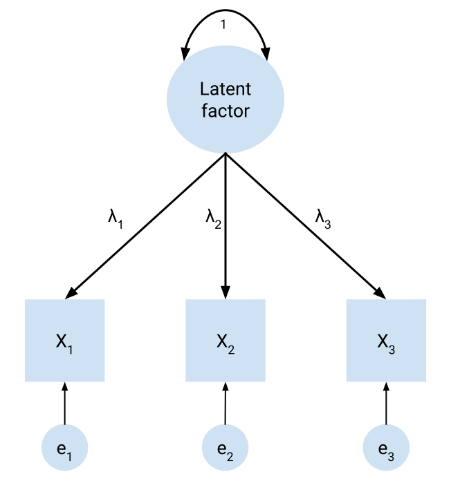
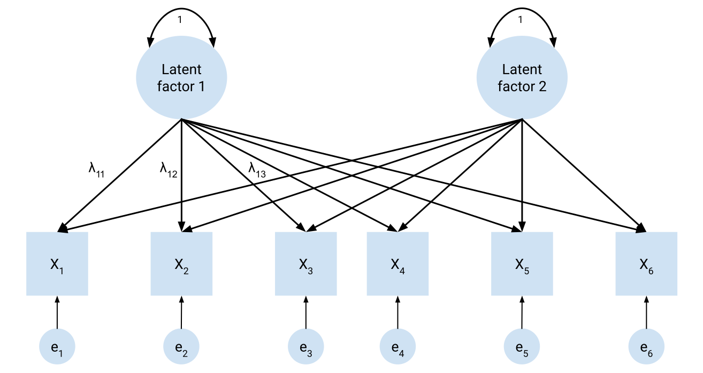
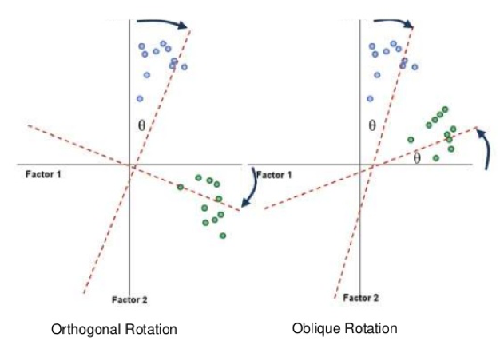

# Exploratory factor analysis 

```{r warning = FALSE, message = FALSE, echo = FALSE}
library(tidyverse)
library(ggpubr)
library(here)
library(psych)
library(EFA.dimensions)
```

Many of the *things* we are interested in psychological research are things that are both *unobservable* and not *directly* measurable. Consider, for instance, someone's height: this is an observable and directly measurable quantity, in that we can a) see how tall they are and b) take a tape measure to them and get a direct, precise measurement of their height. In contrast, consider the things that we are often interested in when it comes to psychological constructs: motivations, wellbeing attitudes, beliefs, cognitive abilities, values, personality features... 

None of these kinds of constructs are directly measurable or even tangible. We can't take a rule to measure how much someone enjoys listening to music, for example, or identify the extent to which they believe that listening to certain genres is healthy or unhealthy for you. However, we might be able to observe *behaviours* that might relate to these constructs, or people may respond to questions in ways that are indicative of said constructs. 

In this module we talk about **factor analysis**, which is one method of using statistics to identify these **latent constructs**. Specifically, we will focus on **exploratory factor analysis**, which aims to take a series of variables and identify the latent constructs that may underlie these variables.

## Introduction to EFA

We generally conduct a survey because we're interested in how different people hold different attitudes, ideas or beliefs about things. All of the standard statistical tools that you learned in Modules 5 and 6 are useful in this regard, and can absolutely be used with survey data. But given how highly dimensional survey data is, it opens up a new way of analysing data - exploratory factor analysis.

### Dimension reduction

Sometimes it's easy to forget that designing a questionnaire and administering it gives rise to quite complex data. After all, a single question item may simply ask participants to rate themselves on a statement using a Likert scale, as we have seen earlier in this module. However, consider how many questions we might collect across a scale and it quickly becomes evident that this kind of data is highly dimensional - that is, with lots of individual questions we end up with a lot of data to sift through.

This kind of scenario is where dimension reduction techniques become extremely useful. Dimension reduction techniques allow us to essentially collapse data into 'supervariables' that can simplify the analyses that we do by capturing the commonalities across questionnaire items. 

Principal components analysis (PCA) is the most common form of dimension reduction. Principal components analysis lets us take highly dimensional data, such as a questionnaire/scale with multiple items, and collapse that down into a smaller number of components.

 
### Factor analysis

Factor analysis is another analytical technique like dimension reduction. However, the key conceptual difference is that while PCA lets us collapse multiple variables into a smaller number of components, factor analysis lets us identify latent factors in our data. Latent factors are the factors underlying the behaviours and responses that we observe in our questionnaire items. We might find, for example, that performance on a series of tests is actually underlaid by multiple distinct, theoretically meaningful factors.

Therefore, factor analysis lets us build and test theories about latent psychological constructs. Factor analysis allows us to indirectly measure these latent factors - essentially, are our questions tapping into the same 'thing'?

Factor analysis can be split into exploratory factor analysis (EFA) and confirmatory factor analysis (CFA). We will focus specifically on EFA in this module.

 
**A terminology note**

You'll note that we've described PCA as generating components, while FA generates factors. It's worth remembering that this is intentional, and the two terms should not be used interchangeably. We will talk more about this on the pages that follow, but components are simply linear combinations of multiple variables. Factors are estimates of latent variables that drive behaviour. The latter specifically is what we use to test theories about psychological constructs.

 
### The steps of exploratory factor analysis

EFA is quite an involved analysis, and there are several considerations that must be taken into account:

-    Prepare data and assess for suitability
-    Decide on the extraction method
-    Decide on how many factors to retain
-    Decide on the rotation method
-    Interpret the results

 
### Example dataset

The example we'll be using to work through this data is from a brilliant statistician and educator, Professor Andy Field, who is very highly regarded for his Discovering Statistics series - including Discovering Statistics with SPSS and Discovering Statistics with R. I highly recommend checking them out if you plan on using them!

As part of his book, Prof. Field came up with a questionnaire called the SPSS Anxiety Questionnaire (SAQ). For the purposes of the next few pages we'll be using a reduced version with just 9 questions, which we'll call the SAQ-9. The questions in this survey are:

  Q1: Statistics makes me cry
  Q2: My friends will think I'm stupid for not being able to cope with SPSS
  Q4: I dream that Pearson is attacking me with correlation coefficients
  Q5: I don't understand statistics
  Q6: I have little experience of computers
  Q14: Computers have minds of their own and deliberately go wrong whenever I use them
  Q15: Computers are out to get me
  Q19: Everybody looks at me when I use SPSS
  Q22: My friends are better at SPSS than I am

```{r}
saq <- read_csv(here("data", "efa", "SAQ-9.csv"))
```

As we walk through the content, we will use this dataset to illustrate how to conduct an exploratory factor analysis. (Note the questions were specifically chosen for demonstration purposes.)

To actually conduct the EFA, we will primarily rely on two packages: `psych` and `EFA.dimensions`. The `psych` package is a fairly big package designed to run many common analyses in psychological science, specifically analyses that relate to *psychometrics.* It's an incredibly useful package to be aware of in general. `EFA.dimensions` is another great package that provides functions to help with certain parts of the EFA process.

## Theory of EFA
 

On this page, we (briefly) touch on a bit of the statistical theory underlying factor analysis and PCA. We won't dive too deeply into the maths underlying EFA, but will focus on the high-level conceptual stuff.

### PCA vs EFA

Here is a good point to formally differentiate PCA vs EFA, following on from the brief disclaimer on the previous page.

Both PCA and EFA will extract up to k factors that attempt to explain the observed variables. k, in this instance, is capped at the number of observed variables; so, if you input 24 variables into a PCA, the maximum number of components that you can estimate is 24. However, what defines these components/factors differs:

-    In PCA, where we are just interested in collapsing variables, we assume that all variance in the observed variables is explained by the factors. Ultimately, a PCA will extract k components that ultimately explain 100% of the variance in all of the observed variables. 
-    In EFA, the goal is only to explain common variance between the observed variables. EFA explicitly models the variance in the items to be comprised of common variance, which is variance due to shared underlying factors, and unique variance. Unique variance can be further broken down into specific variance, which is variance that is specific to each item, and error variance. By partitioning variance in this way, EFA is able to test models of factors as it allows for disconfirmation - a vital part of any model testing.

In short, EFA allows us to generate theoretical entities that we can test in subsequent analyses. PCA only provides us with a measure that combines the effects of multiple variables, but does not test latent factors.

 

 
The common factor model

The basis of factor analysis is the common factor model. Broadly speaking, the common factor model suggests that variables that relate to each other are likely driven by underlying latent variables. For example, if five questions in a survey all ask about a specific aspect of motivation, and these items correlate with each other, we would expect the same thing - or latent factor - to be driving responses on these five items. Exploratory factor analysis operates under this common factor model.

Below is a basic diagram of the common factor model. The squares represent observed variables, which are the variables that we measure. The big circle denotes the latent factor that we want to estimate. The circles leading to the observed variables are error terms. In an exploratory factor analysis, the primary thing we want to investigate is the factor loadings, denoted by the various lambdas ($\lambda$). We will see precisely what the factor loadings are later, but generally they are how strongly the latent factor predicts each observed variable.

```{r echo = FALSE}

```

Now let's take a look at the common factor model with two factors. As you can see, we allow every observed variable to load onto every factor - thus, we estimate factor loadings for every possible path going from latent factors to observed variables. This is what we estimate in exploratory factor analysis (and PCA - sort of).

For brevity's sake, only three lambdas have been shown, but hopefully they are illustrative enough to get the general gist across. Every path leading from a latent variable to an observed variable is a parameter to be estimated in an exploratory factor analysis.


```{r echo = FALSE}

```

 

 

 
### Partial correlations

In Module 10, we talked about the concept of correlation - i.e. how related two variables are. Recall that correlation coefficients are scaled from -1 to 1. Now we move to the concept of partial correlation - the relationship between two variables while controlling for a third.

Let's come back to the flow data in Week 10. Imagine we want to test the correlation between Gold MSI scores and flow proneness. However, we might suspect that openness to experience may play a role in the relationship between these variables. One thing we could do is to calculate a partial correlation between MSI scores and flow proneness while controlling for openness.

If we know the correlation between:

-    MSI scores and flow proneness,
-    MSI scores and openness,
-    Flow proneness and openness,

We could calculate the partial correlation between Gold-MSI and flow proneness, controlling for openness, using the below formula:

Both PCA and EFA rely on estimating partial correlations. Specifically, factor analysis aims to estimate latent factors that minimise the partial correlations among observed variables. If a latent factor perfectly explains the relationship between two variables, the partial correlations between the observed variables should be zero. A lot of the 'under the hood' maths, which we won't touch on, essentially relates to identifying the latent factors that maximise the amount of variance explained in each variable by the factor solutions. 

## Initial considerations for EFA

We'll start with some basic considerations for EFA/PCA. These are generally things that should be thought about/considered before an EFA, or at least before you interpret the results.

### Sample size

For adequate power, EFA typically needs a fairly big sample size. There is no clear agreement about what constitutes a 'good' sample size, and it's difficult to give concrete recommendations.

Many guides and sources will often mention a n:p rule of thumb, where n is sample size and p is number of variables (which is the number of parameters that needs to be estimated). The idea is that an ideal EFA sample size will have n participants for every variable you are analysing. These can range from as low as 3:1 to 20:1, with a typical 'ok' range being from 10-20:1. However, there is no clear support for these rules, and no minimum is truly sufficient (Hogarty et al. 2005).

In general - the bigger the better, and the more variables you have the more participants you need. Aim for at least 300+ no matter the circumstance (this is a very blunt rule of thumb!).

Below are our descriptives. While we can use a bit of tidyverse to get descriptives, the `describe()` function from the `psych` package is also convenient for getting basic descriptives for every column in a dataset. We can see that we have n = 2571, which should be more than adequate.

```{r}
describe(saq)
```

 
### Assumptions

EFA can be conducted with one of multiple algorithms that determines the final factor structure to be extracted. Different methods rely on different assumptions, so basic assumption checks are useful:

-    Data must be interval/ratio data. Ordinal data is problematic unless you generally have at least 5 scale points; in which case, you can broadly approximate this to be continuous.
-    Normality is important, depending on the method. The usual QQ-plot or Shapiro-Wilks tests on individual items can be useful here.a
-    Multicollinearity: observed variables should not be collinear with each other.

 

Note though that this only tests the normality of one variable, i.e. univariate normality. EFA is ideal with multivariate normality, i.e. the joint dimensions of the entire dataset are normally distributed. Univariate normality is necessary but not sufficient for multivariate normality. Sadly, however, Jamovi doesn't give an easy way to test multivariate normality so let's run with univariate normality for now.

 
### Factorability

Factorability broadly describes whether the data are likely to be amenable to factor analysis. If data are factorable, it suggests that there is likely to be at least one latent factor underlying the observations.

We can test factorability in three ways:

1. Correlations

A simple matrix of correlations can give us a first-pass indication of factorability. If most items correlate with each other, this can indicate that there are underlying latent factors. There is no hard and fast rule for what counts as 'acceptable', but if most variables are not significantly correlated that indicates that the data may not be factorable. In our SAQ-9 data, we can see that all correlations between variables are significant, which is generally a good sign.

```{r}
cor(saq)

# Alternatively, the lowerCor() fucntion from psych prints this more nicely

lowerCor(saq)
```


2. Bartlett's test of sphericity

Bartlett's test of sphericity tests the null hypothesis that all correlations between variables are zero at the population level. In other words, if Bartlett's test is non-significant it suggests that all of the indicator variables are not correlated. As a result, Bartlett's test is pretty much always significant as it is very sensitive to sample size. Unsurprisingly, then, our Bartlett's test result is significant.

To run this, we use the `cortest.bartlett()` function from `psych`. Note that base R does include a function called `bartlett.test()`, but this is not the same test! (same Bartlett, though.)

```{r}
cortest.bartlett(saq)
```


3. Kaiser-Meyer-Olkin (KMO) Test/Kaiser's Measure of Sampling Adequacy

This test is often referred to as the KMO Test or Kaiser's MSA, but both respectively mean the same thing. It is a measure of how much variance among all variables might be due to common variance. Higher KMO/MSA values indicate that more variance is likely due to common factors, thus indicating suitability for factor analysis.

Kaiser (1974) provided the following (hilarious) interpretations of MSA values:

MSA values are typically calculated for each variable, and for overall. It helps to report both. The `KMO()` function in `psych` will calculate both sets of measures of sampling adequacy. Here are our variables below. Overall they are generally in the meritorious range (except for one):

```{r}
KMO(saq)
```
## How many factors/components?

A crucial element of doing an EFA is deciding on the number of factors that should be extracted for the final solution. This is not a trivial decision, and essentially determines the final factor structure you derive and interpret in your factor analysis.
Note that while we mainly talk about factors on this page, the same considerations apply when thinking of components in PCA.

### Deciding on the number of factors

Recall that an EFA/PCA will extract up to k factors/components, where k is the number of observed variables. At k factors/components, this will have explained all of the possible variance there is to explain in the observed variables. The basic idea behind how these factors are calculated is by essentially drawing straight lines through our data, much like a regression line. The idea is that each straight line (factor/component) should explain as much variance as possible, and each successive factor/component that is drawn explains the remaining variance.

The first factor/component will always attempt to explain the most variance possible. The second factor/component will then be drawn through what remains after the first factor/component is calculated, in a way that both maximises the variance captured and is uncorrelated with the first factor/component. This lets us capture as much variance as possible in a clean way, where we can identify the relative contributions of each successive factor/component.

The amount of variance that is captured by each factor/component is represented by a number called the **eigenvalue.** Naturally, the first factor/component will have the highest eigenvalue, and the eigenvalue of each factor/component afterwards will decrease.

This means that at some point, we reach a stage where an additional factor doesn't add much in terms of the variance explained. This indicates that there isn't much utility in retaining factors after a certain point - i.e. we get diminishing returns on increasing the number of factors we have to interpret. We must strike a balance between having a relatively straightforward factor structure to interpret and how much variance is explained. Too few factors means we may not accurately capture enough variance to be meaningful or miss very crucial relationships, but too many factors means we lose parsimony and interpretability.

There are several ways in which we can identify where the most optimal number of factors to retain is.

 
### The Kaiser-Guttman rule

The Kaiser-Guttman, Kaiser or simply the "eigenvalue > 1" rule states that we should simply keep any factor with an eigenvalue above 1. To do this, we first need a correlation matrix from our data. We then feed this to the `eigen()` function in base R, which will calculate eigenvalues. I've piped it here, but you can also go straight to `eigen(cor(saq))`. Our data suggests that we retain 2 factors using this rule.

```{r}
saq_eigen <- cor(saq) %>%
  eigen()

saq_eigen$values
```

### The scree plot

The scree plot is a plot of each factor's eigenvalue. This method relies on visual inspection - namely, you want to identify the 'elbow' of the line, or the point where the graph levels off. This is the point where the amount of variance explained by additional factors reaches that diminishing returns phase.

`psych` will plot two sets of eigenvalues - one 'component'-based set (which is what we calculated above), and one 'factor'-based set (which is what Jamovi gives you). 

This is inherently a bit subjective, and sometimes isn't very clear. On our scree plot below, it looks like four factors is the point where the diminishing returns begin, so we would go with retaining four factors. However, a more conservative interpreter could reasonably argue that we should only retain 2 factors.

```{r}
scree(saq)
```


 
### Parallel analysis

Parallel analysis (Horn, 1965) is a sophisticated technique that involves simulating random datasets of the same size as our actual dataset, and comparing our dataset's eigenvalues against the random dataset's eigenvalues. Parallel analysis is generally demonstrated using a scree plot with an additional scree line for the simulated datasets. The `fa.parallel()` function will run this for us.

The number of factors to retain is determined by the number of factors where our actual data's eigenvalue exceeds the simulated dataset's eigenvalue. In this instance, we would choose to retain three factors, as the actual data eigenvalues clearly drop below the simulated data at four factors.

```{r}
fa.parallel(saq)
```


 
### How to decide?

Let's summarise our interim decisions so far:

-    Kaiser's rule suggests 1 factor
-    Visual scree plot inspection suggests either 2 or 4 factors
-    Parallel analysis suggests 3 factors

How do we decide what to use? Decades of empirical and simulation literature have shown a couple of things:

-    **Parallel analysis is one of the best methods** of identifying how many factors should be retained. While it is sensitive to various things like sample size, simulation studies have shown that parallel analysis consistently outperforms other methods in terms of how many factors should be retained.
-    In contrast, **do not use the Kaiser rule**! The Kaiser rule will consistently misestimate the number of factors - often, the misestimation will be quite severe. It is an extremely popular rule because a) it is simple to interpret and b) SPSS, which was the dominant statistical program of choice for a very long time, defaults to only using the Kaiser rule for PCA/EFA.
-    **Theoretical and practical considerations** should also inform your decision making. If parallel analysis suggests 7 factors, for example, but those 7 factors are hard to interpret then you should probably not run with that by default. Instead, the next thing to do would be to step through solutions that remove one factor at a time until an acceptable, interpretable model has been reached.

There are other methods of identifying factors, such as Vellicer's Minimum Average Partials test, but Jamovi does not provide these options. In the absence of any strong justification for anything else, it is best to fall back on parallel analysis. Thus, it's best if we go with three factors.

## Interpreting output

Let's now look at how to actually interpret the output of a factor analysis, including how to make sense of the main numbers that you get out of a basic EFA/PCA output.

### Extraction methods

PCA only has one method of deriving the eigenvalues of the components, and so it will give the same answer every time you run it on the same dataset. EFA, however, has multiple possible means of estimating factors, which are typically termed extraction methods. We won't go into the details of how exactly they work, but the key thing to know is that the extraction method essentially changes

There are three extraction methods available in Jamovi:

-    **Maximum likelihood.** One of the most common options, and provides the most generalisable and robust estimates. ML methods assume normality and generally require large datasets, however.
-    **Principal axis factoring.** Principal axis factoring does not make particular assumptions about the normality or distribution of the data, meaning that it is good at handling more complex datasets.
-    **Minimum residuals.** The minimum residual method is sort of a middle-ground option between the two, but isn't as commonly used in psychological research.

Under ideal conditions, maximum likelihood (ML) and PA (principal axis) methods will generally give very similar estimates of the factors. When data are severely non-normal (or you want to anticipate that it will be), it is better to go with PA in the first instance. Otherwise, ML estimates are generally the way to go.

To run a factor analysis in r, we use the `fa` function from `psych`. At minimum, we must specify the following:

- The dataset as the first argument
- The number of factors we want to extract
- The type of rotation - for now set this to "none", as we'll talk about this later
- The factoring method, `fm` - as above. `"ml"` stands for maximum likelihood, `"pa"` stands for principal axis factoring and `"minres"` stands for minimum residuals.

```{r}
saq_efa <- fa(
  saq,
  nfactors = 3,
  rotate = "none",
  fm = "ml"
)
```

 
### Interpreting output

Below is the main output of our EFA. This is what we call a factor matrix:

```{r}
saq_efa
```


What do these numbers mean? Firstly, each value in each factor column (labelled `ML1`, `ML2` etc) gives us our loadings. Note that as per the common factor model we described before, we estimate a loading for every variable on every factor. However, this can be a bit gross to interpret, so we generally choose to suppress (not remove) loadings below a certain threshold. By default, Jamovi will hide loadings below 0.3. We can also sort the items based on their loadings. To do this, we use the `fa.sort()` function and feed in our EFA object. We can then use `print()` to clean up this output with two arguments: `digits` to show rounding, and `cut` to suppress values below a certain size. This gives us a nicer output:

```{r}
saq_efa <- fa.sort(saq_efa) 
print(saq_efa, digits = 3, cut = .30)
```


Statistically speaking, in a factor matrix each loading is a **regression coefficient** for the latent factor predicting the variable. We can interpret them as we would with normal regressions, except this is a regression coefficient for our latent variable predicting each observed variable. For example, the loading for q14 on factor 1 is 0.631. This means that for every 1 unit increase on latent factor 1, scores on Q14 increase by .631 units.

Jamovi typically only gives you the **uniqueness** column, `u2`, which gives us the value of unique variance as a percentage. This is how much variance in each item is not explained by the factors we have chosen. In this instance, 58% of the variance in Q14 is not explained by the three factors.

Generally though, it's easier to think in terms of **communalities**, or the values in the `h2` column, which is the amount of variance that is explained by the factors. Communalities are simply 1 - uniqueness; thus, the communality of Q14 is 0.420, which indicates that 42% of the variance in Q14 is explained by the three factors. Higher communalities indicate that the factors collectively explain more variance in the observed variable.

How is this value calculated? Communalities are the sum of the squared factor loadings. Therefore, we can look at Q14's factor loadings in the first (pre-sorted) output table, and calculate the communality as:

$$
h^2 = .631^2 + -.116^2 + .0963^2
$$

Which gives us an answer of approximately 0.420:

```{r}
.631^2 + (-.116)^2 + .0963^2
```


 
### Total variance explained

The output of `psych` will also give you a brief table of the total amount of variance explained by each factor. This is shown in the output of `fa`, but can also be accessed again below. It is generally useful to at least report the total cumulative variance explained by all factors. In this case, the three factors collectively explain 35.1% of the total variance in the data (shown by the row saying "Cumulative var").

```{r}
saq_efa$Vaccounted
```
## Rotation, and interpreting output again


You may have noticed that on the previous page, we didn't make much of an effort to actually talk about what the factors were or what they meant. That's because the output that we got on the previous page isn't actually terribly informative or easy to interpret. To help with this, in EFA we perform a technique called **rotation**.

### Rotations

Rotations are a technique in EFA that are done to help with the interpretability of the factor solution. The key aim of rotation is to achieve **simple structure** where possible.

You may have noticed that the matrix from the previous page has quite a few variables with high enough loadings on multiple factors. This is called **cross-loading**, and indicates that two factors explain the variable. This is not easily interpretable! Ideally, in a robust simple structure we want:

-    Only one loading per variable
-    At least three loadings per factor

```{r}
print(saq_efa, digits = 3, cut = 0.3)
```


Rotation can help us achieve this. What rotations essentially do is change how variance is distributed within each factor. That wording is extremely important to note. It does not change our data in any way - the actual amount of variance explained by each factor does not change. What does change is how variance is distributed across the factors, which has the effect of then changing the loadings. But the actual data does not change!!

There are two families of rotations that we can employ.

-    **Orthogonal** rotations force factors to be **uncorrelated**.
-    **Oblique** rotations allow factors to be correlated.

The below diagram visualises what rotations do:

```{r echo = FALSE}

```


**Which rotation to choose?** In psychology, everything tends to be correlated with everything else, and it's extremely rare that we would get an instance where two factors do not correlate at all. For that reason, **oblique rotations are generally the way to go**. Orthogonal rotations are extremely hard to justify without strong a-priori evidence - and even if two factors are uncorrelated, oblique rotations will give the same solution as orthogonal ones. In short, there's generally no reason to prefer an orthogonal rotation by default.

 
### Rotated factor solution

Let's apply an oblique rotation to our factor analysis. The default oblique rotation is called oblimin. To do this, we need to re-run our `fa()` function with a rotation specified.

```{r}
saq_efa_rot <- fa(
  saq,
  nfactors = 3,
  rotate = "oblimin",
  fm = "ml"
)
```


This produces the following output, which we now term a pattern matrix:

```{r}
saq_efa_rot %>%
  fa.sort() %>%
  print(digits = 3, cut = 0.3)
```


Now we can see our simple structure taking effect, and this output is much more interpretable from before. These values are still regression coefficients between each latent factor and each variable, but now we can group these variables into their underlying latent factors much more easily. We can see that questions 1, 4 and 5 are best captured by factor 1, questions 6, 14 and 15 by factor 2 and questions 2, 19 and 22 by factor 3.

**One warning here**. On the previous page, where we had an unrotated solution, the communalities were calculated by summing the squared factor loadings for each variable. That rule no longer applies here because by allowing the factors to correlate, the regression loadings now capture non-specific variance. Summing the squared factor loadings will lead to greater communality values than what they actually are. However, as you can hopefully see in the uniqueness column, the actual communalities have not changed. Rotation does not change how much variance is explained in total - only how that variance is distributed!

 
Oblique rotations will also generate a **factor correlation matrix**. This calculates the correlations between the factors - remembering that by specifying an oblique rotation, we allowed them to correlate:

```{r}
saq_efa_rot$Phi
```


Finally, we get the table of variance explained. This is now not as useful because of the same reason we cannot sum the squared factor loadings - each factor on its own now captures shared variance across the other factors as they are allowed to correlate. However, the total amount of variance explained is still 35.1%; once again, this does not change.

```{r}
saq_efa_rot$Vaccounted
```

