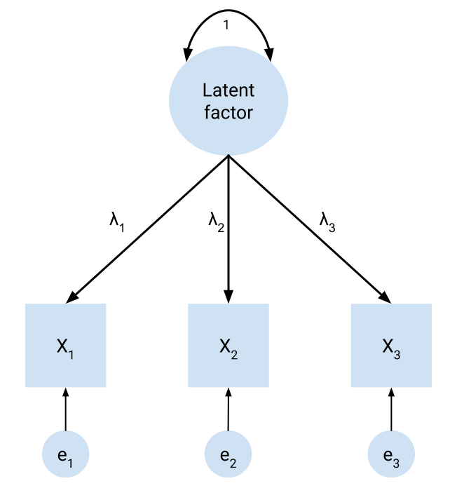
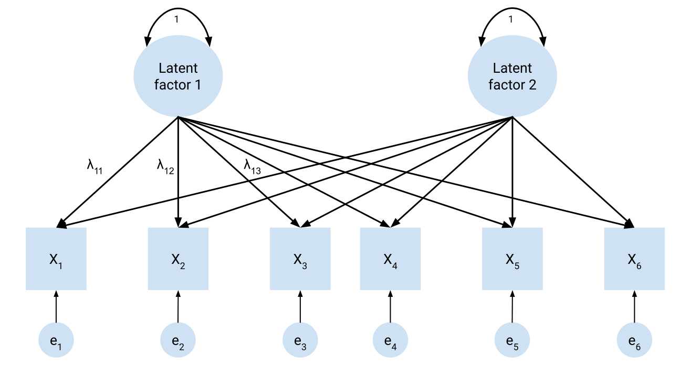
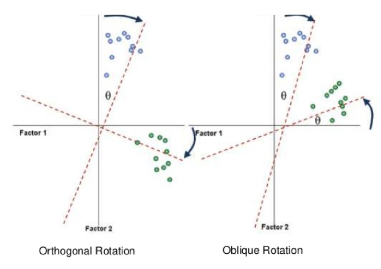

# Exploratory factor analysis 

```{r 11_packages, warning = FALSE, message = FALSE, echo = FALSE}
library(tidyverse)
library(ggpubr)
library(here)
library(psych)
library(EFA.dimensions)
```

Many of the *things* we are interested in psychological research are things that are both *unobservable* and not *directly* measurable. Consider, for instance, someone's height: this is an observable and directly measurable quantity, in that we can a) see how tall they are and b) take a tape measure to them and get a direct, precise measurement of their height. In contrast, consider the things that we are often interested in when it comes to psychological constructs: motivations, wellbeing attitudes, beliefs, cognitive abilities, values, personality features... 

None of these kinds of constructs are directly measurable or even tangible. We can't take a ruler to measure how much someone enjoys listening to music, for example, or identify the extent to which they believe that listening to certain genres is healthy or unhealthy for you. However, we might be able to observe *behaviours* that might relate to these constructs, or people may respond to questions in ways that are indicative of said constructs. 

In this module we talk about **factor analysis**, which is one method of using statistics to identify these **latent constructs**. Specifically, we will focus on **exploratory factor analysis**, which aims to take a series of variables and identify the latent constructs that may underlie these variables.


## Introduction to EFA
 
::: {style="background-color: #f5f5f5;  padding: 1.75rem;"}
On this page, we briefly consider what dimensional reduction techniques are, to provide a grounding for the rest of the module.
:::


### Dimension reduction

As mentioned on the previous page, in psychological research it is common to use **scales** that measure some unobserverable, or indirectly measurable construct - like motivations, attitudes and beliefs. These scales often take the form of surveys or questionnaires that ask participants a series of questions. All of the standard statistical tools that you learn (e.g. *t*-tests, ANOVAs, regressions) are useful in this regard, and can absolutely be used with survey data. 

However, even a single questionnaire with a number of survey items will inevitably give rise to quite complex data. A single question item may simply ask participants to rate themselves on a statement using a Likert scale or similar. Consider though that questionnaires often capture responses on *many* statements, or performance batteries might capture performance on *multiple* tasks. It may quickly be evident that this kind of data is highly dimensional - that is, with lots of individual questions we end up with a lot of data to sift through.

Thus, we sometimes need techniques where we can *reduce* the dimensionality of our data. This is  is where dimension reduction techniques become extremely useful. Dimension reduction techniques allow us to essentially collapse multiple variables into a smaller set of variables that represent them. 

### Forms of dimension reduction

There are two main dimension reduction techniques:

- **Principal components analysis (PCA)** is the most common form of dimension reduction. Principal components analysis lets us take highly dimensional data, such as a questionnaire/scale with multiple items, and collapse that down into a smaller number of components. The components are, in a sense, aggregates of the variables they are comprised of.
- **Exploratory factor analysis (EFA)** is a technique that aims to identify latent factors from a given set of observable variables. While it achieves a similar goal as PCA, which is to reduce lots of variables down into a smaller set, the resulting factors can be interpreted as latent factors that underlie or drive responses on the variables they influence.

In this module we will focus primarily on EFA. However, as we will also see on the next section many of the things we talk about will also apply to conducting PCAs - with some important caveats.

## Introduction to factor analysis

::: {style="background-color: #f5f5f5;  padding: 1.75rem;"}
We begin with a general overview of factor analysis and its conceptual underpinnings.
:::

### What is factor analysis?

Factor analysis describes a family of statistical techniques that center around the purpose of identifying **latent factors**, or **latent variables**. Latent factors are the factors underlying the behaviours and responses that we observe in our questionnaire items. In other words, the general inference we make is that people's behaviours (e.g. responses to specific self-report questions) are underlaid or driven by latent factors that denote psychological constructs. 

Consider a simple example. Imagine a person consistently endorses the following statements:

- I am the life of the party.
- I talk to a lot of different people at parties.

And they rate themselves low on the following statements:

- I don't talk a lot.
- I keep in the background.

You can probably see that this pattern of responding would indicate something about this person - all of these questions tap into the same 'thing' or concept. In this case, all of these statements are a measure of the personality factor of extroversion, from the Mini-IPIP (International Personality Item Pool). This factor can be identified through conducting a factor analysis of responses to survey items like these.

Therefore, in essence factor analysis lets us build and test models about latent psychological constructs. Factor analysis can be split into **exploratory factor analysis (EFA)** and **confirmatory factor analysis (CFA)**. We will focus specifically on EFA in this module.

### The common factor model

The basis of both types of factor analysis is the **common factor model**. Broadly speaking, if variables (e.g. survey items) are decently correlated with each other, they share *variance* with each other. This shared variance reflects variance that is common to the variables (**common variance**), and thus may indicate underlying latent factors. We can perhaps intuitively see this with the four extraversion questions above - responses on the four items are all likely to correlate with each other (e.g. compare "I talk to a lot of different people at parties" with "I don't talk a lot"). Thus, they are likely to be driven by some underlying factor.

Below is a basic diagram of the common factor model, with one latent factor. Here is what each part of the figure represents:

- The squares represent observed variables, which are the variables that we measure. 
- The big circle denotes the latent factor that we want to estimate. The circles leading to the observed variables are error terms. 
- The arrows denote *paths*. Note the direction of the paths here - they go from the latent factor to each observed variable. This is because we are inferring that the latent variable is causing the behaviour in each observed variable.
- In an exploratory factor analysis, the primary thing we want to investigate is the factor loadings, denoted by the various lambdas ($\lambda$). We will see precisely what the factor loadings are later, but generally they are how strongly the latent factor predicts each observed variable.

```{r echo = FALSE}

```

Now let's take a look at the common factor model with two factors. As you can see, we allow every observed variable to load onto every factor - thus, we estimate factor loadings for every possible path going from latent factors to observed variables. This is what we estimate in exploratory factor analysis (and PCA - sort of).

For brevity's sake, only three lambdas have been shown, but hopefully they are illustrative enough to get the general gist across. Every path leading from a latent variable to an observed variable is a parameter to be estimated in an exploratory factor analysis.


```{r echo = FALSE}

```

Typically, however, we *don't know* how many latent factors may underlie a given set of observed variables. For instance, if you have a 25-item scale, how many factors might underlie responses to the scale? 

Technically speaking, if we have *k* items then we can extract up to *k* factors, where each item forms its own factor. However, if we did that then we wouldn't actually be extracting any factors at all - we would simply be reproducing the data by itself! In addition, after a certain number of factors we will not gain any appreciable increase in both how much of the data we explain, and may also run into issues of interpretability (both of which we will see shortly). In other words, there will be a certain number of factors that provides the best balance between *interpretability* and *statistical fit*.

Thus, the overarching goal of EFA is to **identify the correct** (or at least defensible) **number of factors** underlying a given set of observed variables. 

### PCA vs EFA

Here is a good point to formally differentiate PCA vs EFA, following on from the brief disclaimer on the previous section.

Both PCA and EFA operate on similar mathematical and procedural principles, to the point where they have often been used interchangeably. However, they are **not the same thing**! The key difference is how PCA and EFA treat variance:

-    In PCA, we assume that *all variance* in the observed variables is shared by underlying 'latent variables'. Thus, we don't distinguish between variance that is common to the observed variables and error variance. 
-    In EFA, the goal is only to explain *common variance* between the observed variables - i.e. the variance that is actually shared between observed variables. EFA explicitly models the variance in the items to be comprised of common variance, which is variance due to shared underlying factors, and *unique variance*. Unique variance can be further broken down into specific variance, which is variance that is specific to each item, and error variance. 

What does this mean? Essentially, by partitioning common variance only and allowing for error, EFA provides a true model of latent factors, which can then be tested with CFA and other techniques. In constrant, PCA does **not** actually generate a model that can be tested, as it contains no specific error component like EFA does. PCA simply reduces a lot of variables into a smaller number of variables.

This means that the actual products of PCA and EFA are also conceptually different, and thus go by different terms: PCA generates *components*, while FA generates *factors.* The two terms should not be used interchangeably. 

::: {.callout-warning}
### Don't conflate PCA and EFA

Although PCA and EFA are conceptually (and mathematically) different as discussed above, they have often been treated as interchangeable - i.e. PCA has often been (mis)used as a form of factor analysis. Be careful not to make the same mistake for the reasons described above. Even though similar results can be obtained between PCA and EFA under ideal conditions, this does not automatically mean that PCA provides a true test of latent factors.
:::


 
### Partial correlations

In the [regression module in Chapter @sec-regressions-1], we talked about the concept of **correlation** - i.e. how related two variables are. Recall that correlation coefficients are scaled from -1 to 1. Similarly, in the [second regression module in Chapter @sec-regressions-2] we also talked about the concept of **partial correlation** - the relationship between two variables while controlling for a third, as denoted using the below formula:

$$
r_{xy.z} = \frac{r_{xy} - (r_{xz} \times r_{yz})}{\sqrt{(1-r^2_{xz})(1-{r^2_{yz}})}}
$$

Both PCA and EFA rely on estimating partial correlations. Specifically, factor analysis aims to estimate latent factors that **minimise the partial correlations** among **observed** variables. If a latent factor perfectly explains the relationship between two variables, the partial correlations between the observed variables (i.e. after accounting for the latent factor) should be zero. A lot of the 'under the hood' maths, which we won't touch on, essentially relates to identifying the latent factors that maximise the **amount of variance** explained in each variable by the factor solutions. 

 
### The steps of an EFA

EFA is quite an involved analysis, and there are several considerations that must be taken into account:

-    Prepare data and assess for suitability
-    Decide on the extraction method
-    Decide on how many factors to retain
-    Decide on the rotation method
-    Interpret the results

This takes us through the process of examining a set of data for their suitability for factor analysis, to the process of deciding how many latent factors we identify from the data and interpreting them.

The example data we'll be using to work through these steps are from a brilliant statistician and educator, Professor Andy Field, who is very highly regarded for his Discovering Statistics series - including Discovering Statistics with SPSS and Discovering Statistics with R. I highly recommend checking them out if you plan on using them!

As part of his book, Prof. Field came up with a questionnaire called the SPSS Anxiety Questionnaire (SAQ). For the purposes of the next few pages we'll be using a reduced version with just 9 questions, which we'll call the SAQ-9. The questions in this survey are:

-  Q1: Statistics makes me cry
-  Q2: My friends will think I'm stupid for not being able to cope with SPSS
-  Q4: I dream that Pearson is attacking me with correlation coefficients
-  Q5: I don't understand statistics
-  Q6: I have little experience of computers
-  Q14: Computers have minds of their own and deliberately go wrong whenever I use them
-  Q15: Computers are out to get me
-  Q19: Everybody looks at me when I use SPSS
-  Q22: My friends are better at SPSS than I am

```{r}
saq <- read_csv(here("data", "efa", "SAQ-9.csv"))
```

As we walk through the content, we will use this dataset to illustrate how to conduct an exploratory factor analysis.^[Note the questions were specifically chosen for demonstration purposes.]

To actually conduct the EFA, we will primarily rely on two packages: `psych` and `EFA.dimensions`. The `psych` package is a fairly big package designed to run many common analyses in psychological science, specifically analyses that relate to *psychometrics.* It's an incredibly useful package to be aware of in general. `EFA.dimensions` is another great package that provides functions to help with certain parts of the EFA process.


## Initial considerations for EFA

:::{style="background-color: #f5f5f5;  padding: 1.75rem;"}
We'll start with some basic considerations for EFA/PCA. These are generally things that should be thought about/considered before an EFA, or at least before you interpret the results.
:::

### Sample size

EFA is a technique that typically needs a fairly big sample size for adequate power. However, the power of an EFA depends heavily on various features of the chosen EFA model itself, such as how many factors we extract and how many items we have per factor. Thus, there is no 'clear' there is no clear agreement about what constitutes a 'good' sample size, and it's difficult to give concrete recommendations.

Many guides and sources will often mention a n:*p* rule of thumb, where n is sample size and *p* is number of variables (which is the number of parameters that needs to be estimated). The idea is that an ideal EFA sample size will have n participants for every variable you are analysing. These can range from as low as 3:1 to 20:1, with a typical 'ok' range being from 10-20:1. However, there is no clear support for these rules, and no minimum is truly sufficient (Hogarty et al. 2005).

In general - the bigger the better, and if you have more variables to factor analyse then you will need more participants. It's good to aim for at least 300+ no matter the circumstance, but it should be noted that this is a very blunt rule of thumb!

### Descriptives of the data

Often, the first useful step in conducting an EFA is to simply examine the descriptive statistics for each item. Below are our descriptives for our 9-item scale. While we can use a bit of tidyverse to get descriptives, the `describe()` function from the `psych` package is also convenient for getting basic descriptives for every column in a dataset. We can see that we have n = 2571, which should be more than adequate.

```{r}
describe(saq)
```

Based on the descriptives of each item, we can see that q02 ("My friends will think I'm stupid for not being able to cope with SPSS") might be a bit skewed towards lower values, given the median here is 1 out of 5. This may not automatically be an issue, however.
 
### Assumptions

Because EFA fundamentally examines correlations between variables, many of the assumptions inherent to Pearson's *r* (and linear relationships more broadly) apply directly to EFAs. This includes:

- Data must be interval/ratio (continuous) data. Ordinal data with at least 5 scale points can be treated as continuous (e.g. see Huh & Gim, 2025); otherwise, you must alter the methods used for the EFA.
- Linearity between variables
- Normality is important, depending on the method. The usual QQ-plot or Shapiro-Wilks tests on individual items can be useful here.
- Multicollinearity: observed variables should not be collinear with each other.


Note though that the Shapiro-Wilks test only tests the normality of one variable, i.e. univariate normality. EFA is ideal with multivariate normality, i.e. the joint dimensions of the entire dataset are normally distributed. Univariate normality is necessary but not sufficient for multivariate normality. Although Jamovi doesn't provide an easy way to test for multivariate normality (yet), it is very easy to do so in R with the `MVN` package.

```{r message = FALSE}
library(MVN)

# Use the mvn() function to create the test output
mvn_results <- mvn(saq, mvn_test = "mardia")

# Extract the multivariate normality test only
mvn_results$multivariate_normality
```


 
### Factorability

Factorability broadly describes whether the data are sutiable for factor analysis. If data are factorable, it suggests that there is likely to be at least one latent factor underlying the observations.

We can test factorability in three ways:

1. Correlations

A simple matrix of correlations can give us a first-pass indication of factorability. As per the common factor model, if most items correlate with each other this can indicate that there are underlying latent factors. There is no hard and fast rule for what counts as 'acceptable', but if most variables are not significantly correlated that indicates that the data may not be factorable. In our SAQ-9 data, we can see that all correlations between variables are significant, which is generally a good sign. 

Naturally, we can use `cor()` to generate a correlation matrix. Alternatively, the `lowerCor()` fucntion from `psych` prints this more nicely:

```{r}
cor(saq)

lowerCor(saq)
```


2. Bartlett's test of sphericity

Bartlett's test of sphericity tests the null hypothesis that all correlations between variables are zero at the population level. In other words, if Bartlett's test is non-significant it suggests that all of the indicator variables are not correlated, using a chi-square test. This is a more formal test of seeing whether the variables are significantly correlated with each other across a full matrix than the visual inspection above. 

Note though that Bartlett's test is highly sensitive, especially in large samples. In large sample sizes, Bartlett's test can be significant even with trivial differences between the observed and null correlation matrices, because it is a test of whether *any* correlations are significantly different from zero! So it is probably no real surprise that our Bartlett's test is significant here, and likely always will be for the kind of data we use for EFA.

To run this, we use the `cortest.bartlett()` function from `psych`. Note that base R does include a function called `bartlett.test()`, but this is not the same test! (same Bartlett, though.)

```{r}
cortest.bartlett(saq)
```

3. Kaiser-Meyer-Olkin (KMO) Test/Kaiser's Measure of Sampling Adequacy

This test is often referred to as the KMO Test or Kaiser's MSA, but both respectively mean the same thing. The KMO is another measure of factorability that doesn't share the same sensitivity to sample size as Bartlett's test. It is a measure of how much variance among all variables might be due to common variance. Higher KMO/MSA values indicate that more variance is likely due to common factors, thus indicating suitability for factor analysis.

Kaiser (1974) provided the following (hilarious) interpretations of MSA values:

```{r echo = FALSE}
data.frame(
  msa = c("MSA > 0.90", "MSA between .80 - .90", "MSA between .70 - .80", "MSA between .60 - .70", "NSA between .50 - .60", "MSA < .50"),
  interpretation = c("Marvelous", "Meritorious", "Middling", "Mediocre", "Miserable", "Unacceptable")
) %>%
  knitr::kable(col.names = c("MSA value", "Interpretation"))
```


MSA values are typically calculated for each variable, and for overall. It helps to report both. The `KMO()` function in `psych` will calculate both sets of measures of sampling adequacy. Here are our variables below. Overall they are generally in the meritorious range (except for one):

```{r}
KMO(saq)
```
::: {.callout-note}
### What happens if one variable has a low KMO value?

If a variable has a low individual low KMO value, particularly when compared to other items, it indicates that that singular variable likely doesn't share a lot of variance with the other variables. In turn, this will mean that the variable likely won't load strongly on a factor. The typical thing to do in this case is to drop the variable with the low KMO.
:::


## How many factors/components?

::: {style="background-color: #f5f5f5;  padding: 1.75rem;"}
A crucial element of doing an EFA is deciding on the number of factors that should be extracted for the final solution. This is not a trivial decision, and essentially determines the final factor structure you derive and interpret in your factor analysis.
Note that while we mainly talk about factors in this section, the same considerations apply when thinking of components in PCA.
:::

### Deciding on the number of factors


Recall that an EFA/PCA will extract up to k factors/components, where k is the number of observed variables. At *k* factors/components, all of the possible variance there is to explain in the observed variables will have been captured. But how does this process actually work?

The basic idea is that the first factor/component will always attempt to explain the most variance possible. The second factor/component will then attempt to explain what variance remains after the first factor/component is calculated, in a way that both maximises the variance captured and is uncorrelated with the first factor/component. Each successive factor that is extracted will again try and explain additional variance that hasn't been captured by the factors already extracted. This lets us capture as much variance as possible in a clean way, where we can identify the relative contributions of each successive factor/component. 

This means that at some point, we reach a stage where an additional factor doesn't add much in terms of the variance explained. This indicates that there isn't much utility in retaining factors after a certain point - i.e. we get diminishing returns on increasing the number of factors we have to interpret. We must strike a balance between having a relatively straightforward factor structure to interpret and how much variance is explained. Too few factors means we may not accurately capture enough variance to be meaningful or miss very crucial relationships, but too many factors means we lose parsimony and interpretability.

The amount of variance that is captured by each factor/component is represented by a number called the **eigenvalue.** We will not concern ourselves about how eigenvalues are calculated. Naturally, the first factor/component will have the highest eigenvalue, and the eigenvalue of each factor/component afterwards will decrease.

There are several ways in which we can identify where the most optimal number of factors to retain is.

 
### The Kaiser-Guttman rule

The Kaiser-Guttman, Kaiser or simply the "eigenvalue > 1" rule states that we should simply keep any factor with an eigenvalue above 1. To do this, we first need a correlation matrix from our data. We then feed this to the `eigen()` function in base R, which will calculate eigenvalues. I've piped it here, but you can also go straight to `eigen(cor(saq))`. Our data suggests that we retain 2 factors using this rule.

```{r}
saq_eigen <- cor(saq) %>%
  eigen()

saq_eigen$values
```

### The scree plot

The scree plot is a plot of each factor's eigenvalue. This method relies on visual inspection - namely, you want to identify the 'elbow' of the line, or the point where the graph levels off. This is the point where the amount of variance explained by additional factors reaches that diminishing returns phase mentioned above.

The `psych` package provides a helpful `scree()` function that will create this plot for us. `psych` will plot two sets of eigenvalues - one 'component'-based set (which is what we calculated above), and one 'factor'-based set (which is what Jamovi gives you). 

This is inherently a bit subjective, and sometimes isn't very clear. On our scree plot below, it looks like either two or four factors is the point where the diminishing returns begin, so we could go with retaining four factors. However, a more conservative interpreter could reasonably argue that we should only retain 2 factors.

```{r}
scree(saq)
```


### Parallel analysis

Parallel analysis (Horn, 1965) is a sophisticated technique that involves simulating random datasets of the same size as our actual dataset, but with correlations of 0 across the board, and comparing our dataset's eigenvalues against the random dataset's eigenvalues. The general intuition here is that if there are meaningful factors in our data, they should be evident when compared against random noise. 

Parallel analysis is generally demonstrated using a scree plot with an additional scree line for the simulated datasets. The `EFA.dimensions` package comes with a handy function called `RAWPAR()` that will conduct parallel analysis for us, and plot the results.^[The `psych` package has a similar function called `fa.parallel()`.]


The number of factors to retain is determined by the number of factors where our actual data's eigenvalue exceeds the simulated dataset's eigenvalue. `RAWPAR()` will calculate eigenvalues from the random data at two points: the mean eigenvalue for each number of factors, and (by default) at the 95th percentile of eigenvalues. You should look at the *percentile-based eigenvalue* when comparing against our actual dataset, because this is essentially a more stringent test of how many factors to keep. In this instance, we would choose to retain two factors, as the actual data eigenvalues clearly drop below the simulated data at three factors.^[As you can see from the code below, there are two ways of calculating these eigenvalues - using either a PCA or PAF (principal axis factoring). The `fa.parallel()` function uses both. Although counterintuitive given that they are not the same technique conceptually, the PCA-based output (i.e. number of *components*) is the typical method, and actually does perform well at correctly identifying the number of factors to extract. Jamovi appears to default to PAF-based eigenvalues, however.] 

```{r}
library(EFA.dimensions)
RAWPAR(saq, extraction = "PCA", percentile = 95)
```

### Velicer's Minimum Average Partials (MAP) test

The Minimum Average Partials (MAP; Velicer, 1976) test is another powerful test that is generally useful at identifying how many factors should be extracted. It basically works by calculating the partial correlations between items and finding their average *after* removing the variance explained by the factors. The idea here is that the correct number of factors should minimise the residual partial correlations. 

The `EFA.dimensions` package provides a `MAP()` function, which will print this nicely for us:

```{r}
library(EFA.dimensions)
MAP(saq)
```
Here, we look for the number of factors with the minimum average partial correlation (hence the name). There are two forms of this test, one based on the original and a revised version - the only difference is that the original looks for the average *squared* correlation, while the revised version calculates it to the 4th power. As we can see, the smallest average correlation in both versions occurs when we extract one factor.

### How to decide?

Let's summarise our interim decisions so far:

-    Kaiser's rule suggests 1 factor
-    Visual scree plot inspection suggests either 2 or 4 factors
-    Parallel analysis suggests 2 factors
-    MAP suggests 1 factor

How do we decide what to use? Decades of empirical and simulation literature have shown a couple of things:

-    **Parallel analysis is one of the best methods** of identifying how many factors should be retained. While it is sensitive to various things like sample size, simulation studies have shown that parallel analysis consistently outperforms other methods in terms of how many factors should be retained.
-    In contrast, **do not use the Kaiser rule**! The Kaiser rule will consistently misestimate the number of factors - often, the misestimation will be quite severe. It is an extremely popular rule because a) it is simple to interpret and b) SPSS, which was the dominant statistical program of choice for a very long time, defaults to only using the Kaiser rule for PCA/EFA.
-    Scree plots also should not be the first port of call as they are subjective judgements.
-    **Theoretical and practical considerations** should also inform your decision making. If parallel analysis suggests 7 factors, for example, but those 7 factors are hard to interpret then you should probably not run with that by default. Instead, the next thing to do would be to step through solutions that remove one factor at a time until an acceptable, interpretable model has been reached.

There are other methods of identifying factors, such as the Hull and Comparison data methods that we could also optionally run. Both R and Jamovi provide options for these analyses now (albeit through different packages/modules respectively). In the absence of any strong justification for anything else, it is best to fall back on parallel analysis. However, for pedagogical reasons we will proceed with extracting three factors (mainly because it demonstrates nice simple structure while still being interpretable).

::: {.callout-warning}
# A further note on SPSS defaults
:::

## Interpreting output

::: {style="background-color: #f5f5f5;  padding: 1.75rem;"}
Let's now look at how to actually interpret the output of a factor analysis, including how to make sense of the main numbers that you get out of a basic EFA output.
:::

### Extraction methods

PCA only has one method of deriving the eigenvalues of the components, and so it will give the same answer every time you run it on the same dataset. EFA, however, has multiple possible means of estimating factors, which are termed extraction methods. We won't go into the details of how exactly they work, but the key thing to know is that the extraction method essentially changes how factor loadings are calculated, which in turn have implications for intepretability.

There are three extraction methods available in Jamovi, which we will also discuss here for parity:

-    **Maximum likelihood (ML).** One of the most common options, and provides the most generalisable and robust estimates. ML methods assume multivariate normality and generally require large datasets, however.
-    **Principal axis factoring (PAF).** Principal axis factoring does not make particular assumptions about the normality or distribution of the data, meaning that it is good at handling more complex datasets.
-    **Minimum residuals.** Also known as **unweighted least squares**, this option is appropriate for instances in which you have either categorical or ordinal data. There are a few more steps that you must undertake before analysing categorical/ordinal data via EFA, however. 

Under ideal conditions, maximum likelihood and principal axis factoring will generally give very similar estimates of the factors. When data are severely non-normal (or you anticipate that it will be), it is better to go with PAF in the first instance. Otherwise, ML estimates are generally the way to go.

To run a factor analysis in R, we use the `fa()` function from `psych`. At minimum, we must specify the following:

- The dataset as the first argument
- The number of factors we want to extract
- The type of rotation - for now set this to `"none"`, as we'll talk about this later
- The factoring method, `fm` - as above. `"ml"` stands for maximum likelihood, `"pa"` stands for principal axis factoring and `"minres"` stands for minimum residuals.

```{r}
saq_efa <- fa(
  saq,
  nfactors = 3,
  rotate = "none",
  fm = "ml"
)
```

 
### Interpreting output

Below is the main output of our EFA. This is what we call a factor matrix:

```{r}
saq_efa
```


What do these numbers mean? Firstly, our factors are denoted by the columns titled `ML` - so `ML1`, `ML2` and `ML3` all denote a factor each. Each value in each factor column represents our **factor loadings**. Note that as per the common factor model we described before, we estimate a loading for every variable on every factor. 

Statistically speaking, in a factor matrix each loading is a **regression coefficient** for the latent factor predicting the variable. We can interpret them as we would with normal regressions, except this is a regression coefficient for our latent variable predicting each observed variable. For example, the loading for q14 on factor 1 is 0.631. This means that for every 1 unit increase on latent factor 1, scores on Q14 increase by .631 units.

Note too that we get a column called `h2`. This is our estimate of the **communalities** ($h^2$) for each item, which is the amount of variance that is explained by the factors expressed as a percentage. The communality of Q14 is 0.420, which indicates that 42% of the variance in Q14 is explained by the three factors. Higher communalities indicate that the factors collectively explain more variance in the observed variable.

Likewise, the **uniqueness** column, `u2` gives us the value of unique variance ($u^2$) as a percentage. This is how much variance in each item is *not* explained by the factors we have chosen, and are calculated by subtracting the communalities from 1 (i.e. $u^2 = 1 - h^2$). In this instance, 58% of the variance in Q14 is not explained by the three factors.

How are communalities calculated? Communalities are the sum of the squared factor loadings. Therefore, we can look at Q14's factor loadings in the first (pre-sorted) output table, and calculate the communality as:

$$
h^2 = .631^2 + -.116^2 + .0963^2
$$

Which gives us an answer of approximately 0.420:

```{r}
.631^2 + (-.116)^2 + .0963^2
```


However, in general a full factor loading table can be a bit gross to interpret, so we generally choose to suppress (not remove) loadings below a certain threshold.^[By default, Jamovi will hide loadings below 0.3. `psych` does not automatically impose a default.] We can also sort the items based on their loadings for readaability. To do this, we first use the `fa.sort()` function and feed in our EFA object. We can then use `print()` to clean up this output with two arguments: a) `digits` to show rounding, and b) `cut = .30` to suppress values below a certain size (in this case, loadings below 0.30). This gives us a nicer output:

```{r}
saq_efa <- fa.sort(saq_efa) 
print(saq_efa, digits = 3, cut = .30)
```
 
### Total variance explained

The output of `fa()` will also give you a brief table of the total amount of variance explained by each factor. This can also be accessed again using the below. It is generally useful to at least report the total cumulative variance explained by all factors. In this case, the three factors collectively explain 35.1% of the total variance in the data (shown by the row saying "Cumulative var").

```{r}
saq_efa$Vaccounted
```


## Rotation, and interpreting output again

::: {style="background-color: #f5f5f5;  padding: 1.75rem;"}
You may have noticed that in the previous section, we didn't make much of an effort to actually talk about what the factors were or what they meant. That's because the output that we got on the previous page isn't actually terribly informative or easy to interpret. To help with this, in EFA we perform a technique called **rotation**.
:::

### Rotations

You may have noticed that the factor loading matrix from the previous page is still somewhat messy, even after we cleaned it up a bit:

```{r}
print(saq_efa, digits = 3, cut = 0.3)
```

There are quite a few variables with high enough loadings on multiple factors. This is called **cross-loading**, and can indicate that two factors explain the variable. In addition, it's not terribly clear how to actually interpret the factors. 

**Rotations** are a technique in EFA that are conducted to help with the interpretability of the factor solution. The key aim of rotation is to achieve **simple structure** where possible. Ideally, in a robust simple structure we want:

-    Only one loading per variable
-    At least three loadings per factor

Rotation can help us achieve this. What rotations essentially do is change how variance is distributed within each factor. In general, rotations align the factors more closely with their underlying variables, so that high loadings are increased and low loadings are decreased. This has the effect of clarifying which items load onto which factors as much as possible, and can help us obtain a more readily interpretable set of loadings for each factor.

It's extremely important to note that all rotations do is shift around the *variance* within the factors. Rotation does *not* change our data in any way - the actual amount of variance explained by each factor does not change. What does change is how variance is distributed across the factors, which has the effect of then changing the loadings. But (to reiterate one more time) the actual data does not change!!

There are two families of rotations that we can employ.

-    **Orthogonal** rotations force factors to be **uncorrelated**.
-    **Oblique** rotations allow factors to be correlated.

The below diagram visualises what rotations do:

```{r echo = FALSE}

```


**Which rotation to choose?** In psychology, everything tends to be correlated with everything else, and it's extremely rare that we would get an instance where two factors do not correlate at all. For that reason, **oblique rotations are generally the way to go**. Orthogonal rotations are extremely hard to justify without strong a-priori evidence - and even if two factors are uncorrelated, oblique rotations will give the same solution as orthogonal ones. In short, there's generally no reason to prefer an orthogonal rotation by default.

 
### Rotated factor solution

Let's apply an oblique rotation to our factor analysis. The most common oblique rotation is called (direct) oblimin. To do this, we need to re-run our `fa()` function with a rotation specified.

```{r}
saq_efa_rot <- fa(
  saq,
  nfactors = 3,
  rotate = "oblimin",
  fm = "ml"
)
```


This produces the following output, which we now term a pattern matrix:

```{r}
saq_efa_rot %>%
  fa.sort() %>%
  print(digits = 3, cut = 0.3)
```

Now we can see a simple structure coming through more clearly, and this output is much more interpretable from before. These values are still regression coefficients between each latent factor and each variable, but now we can group these variables into their underlying latent factors much more easily. We can see that questions 1, 4 and 5 are best captured by factor 1, questions 6, 14 and 15 by factor 2 and questions 2, 19 and 22 by factor 3.

::: {.callout-warning}
### Rotation changes loading calculations

On the previous page, where we had an unrotated solution, the communalities were calculated by summing the squared factor loadings for each variable. That rule no longer applies here because by allowing the factors to correlate, the regression loadings now capture **non-specific variance**. Summing the squared factor loadings will lead to greater communality values than what they actually are. 

However, as you can hopefully see in the communality/uniqueness columns of the output, the actual communalities have not changed. Nor that the total amount of variance explained (under Cumulative Var) changed. Rotation does not change how much variance is explained in total - only how that variance is distributed!
:::
 
Oblique rotations will also generate a **factor correlation matrix**. This calculates the correlations between the factors - remembering that by specifying an oblique rotation, we allowed them to correlate:

```{r}
saq_efa_rot$Phi
```

Finally, we get the table of variance explained. This is now not as useful because of the same reason we cannot sum the squared factor loadings - each factor on its own now captures shared variance across the other factors as they are allowed to correlate. However, the total amount of variance explained is still 35.1%; once again, this does not change.

```{r}
saq_efa_rot$Vaccounted
```

## Interpreting solutions, and factor scores

:::{style="background-color: #f5f5f5;  padding: 1.75rem;"}
Now that we've identified our final factor solution, it's time to give the factors meaning! We'll also briefly talk about what we can do with factors after deriving them.
:::

### Naming factors

At this point, we now have a rotated factor solution that has achieved our goal of simple structure. We can now finish our interpretation of this factor solution by naming the factors.

This comes down to your judgement as the researcher. Generally, you'd want to name factors after the construct/thing that groups the relevant items together. So, let's come back to our original list of questions and our rotated factor solution:

- Q1: Statistics makes me cry
- Q2: My friends will think I'm stupid for not being able to cope with SPSS
- Q4: I dream that Pearson is attacking me with correlation coefficients
- Q5: I don't understand statistics
- Q6: I have little experience of computers
- Q14: Computers have minds of their own and deliberately go wrong whenever I use them
- Q15: Computers are out to get me
- Q19: Everybody looks at me when I use SPSS
- Q22: My friends are better at SPSS than I am

```{r}
saq_efa_rot %>%
  fa.sort() %>%
  print(digits = 3, cut = 0.3)
  
```


We can see that Factor 1 captures Q1, Q4 and Q5. These questions all relate to a fear of statistics. We might interpret the underlying latent factor, therefore, to be Fear of Stats.

Factor 2 captures Q6, Q14 and Q15. All of these questions revolve around being scared of computers in some form! So we might name this Fear of Computers or something similar.

Finally, Factor 3 captures Q2, Q19 and Q22. These questions relate to SPSS and what appears to be social stigma in particular. Let's name this one SPSS Stigma.

With that, we have successfully estimated latent factors underlying these nine survey questions, and named them.

### Factor scores

One thing that can be done immediately after estimating latent factors/deriving components is to calculate **factor/component scores**. Factor scores calculate a single value for each factor that represents each participant's overall 'rank'/position on the distribution of that factor. Factor scores are roughly (but not perfectly) analogous to z-scores.

With three factors, we can estimate a factor score for each person on each factor. We can then apply these to our usual set of statistical analyses, e.g. use them as predictors or outcomes for regressions and similar. There are three methods for calculating factor scores:

- The **Thurstone** or regression method
- The **Bartlett** or least-squares method
- The **Anderson-Rubin** method

The Anderson-Rubin method assumes uncorrelated factors, so does not really work in obliquely rotated factor solutions. Either the Thurstone or Bartlett methods are generally ok, and truthfully it may not really matter that much in practice.

`psych` will calculate factor scores automatically when `fa()` is run, and will default to Thurstone/regression factor scores. You can access these within the object that is created from running `fa()` as follows:

```{r}
saq_efa_rot$scores %>%
  head() # To only print the first few rows
```

The method used to calculate factor scores can be changed when `fa()` is run by specifying the `scores` argument. 

```{r}
saq_efa <- fa(
  saq,
  nfactors = 3,
  rotate = "oblimin",
  fm = "ml",
  scores = "Bartlett"
)

saq_efa$scores %>%
  head()
```

Alternatively, you can manually calculate factor scores using the `factor.scores()` function from `psych`. To do so, you must supply a) the name of the dataframe, b) the EFA object from `fa()` and c) the method you with to use.

```{r}
manual_scores <- factor.scores(
  x = saq,
  f = saq_efa,
  method = "Bartlett"
) 

# To access the factor scores
manual_scores$scores %>%
  head()
```

