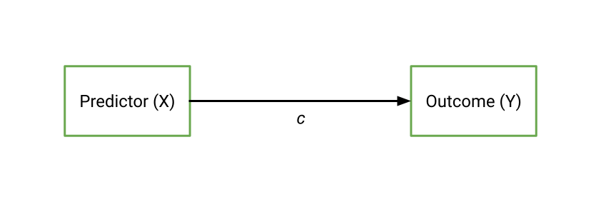
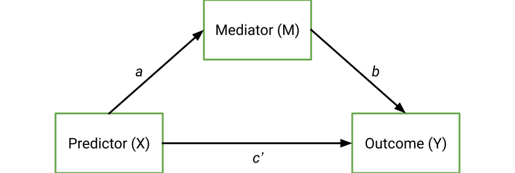
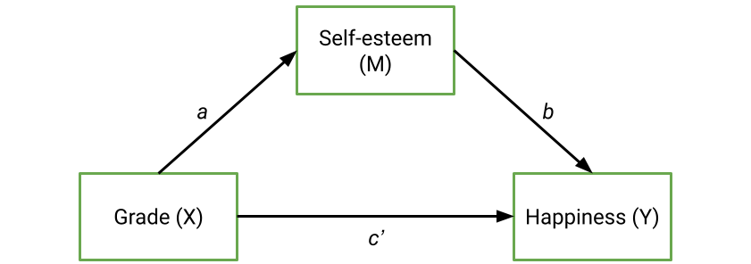
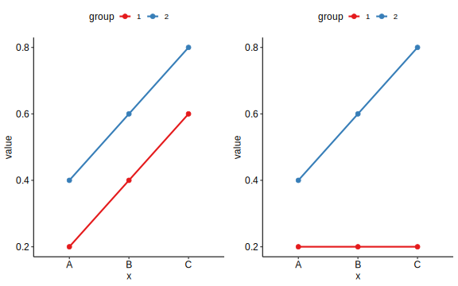
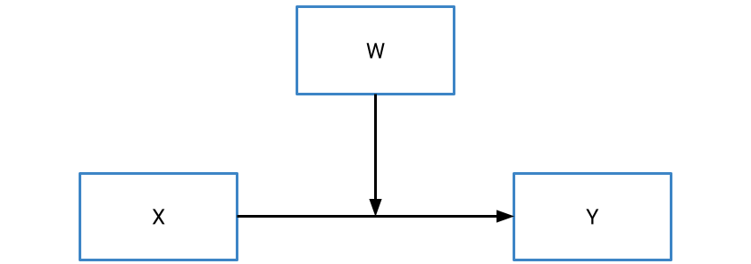
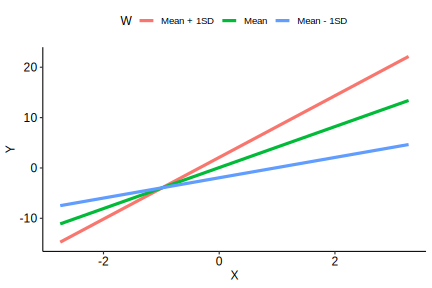
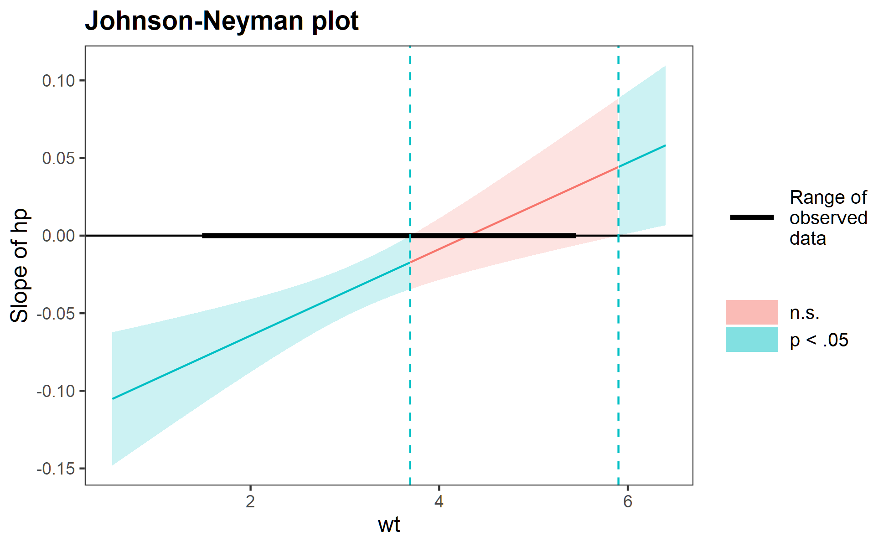

# Mediation and Moderation

Sometimes, the hypotheses we want to test are ones where the effect of interest works in a very specific way. In some cases, we might hypothesise that the relationship between two variables is actually best explained by a third variable that acts between them. For instance, we might predict that a relationship between sugar levels in food and happiness is best explained by food intake - we might eat more sugar, and eating more makes us happier (or something like that).^[I'm no dietitian or food psychology expert so I make no claims as to the veracity or accuracy of this statement.] This kind of hypothesis is called a **mediation**, and is common in psychological research as a lot of our work deals with *processes.*  

In other instances, we might expect interaction effects like what we saw in [two-way ANOVA](#interactions), but between continuous predictors. Note that up until this point we have only considered categorical x categorical interactions within an ANOVA context, so now is a good time to explore continuous x continuous interactions. We describe these effects as **moderation** effects.

This chapter will cover both mediation and moderation.

```{r warning = FALSE, message = FALSE, echo = FALSE}
library(tidyverse)
library(ggpubr)
library(here)
library(emmeans)

theme_set(theme_pubr())
```

## Mediation: Intro

<div style="background-color: #f5f5f5;  padding: 1.75rem;">
We start with an overview of the concept of mediation, with special consideration to its interpretation for the time being.
</div>

### Introduction to mediation

**Mediation** refers to a specific model where we hypothesise that the relationship between a predictor X and an outcome Y is explained by the effect of a third *mediating* variable. You can imagine a simple linear regression in the following way, with c representing the **direct effect** (or the regression coefficient) between the predictor and the outcome.

```{r echo = FALSE, fig.align = "center"}

```

But what happens if we believe that there actually isn't as direct of a relationship? In other words, we believe that our predictor X actually predicts/affects Y through a mediating variable, M? That might look like the following:

```{r echo = FALSE, fig.align = "center"}

```


In other words, mediation occurs when the effect of X on Y is explained through the effect of M. When paired with clever and careful study designs, mediations can be used to **test causality**. The underlying principle of the diagram above is that X causes M, and M causes Y; i.e. we implicitly specify **directional relationships** between our predictor, mediator and outcome.

 
### In mathematical terms

The basic idea of mediation is that the **total direct effect, c, should reduce** once the mediator is accounted for. This new direct effect is denoted as c' (c-prime). If a mediating effect is significant, then *c'* should be smaller than *c*; after all, if the mediator explains what is going on then this should explain the direct effect between the predictor and outcome.

The a and b paths denote the relationship between the predictor and mediator (a), and the mediator and the outcome (b). Together, they denote the **indirect effect** of the mediator, which we denote as ab - literally, the product of the two coefficients.

What is the relationship between the direct and indirect effect? Well, if the original effect c is the **total** effect, we can decompose this as:

Total effect = direct effect (c') + indirect effect (ab)

Without a mediator, the indirect effect ab is equal to zero, and so we only have a direct effect. However, if the indirect effect fully explains the relationship between the predictor and the outcome then we would expect the direct effect (c') to be close to 0, and the indirect effect to fully explain/comprise the total effect. 

## Mediation: Causal steps

<div style="background-color: #f5f5f5;  padding: 1.75rem;">
No introduction to mediation is complete without considering the causal steps approach, which held dominance as the main method of testing mediations for a while. Below is an overview of this approach.
</div>

### The causal steps approach

The causal steps approach outlined by Baron and Kenny (1986) was one of the first defined ways to test for a mediation. The name refers to a sequence of analytical steps that must be taken in order to apparently demonstrate a mediation, in line with the figure we saw on the previous page:

```{r echo = FALSE, fig.align = "center"}

```

To illustrate the causal steps approach (and subsequent approaches), we will use a fictional dataset below. This dataset contains scores on students' grades, self-esteem and happiness. We theorise that the relationship between a student's grades and their happiness is mediated by their self-esteem, which gives rise to the hypothetical mediation below:

```{r echo = FALSE, fig.align = "center"}

```

```{r message = FALSE, warning = FALSE}
med_data <- read_csv(here("data", "medmod", "med_grades.csv"))
```


### Step 1: Test the direct effect (c)

The first step in the classic causal steps approach is simply to see whether our predictor X predicts the outcome Y, using a linear regression. This tests the direct effect, c. The magnitude of this direct effect is 0.396.

```{r}
step_1 <- lm(happiness ~ grade, data = med_data)
summary(step_1)
```
 
### Step 2: Test the predictor and mediator (a)

The next step is to see whether the predictor significantly predicts the mediator, which denotes the a path. The estimate for a in this case is 0.561.

```{r}
step_2 <- lm(self_esteem ~ grade, data = med_data)
summary(step_2)
```
 
### Step 3: Test the predictor and mediator on the outcome (b)

This step involves running a multiple regression with both X and M as predictors, and Y as the outcome. This is because as in the model above, the effect of Y is determined by both the effect of the predictor and the mediator. The estimate for b is the regression coefficient for the mediator in this analysis - in this case, b = 0.6355.

```{r}
step_3 <- lm(happiness ~ grade + self_esteem, data = med_data)
summary(step_3)
```
 
### Step 4: Decide the extent of mediation

Recall on the previous page that the idea of mediation is to see how close *c*, the direct effect, gets to zero after mediation (i.e. *c'* = 0). The significance of the mediated direct effect, *c'*, as well as its magnitude are generally used to determine the extent to which this direct effect has been mediated.

If **full mediation** has occurred, the effect of *c'* should be non-significant and close to 0. If *c'* is still significant and not close to 0, but all the other steps are significant, then **partial mediation** is said to have occurred.

In our instance, the estimate of *c'* is 0.0396, with a *p*-value of .719. Given that the *c'* effect is non-significant, we would say that self-esteem **fully mediates** the relationship between grades and happiness.

One final check - also recall that the total effect, *c*, can be broken down into the direct effect *c'* and the indirect effect *ab*. You can manually check the maths here - *ab* (0.561 * 0.6355) + 0.0396 (the coefficient for *c'*) gives us 0.396, which was our initial estimate of the total effect *c*.

 
### Problems with the causal steps approach

The causal steps approach is not often used in mediation analyses anymore for a couple of reasons:

-    **Step 1 is not always necessary**. A non-significant *c* does not necessarily indicate that there is no mediation - in fact, sometimes we can observe **suppression effects**, where the indirect effect is positive while the direct effect is negative (or vice versa). This can happen when the causal chains act in opposite directions, thereby cancelling out the overall effect.
-    This approach does not *really* test the indirect path - only its individual components. Because we are interested in the effect of the mediating path, i.e. *ab*, it makes sense that we would want to know if that overall indirect effect is significant. However, this approach doesn't actually test for that.
-    Related to the above, Type II errors can be higher with this approach - some mediation effects can be missed.

## Mediation: Sobel's test and bootstrapping    

<div style="background-color: #f5f5f5;  padding: 1.75rem;">
So the causal steps approach doesn't really work for mediation... What now? Well, there are two more contemporary methods of testing mediations. While the latter (the bootstrap method) is the most recommended, we demonstrate both for completion's sake.
</div>

### Running mediations in R

There are many packages available to run mediations in R, including the well-known package `mediation` package. One of the most popular software tools for running mediations (and moderations), particularly for SPSS users, is the [PROCESS macro by Andrew Hayes](https://processmacro.org/index.html). PROCESS is essentially a set of code that can run a series of what we call *conditional process models* - including mediation and moderation. 

Note that due to copyright reasons, the R version of process isn't available on this book's corresponding GitHub repo; however, it can be downloaded for free from the official site using the link above. Detailed documentation is available in Hayes (2022). Loading PROCESS is not quite like loading a package in R as it isn't available in package form. To load it, you must use the `source()` function in base R, which will run another R script. Place the `process.R` file somewhere you can find it, and pass the file path to `source()`. It will take a little bit to load depending on your computer's specs, but if it has loaded correctly then you should see the following:

```{r cache = TRUE}
source(here("code", "process.R"))
```

Key to the PROCESS macro is the `process()` function, which is basically a does-it-all function that will run both mediations and moderations. 

### Sobel's test

The first, and perhaps most common method, goes by a couple of names: Sobel's test or the delta method are perhaps the two most well known. Jamovi calls this the **Standard** method. Sobel's test is a direct test of the significance of the *ab* pathway in a mediation.

The principle behind Sobel's test is actually relatively simple: it is analogous to a *t*-test, in that a *t*-statistic is calculated by dividing the estimate of *ab* by its estimated standard error:

$$
t_{ab} = \frac{ab}{SE_{ab}}
$$

From there, a *p*-value can be calculated by using this *t*-statistic and comparing it against a null *t*-distribution, much like you would with a *t*-test or a regression slope.

Note that Sobel's test **assumes normality**.

To run a mediation, we use the `process()` function as follows:
- `data` specifies the dataset.
- `x`, `y` and `m` specify the predictor, outcome and mediator respectively.
- `model = 4` specifies that we want to run a mediation. (PROCESS comes with 20-odd different model types!)
- `normal = 1` and `boot = 0` specifies that we only want a Sobel test for the indirect effect.

```{r}
med_sobel <- process(
  data = med_data,
  y = "happiness",
  x = "grade",
  m = "self_esteem",
  model = 4,
  normal = 1,
  boot = 0
)
```

Here is an output of our mediation using Sobel's test. You can see that it gives a *p*-value of not just the individual paths, but of the indirect and direct paths overall. Our indirect effect is significant (z = 4.299, *p* < .001), while our direct effect is not (z = .367, *p* = .719) - suggesting a full mediation, as we saw before.

Note that the output helpfully adds a note stating that the "Normal theory test" was used, which corresponds to Sobel's test.

Sobel's test is probably the most common method used, at least in most recent psychological literature. However, it too has a noticeable problem in that **it only works well in large samples**. This is for a couple of reasons, but primarily that the distribution of *ab* is only normal at very large sample sizes. Therefore, using Sobel's test in smaller sample sizes is likely to be skewed, which leads to **incorrect standard errors**. 

### Bootstrapping

To overcome the problem described above, another approach is to **bootstrap the standard errors**. This is where we continually resample a large number of times from our original dataset and calculate *ab* for each sampled dataset. Once we do this enough times, we can build an empirical distribution of possible *ab* values, and then use that to calculate an empirical *p*-value for each effect.

The advantage of bootstrapping is that we can calculate more robust confidence intervals around our estimates without needing to assume normality - instead, these are directly derived from our data (in a sense). To that effect, here is an output from a *bootstrapped* mediation (specifically, a bias-corrected bootstrapping method). A couple of extra notes here:

- `bc = 1` means we want bias-corrected bootstrap intervals.
- `boot = 1000` means that we want to bootstrap/resample 1000 times. While this is ok for now (and relatively fast), depending on the data you may want to up this to 10000 or higher.
- `seed = 2024` sets a *seed* for this run. Because bootstrapping involves random sampling, every run will give slightly different results (which isn't good for replicability/transparency). Setting a seed locks R into generating the same values on every run.

```{r}
med_bootstrap <- process(
  data = med_data,
  y = "happiness",
  x = "grade",
  m = "self_esteem",
  model = 4,
  bc = 1,
  boot = 1000,
  seed = 2024
)
```


Note that what changes here is the SE and confidence interval around each effect's estimate. We can see that the 95% confidence interval [.224, .538] is different to what we observed in the Sobel test version of this analysis. These are likely to be more robust, and thus we generally will want to prefer bootstrapping when running mediations.

## Moderation: Introduction

<div style="background-color: #f5f5f5;  padding: 1.75rem;">
We start the second half of this module with an overview of what moderation is, and how it can be used. On the next page we will go through a worked example.
</div>

### Refresher on interactions

If you have completed the module on factorial ANOVAs, you'll be familiar with the concept of an interaction:

> where the effect of one IV depends on the effect of another IV.

At the time we dealt with interactions between categorical predictors, i.e. variables with discrete, defined and mutually exclusive groupings in the data - e.g. sex (male, female) vs treatment (drug, placebo). We essentially estimate mean scores for each combination of categories in our data, and compare the variouos combinations on our continuous outcome measure, leading to graphs like these:

```{r fig.align = "center", echo = FALSE}

```


However, one thing we haven't looked at in great detail are interaction effects between *continuous* predictors.

 
### Moderation

**Moderation** occurs when one variable influences the relationship between a predictor (X) and an outcome (Y). In contrast to a mediator, which we denote as M, we typically denote a moderator using W. Put simply, the existence of a moderator implies that the effect of X on Y depends on the value of W.


```{r fig.align = "center", echo = FALSE}

```

 

That might sound familiar... and for good reason! If you thought that just sounds like an interaction effect, you'd be absolutely right. At a statistical/mathematical level, a moderation is simply an interaction between two continuous predictors, and thus you can think of moderation and interaction as the same thing. That means that we can define a moderation using a regression formula as follows:

$$
y = \beta_0 + \beta_1x + \beta_2w + \beta_3(xw) + \epsilon_i
$$

Where $\beta_1$ and $\beta_2$ and are regression coefficients (slopes) for X and W respectively, and $\beta_3$ is the interaction effect.

However, you may have already clocked that this may not be as easy as it may be for a factorial ANOVA, where we deal with categorical predictors. After all, at least in the categorical instance we could group observations based on the combinations of the two predictors. For example, in a factorial ANOVA with sex as one of the variables, we could plot/test an effect between a predictor and an outcome for men and women separately. But how do we do this for continuous variables, where there are no 'clear' cutpoints? To unpack a moderation, there are two techniques we can apply.

 
### Simple slopes

The first approach is the **simple slopes** approach, which is similar in principle to simple effects tests after factorial ANOVAs. The basic idea of a simple slopes test is to calculate the predicted values between X and Y, for multiple levels of the moderator W. The standard approach is to take the mean value of the moderator W, as well as 1 SD above and below the mean, and calculate the regression slopes for each level of the moderator. We can then plot this as follows:

 
```{r fig.align = "center", echo = FALSE}

```

From this graph, we can infer the nature of the interaction. In this example, for participants high on the moderator (red line), the relationship between X and Y is stronger; consequently, for participants low on the moderator (blue line), participants show a weaker relationship.

Of course, we can also choose more points, e.g. if we also wanted to look at +/- 2SD, or at percentile-based cutpoints we could do so.

 
### The Johnson-Neyman technique

A critique of the simple slopes, or "pick-a-point" approach is that the selected points are relatively arbitrary. While +/- 1SD make sense as cutpoints, we tend to choose those in the absence of anything especially meaningful or precise. A second technique for probing a continuous interaction/moderation is called the **Johnson-Neyman** (JN) technique. The basic idea of the Johnson-Neyman technique is that it identifies the point at which the **moderator** no longer significantly interacts with the predictor.

The exact maths behind this is complex, but in short it aims to identify the values of W that are equal to or below a critical *t* value for a significant interaction effect.

We visualise the results of the Johnson-Neyman technique with a plot, which plots values of the moderator (W) on the x-axis against the *slope* of the predictor on the y-axis. Here's an example (from the help docs for the interactions package in R:

```{r fig.align = "center", echo = FALSE}

```

The red shaded region indicates where the moderation is non-significant. So, in this instance, values of the moderator between ~ 3.8 and 5.9 (as an eyeball guess) do not significantly moderate the relationship between the predictor and outcome. Values above or below this, however, do indicate significant moderation. Using the PROCESS macro in SPSS/R, it's possible to get the exact values for where this range starts and ends. 

## Moderation: Example

<div style="background-color: #f5f5f5;  padding: 1.75rem;">
To round this module off, here is a worked example of a moderation.
</div>

### Example scenario

We will use the dataset from Powell et al. (2022) in the Week 10 seminar, which looks at harmonious and obsessive passion in the context of heavy metal music listeners. We'll test a specific question for this example: Do positive experiences predict harmonious passion, and does satisfaction with life moderate this relationship?

```{r warning = FALSE, message = FALSE}
passion_data <- read_csv(here("data", "week_10", "W10_Powell_2022.csv"))
```

### Setting  up in R

To set up a moderation using PROCESS, we turn to the `process()` function once again. This time, we want to set the following options:

- `w` sets our moderator.
- `model = 1` indicates that we want a simple moderation.
- `plot = 1` gives us values for plotting the moderation.
- `jn = 1` calculates the Johnson-Neyman values for a significant moderation. These are also used for plotting.
- `save = 2` is used to save the output to a variable.

```{r eval = FALSE}
passion_mod <- process(
  data = passion_data,
  y = "HP_TOT",
  x = "SPANE_pos",
  w = "SWLS_TOT",
  model = 1,
  plot = 1,
  jn = 1,
  save = 2
)
```


### Output

Let's now take a look at our output. The first output is our overall model fit, which is identical to what we get for any other multiple regression. Our model in this instance is significant, and explains 19.6% of the variance in harmonious passion.

The second output gives us our standard regression table. This tells us whether the moderation is significant, and we can interpret this as we would for any other regression we've seen. So, here we can see that positive experiences are a significant predictor of harmonious passion (B = 0.796, t = 6.290, p < .001), but satisfaction with life is not (p = .279). However, the interaction - or moderation - between the two is significant (B = 0.036, t = 2.576, p = .011).

```{r echo = FALSE}
passion_mod <- process(
  data = passion_data,
  y = "HP_TOT",
  x = "SPANE_pos",
  w = "SWLS_TOT",
  model = 1,
  plot = 1,
  jn = 1,
  save = 2
)
```


This indicates that we should investigate further, first with our simple slope/interaction plot as below. Unfortunately, as you can tell, the `plot` argument in `process()` doesn't actually generate any plots. Rather, it gives a series of values for the predictor, moderator and outcome to plot. The same applies for the output from the Johnson-Neyman technique - while the output does tell you where the moderation is/is not significant, it does not draw a plot. This is probably because PROCESS was designed for SPSS users first and foremost in mind, and the SAS and R versions were designed for parity for SPSS first and foremost (rather than designed to take advantage of their native capabilities).

There are ways to use these values for plotting, but truthfully - at least for this subject - they are far more effort than they are worth. Rather, there is a great package called `interactions` that will draw these plots for us. 

To start, we use `lm()` to build a regular regression model with an interaction between our predictor and moderator:

```{r}
library(interactions)
passion_mod_lm <- lm(HP_TOT ~ SPANE_pos * SWLS_TOT, data = passion_data)
```

The `interact_plot()` function will then draw us a standard plot with simple slopes, based on the model above. For this function to work, at a minimum you must give it a) the name of the `lm()` model, b) the name of the predictor to `pred` and c) the name of the moderator to `modx`. The `colors` argument has also been specified to change the colours for the lines (by default they are different shades of blue).

Based on the below graph, we can see that in all instances, the relationship between positive experiences and harmonious passion is positive. However, for people who are high on satisfaction with like (Mean + 1SD), the relationship is stronger - indexed by a greater slope. This relationship is weaker for people who are low on satisfaction with life (Mean - 1SD).

```{r}
interact_plot(passion_mod_lm, 
              pred = "SPANE_pos",
              modx = "SWLS_TOT", 
              colors = "Set1") 
```

Lastly, we can examine the Johnson-Neyman plots to see where this relationship is non-significant.  The same basic set of arguments - model, predictor, and moderator - can also be used as is for the `johnson_neyman()` function, which will draw a Johnson-Neyman plot. Helpfully, the function will also give a brief summary of the regions of significance/non-significance. Based on the plot and the text output, the moderation is non-significant when the moderator (satifaction with life) is below 6.9.

```{r}
johnson_neyman(passion_mod_lm, pred = "SPANE_pos", modx = "SWLS_TOT")
```


